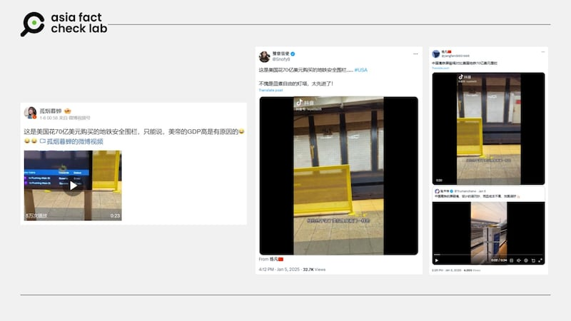
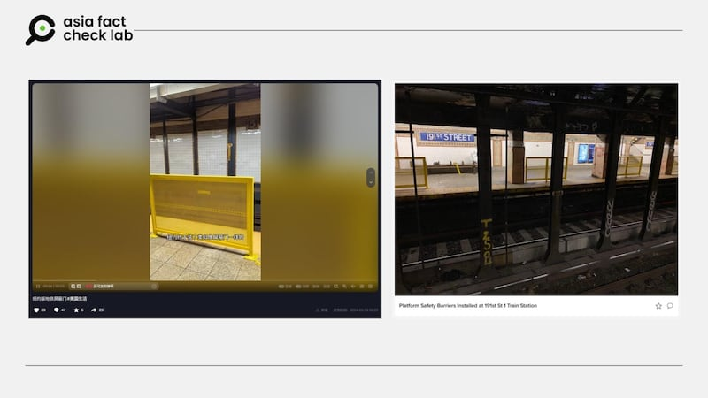
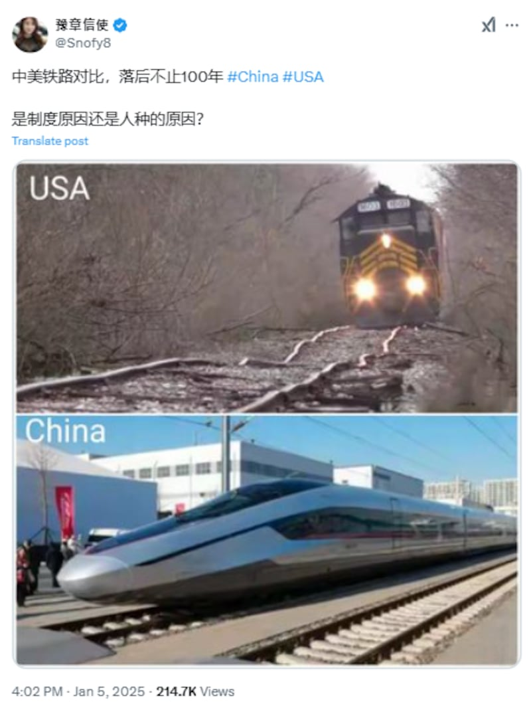

# 事實查覈｜美國裝個地鐵月臺圍欄，花去70億美元？

作者：莊敬、鄭崇生

2025.01.08 10:11 EST

## 查覈結果：誤導

## 一分鐘完讀：

近日一些知名中文社媒用戶發文，稱美國花70億美元買地鐵安全圍欄，並附上視頻顯示紐約某地鐵站黃色圍欄狀的安全裝置，藉以嘲諷美國的公共設施價格虛高。

然而，這是誤導信息，紐約大都會運輸署（MTA）的研究報告以及媒體報道，70億美元的預算是是在紐約上百個地鐵站安裝“全高式安全門”的花費，而並非視頻中的金屬裝置。

此外，近期還有中文社媒號對比美、中鐵路，稱中美之間基礎建設相差太多。但其所展示照片中的鐵路等級不同，直接相比並不恰當。

## 深度分析：

近日，微博“大V”用戶[“孤煙暮蟬”](https://m.weibo.cn/detail/5119621370478774)、Ｘ上的“藍勾勾”用戶“[豫章信使](https://x.com/Snofy8/status/1875817604667076908)”等人都在社媒上發文，稱美國花70億美元購買地鐵安全圍欄，他們附上同一則23秒的短視頻，畫面左上方顯示視頻來自抖音號“ivyelite05”，視頻中展示某地鐵站裝上了簡易的黃色金屬圍欄。另有[中文社媒用戶](https://x.com/yangfan39831908/status/1875791395291897864)轉發這則短視頻，以“美國地鐵70億美元圍欄”對比中國的高鐵屏蔽繩。

亞洲事實查覈實驗室（Asia Fact Check Lab, AFCL）進一步查詢抖音號“ivyelite05”，找到用戶“湯姆師哥說留學”在去年3月發佈的[視頻](https://v.douyin.com/iy5d7Ha9/)，畫面顯示紐約地鐵站月臺上安裝了數個金屬製黃色安全裝置，拍攝者以中文說：“紐約終於裝了像屏蔽門一樣的設備”，但他並沒有提到紐約花費70億美元購買安全圍欄。

近日社媒流傳美國花70億美元購買地鐵安全圍欄。 近日社媒流傳美國花70億美元購買地鐵安全圍欄。 (微博、X截圖)

## 70億美元購買的是什麼裝置？

AFCL以“紐約”、“地鐵”、“圍欄”等中英文關鍵字查詢，找到《[Time Out](https://www.timeout.com/newyork/news/mta-just-added-barriers-on-10-subway-platforms-083024)》、《[ABC7 New York](https://abc7ny.com/nyc-mta-subway-barricades-new-york-city/13348197/)》 、《[Spectrum News NY1](https://ny1.com/nyc/all-boroughs/news/2022/01/20/docs-shows-costs-and-challenges-of-subway-track-safety)》 等多家媒體近年發佈的相關報道，根據他們的報道，安裝“全高式月臺門”（Platform screen doors, PSD）估計需要花費70億美元，而安裝金屬安全護欄較爲便宜。

其中，《Spectrum News NY1》的報道提供了一份紐約大都會運輸署（MTA）的研究報告摘要，這份文件指出，在紐約472個地鐵站中，有128個地鐵站可安裝全高式月臺門，成本估計超過70億美元。 MTA在2022年發佈的[研究報告](https://new.mta.info/document/87881)第39頁至40頁也有同樣說明，這份報告並評估安裝其它安全措施的可能性，包括護欄（barriers）。

在查覈過程中，AFCL注意到《[大紀元](https://www.epochtimes.com/b5/22/1/21/n13519647.htm)》曾在2022年引述《Spectrum News NY1》的報道，指“據NY1新聞20日發佈的報道，爲MTA進行的一項研究發現，在472個地鐵站中，超過四分之一（128 個）的地鐵站內是可以安裝護欄的，所需成本將達70億美元。”但NY1報道所寫的是“platform doors”（月臺門），譯爲“護欄”並不精確。

## 視頻中的黃色圍欄是什麼？

2022年初，亞裔女子高惠民（Michelle Alyssa Go）[被人推下紐約地鐵軌道後身亡](https://cn.nytimes.com/opinion/20230116/michelle-go-death-subway-father/zh-hant/)，如何提高地鐵安全的話題再度引起關注。 MTA陸續在地鐵站安裝護欄，根據紐約媒體《[amNY](https://www.amny.com/news/violence-in-nyc-subways-platform-barriers/)》2025年1月報道，一名MTA發言人表示，目前已有14個紐約地鐵站安裝安全護欄，其目標是每個月在一到兩個地鐵站安裝護欄，具體取決於材料運送的時間。

近日在網上流傳的視頻中，可以看到紐約地鐵站內設置了數個金屬製的黃色安全裝置，AFCL比對MTA於2024年1月發佈的照片，視頻中的黃色裝置符合MTA[新聞稿](https://new.mta.info/press-release/mta-installs-platform-barriers-191-st-1-station)所指的護欄（barriers）。

基於原視頻的拍攝者並沒有提到紐約花費70億美元購買安全圍欄，而MTA研究報告所稱的“70億美元”是在128個地鐵站安裝“全高式月臺門”的預估花費。因此AFCL判斷“孤煙暮蟬”等社媒用戶爲其轉發的視頻添加不準確的文字敘述，傳播了誤導信息。

抖音視頻中的黃色安全裝置（左圖），符合紐約大都會運輸署（MTA）發佈的地鐵站護欄（右圖）。 抖音視頻中的黃色安全裝置（左圖），符合紐約大都會運輸署（MTA）發佈的地鐵站護欄（右圖）。 (抖音、MTA網站截圖)

## 中美鐵路對比落後百年？

AFCL另注意到“[豫章信使](https://x.com/Snofy8/status/1875815241965301951)”還曾在今年1月5日發照片對比中美鐵路，配文寫道“中美鐵路對比，落後不止100年”。對比圖中他使用的中國鐵路照片爲去年底亮相、預計2025年營運的“[國產高鐵列車CR450樣車](https://money.udn.com/money/story/5603/8456995)”，然而對比的美國鐵路，是一部型式老舊的火車，行駛在彎曲的傳統鐵軌上。

X上的中文用戶近日發照片對比中美鐵路。 X上的中文用戶近日發照片對比中美鐵路。 (X截圖)

經查，美國鐵路照片符合美國網媒《[The Drive](https://www.thedrive.com/news/no-this-wobbly-track-didnt-derail-norfolk-southerns-hazmat-train-in-ohio)》2023年報道的配圖，畫面出自YouTube用戶於2017年所發佈的[視頻](https://www.youtube.com/watch?v=rhbhxFNXXjs)，是俄亥俄州的短程鐵路，相關影像曾被人誤傳與俄亥俄州脫軌事件有關。據報道，這段鐵路已經[修復](https://www.youtube.com/watch?v=-J_1Owl9m1k)。

美國的高鐵等基礎設施建設進程確實在其國內引發不少批評爭議，然而，“豫章信使”使用兩張發佈時間相差至少7年，且不同性質的鐵路與列車照片，用來比較中美鐵路的發展，恐誤導受衆。中國社媒用戶先前也曾傳播與美國大衆運輸有關的誤導信息，請參考AFCL“[美國把高鐵建成了”慢鐵](2023-10-24_事實查覈｜美國把高鐵建成了"慢鐵"？.md)”？”查覈報告。

*亞洲事實查覈實驗室（Asia Fact Check Lab）針對當今複雜媒體環境以及新興傳播生態而成立。我們本於新聞專業主義，提供專業查覈報告及與信息環境相關的傳播觀察、深度報道，幫助讀者對公共議題獲得多元而全面的認識。讀者若對任何媒體及社交軟件傳播的信息有疑問，歡迎以電郵*[*afcl@rfa.org*](mailto:afcl@rfa.org)*寄給亞洲事實查覈實驗室，由我們爲您查證覈實。*

*亞洲事實查覈實驗室在X、臉書、IG開張了，歡迎讀者追蹤、分享、轉發。X這邊請進：中文*[*@asiafactcheckcn*](https://twitter.com/asiafactcheckcn)*；英文：*[*@AFCL\_eng*](https://twitter.com/AFCL_eng)*、*[*FB在這裏*](https://www.facebook.com/asiafactchecklabcn)*、*[*IG也別忘了*](https://www.instagram.com/asiafactchecklab/)*。*

[Original Source](https://www.rfa.org/mandarin/shishi-hecha/2025/01/08/fact-check-us-subway-safty-barrier/)