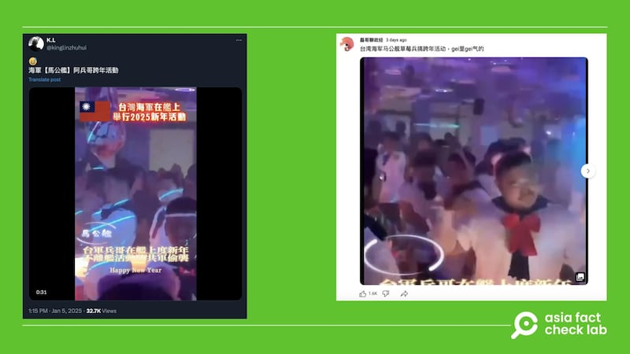
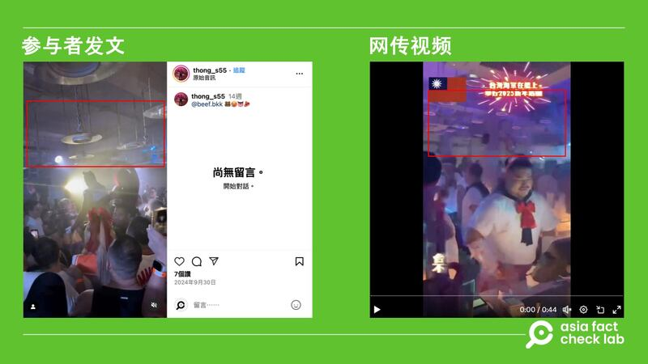
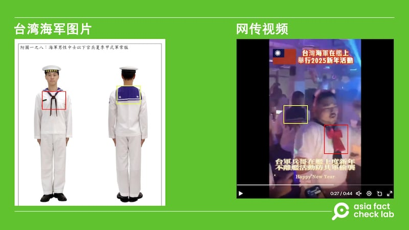

# 事實查覈｜臺灣“馬公艦”跨年派對熱舞視頻曝光？

艾倫、董喆

2025.01.09 18:19 EST

查覈結果：錯誤

## 一分鐘完讀：

2025年1月初，多個社媒平臺上轉傳一則視頻，中文字幕稱臺灣“馬公艦”的軍人在跨年夜時于軍艦上舉辦慶祝活動，畫面則呈現一羣身穿紅色蝴蝶結水手服的男子跳舞的情景。

亞洲事實查覈實驗室（Asia Fact Check Lab，下稱AFCL）細查網傳畫面，發現該視頻是泰國一家同志夜店的活動畫面，且與會者身着的水手服也和臺灣海軍制式水兵服不同。

## 深度分析：

1月5日，X上有中文用戶轉發一則[視頻](https://x.com/kinglinzhuhui/status/1875773109003022550)，畫面爲一羣水手服男子隨音樂跳舞的情景，視頻上印着字幕：“臺灣海軍在艦上舉行2025新年活動”。[TikTok](https://www.tiktok.com/@sb.taiwan/video/7455210310182472967)、[YouTube](https://www.youtube.com/post/Ugkx9nBy7Jq11xAOj9VzyESKvJ6oMUfswl-G)上也出現相同視頻，其中YouTube賬號“磊哥聊正經”轉發時，嘲諷這些都是臺灣“草莓兵”。

網傳臺灣“馬公艦”跨年夜慶祝活動現場 網傳臺灣“馬公艦”跨年夜慶祝活動現場 (圖取自X、YouTube)

AFCL發現，不少人已在網帖評論區質疑該視頻場景疑似在夜店，其中一名用戶更是指出，具體地點應爲泰國曼谷的同志夜店“BEEF.BKK”。

以該夜店名稱作爲關鍵字搜尋，會發現該夜店於2024年9月曾舉辦過水手服扮裝的[活動](https://www.instagram.com/p/C_pjPxmPKb2/)，比對一名參與者在Instagram上發佈的[視頻](https://www.instagram.com/p/DAiG8Mkvldr/)，其天花板裝飾與網傳視頻中的相同，而比對另一則網民在該夜店打卡的[視頻](https://www.instagram.com/beast.cake/p/C_ew8FMTVGY/?img_index=7)，也可發現與網傳視頻中的DJ臺高度相似。

網傳視頻的天花板設計和泰國夜店“BEEF.BKK”的活動畫面相同 網傳視頻的天花板設計和泰國夜店“BEEF.BKK”的活動畫面相同 (圖取自Instagram、X)

再將臺灣法律《陸海空軍服制條例》附圖的[官方水兵服照片](https://navy.mnd.gov.tw/AboutUs/About_Info.aspx?ID=30023&CID=30287)，比對網傳視頻的畫面，會發現視頻中的水手服多了紅色蝴蝶結，且後領角落少了臺灣海軍正式水兵服上會有的青天白日徽。

對比臺灣海軍的水兵服照片，網傳視頻裏的水手服多了紅色蝴蝶結及少了青天白日徽 對比臺灣海軍的水兵服照片，網傳視頻裏的水手服多了紅色蝴蝶結及少了青天白日徽。 (圖取自《陸海空軍服制條例》附圖及X平臺)

臺灣國防部則回應AFCL，指出視頻畫面不是馬公艦內部，但官員無法透露馬公艦當天動向。

綜合“BEEF.BKK”夜店的社媒發文、臺灣海軍照片，以及臺灣國防部的回應，可得出“臺灣馬公艦舉辦跨年派對“爲錯假消息。

*亞洲事實查覈實驗室（Asia Fact Check Lab）針對當今複雜媒體環境以及新興傳播生態而成立。我們本於新聞專業主義，提供專業查覈報告及與信息環境相關的傳播觀察、深度報道，幫助讀者對公共議題獲得多元而全面的認識。讀者若對任何媒體及社交軟件傳播的信息有疑問，歡迎以電郵*[*afcl@rfa.org*](mailto:afcl@rfa.org)*寄給亞洲事實查覈實驗室，由我們爲您查證覈實。*

*亞洲事實查覈實驗室在X、臉書、IG開張了，歡迎讀者追蹤、分享、轉發。X這邊請進：中文*[*@asiafactcheckcn*](https://twitter.com/asiafactcheckcn)*；英文：*[*@AFCL\_eng*](https://twitter.com/AFCL_eng)*、*[*FB在這裏*](https://www.facebook.com/asiafactchecklabcn)*、*[*IG也別忘了*](https://www.instagram.com/asiafactchecklab/)*。*

[Original Source](https://www.rfa.org/mandarin/shishi-hecha/2025/01/09/fact-check-taiwan-naval-ship-party/)