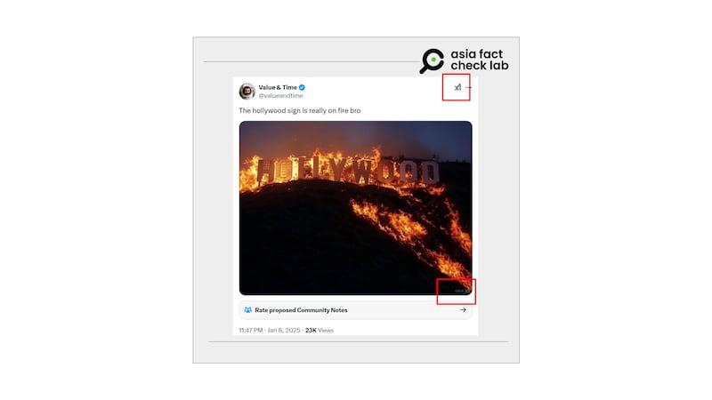

# 事實快查｜好萊塢地標燒燬了？房屋保險被取消？加州山火肆虐，假消息四起

鄭崇生

2025.01.10 01:37 EST

美國加州洛杉磯近日爆發山火，伴隨強烈季風，火勢迅速蔓延，包括衆多好萊塢明星聚集的居住地帕利塞茲區（Palisades）也有多間房屋身陷火海。根據洛杉磯消防局9日的[最新消息](https://lafd.org/news/palisades-fire-0)，帕利塞茲遭受火災蔓延的面積已達1萬7200英畝。

洛杉磯也是北美主要的華人居住地之一，不少華人[轉述當地災情](https://www.worldjournal.com/wj/story/121471/8478157?from=wj_referralnews)。但亞洲事實查覈實驗室（Asia Fact Check Lab, AFCL）也發現，許多疑似電腦動畫（CG）或人工智能（AI）生成的圖片與影像，或是斷章取義的資訊，也形同野火燎原。AFCL整理、覈查了一些廣泛傳播的不實信息：

## 大火燃燒好萊塢山標誌性招牌？

## 這是錯誤資訊。

在[微博上](https://archive.ph/lFBFa)有視頻與照片，都顯示好萊塢山的標誌性招牌深陷火海。然而，這座招牌有時實轉播的影像，根據[官網查詢](https://www.hollywoodsign.org/webcam)，至截稿也沒有任何“身陷火海”的情形。此外，包括事實查覈組織Snopes在內都已經[發表報告](https://www.snopes.com/fact-check/hollywood-sign-la-wildfires/)澄清，這些最早出現在[美國社交媒體平臺X上的圖片](https://archive.is/us32N)以及[TikTok上的視頻](https://archive.is/7i6Si)，都不是目前好萊塢招牌所在地的實際情況。

--- 流傳中好萊塢山的標誌性招牌深陷火海的不實影像 (微博截圖)

至於這些圖象是哪裏來的？細看X平臺上流傳到微博的這張圖片，美東時間1月9日可發現，除了原本右上角已標註上XI，圖片右下角也有”GROK XI”的浮水印（如下方截圖兩個紅圈處），AFCL可以確認，這是一張由AI軟件[Grok生成的圖像](https://x.com/i/grok?focus=1)，但相關發文搬運到了微博上，這一浮水印消失不見。

----- 原本標註爲人工生成的”XI”浮水印 (圖取自X平臺)

Grok是社交媒體平臺X執行長馬斯克（Elon Musk）成立的AI公司，AFCL在Grok實測發現，輸入“create +image+hollywood+sign+on+fire”，約10秒鐘就可得到與上方相似的AI生成圖。值得注意的是，若以文字詢問Grok好萊塢山標誌是否起火，卻又得到否定的答案。

## 洛杉磯知名蓋蒂莊園博物館陷入火海？

## 這是誤導信息。

在[X上有中](https://archive.ph/IOaEf)、[英語](https://archive.ph/tcoeC)發文流傳着洛杉磯當地著名的蓋蒂莊園博物館（Getty Villa Museum）也遭受這次的野火波及，然而，AFCL將發文中的影像與谷歌地圖街景相對照發現，影像中的蓋蒂莊園招牌是真實存在，但對照當地地形位置，發文中位於高處的建築物，並不是蓋蒂莊園內的建物，而是位於山腳下、鄰近蓋蒂莊園的萊昂別墅（Villa de Leon）與周邊太平洋海岸公路（Pacific Coast Highway）接壤坡地上的樹木起火。

----- 左爲網傳圖片，宣稱蓋蒂莊園博物館遭到野火波及。但比對谷歌地圖街景（右），可見該建築物，並不是蓋蒂莊園內的建物。 (圖取自X平臺及谷歌街景)

另外，蓋蒂莊園官網也公佈[新聞稿](https://www.getty.edu/news/updated-statement-from-getty-president-and-ceo-katherine-e-fleming-regarding-palisades-fire/)指出，截至8日上午，博物館建築仍安全無恙，但因應當地的嚴重災情，至少關閉至1月12日。蓋蒂莊園位於這次災情慘重的帕利塞茲，當地鄰近太平洋岸，馬里布海灘（Malibu beach）風景優美，也是洛杉磯的知名觀光地點。

## 加州大火肆虐之際，保險公司“第一時間”取消上千名屋主的保單？

**這也是斷章取義。**微博上名爲[“波士頓圓臉”的大V錄製視頻](https://archive.ph/mGSur)聲稱，“災害要來臨之際，資本家早就知道了，所以說，保險公司在第一時間就取消了當地很多的保險”。

----- 有微博博主稱保險公司在山火爆發的第一時間，大量取消房屋保險合約。 (圖取自微博)

根據視頻中引用的英文報道截圖，AFCL發現，這是[美國新聞週刊（Newsweek）](https://www.newsweek.com/california-insurer-canceled-policies-months-before-los-angeles-wildfires-2011521)8日刊發這次火災情況的相關報道，講述美國去（2024）年有保險公司在評估加州近年來因氣候變化野火頻傳後，取消一些加州當地的房屋火險保單，而其中有上百戶居民就是處在這次山火發生所在地的“寶馬山花園”社區（Pacific Palisades）。然而，在他的視頻中其實可以清楚看到英文報道第一段寫着取消保單是發生在“去年夏”天”，報道標題也明確指出這是在災害發生的“數個月前”（下方截圖右處紅圈處）。

----- 有微博博主稱保險公司在山火爆發的第一時間，大量取消房屋保險合約。但在他自己視頻引用的媒體報道（右圖）中，就提及取消合約是去（2024）年的事情。 (圖取自微博視頻)

根據這篇報道介紹，多傢俬人保險公司在過去3年間取消了加州一些高風險地區的房屋保險，許多民衆因此得透過州政府的“公平取得保險方案”（Fair Access to Insurance Requirements Plan，FAIR Plan ）購買。加州“公平取得保險方案”投保案件在2020年至2024年間成長逾一倍，總額達到45萬2000件。

*亞洲事實查覈實驗室（Asia Fact Check Lab）針對當今複雜媒體環境以及新興傳播生態而成立。我們本於新聞專業主義，提供專業查覈報告及與信息環境相關的傳播觀察、深度報道，幫助讀者對公共議題獲得多元而全面的認識。讀者若對任何媒體及社交軟件傳播的信息有疑問，歡迎以電郵*[*afcl@rfa.org*](mailto:afcl@rfa.org)*寄給亞洲事實查覈實驗室，由我們爲您查證覈實。*

*亞洲事實查覈實驗室更詳細的介紹請參考*[*本文*](2024-10-09_關於亞洲事實查覈實驗室｜About AFCL.md)*。我們另有在X、臉書、IG頻道，歡迎讀者追蹤、分享、轉發。X這邊請進：中文*[*@asiafactcheckcn*](https://twitter.com/asiafactcheckcn)*；英文：*[*@AFCL\_eng*](https://twitter.com/AFCL_eng)*、*[*FB在這裏*](https://www.facebook.com/asiafactchecklabcn)*、*[*IG也別忘了*](https://www.instagram.com/asiafactchecklab/)*。*

[Original Source](https://www.rfa.org/mandarin/shishi-hecha/2025/01/10/fact-check-wildfire-losangeles-aigenerate/)