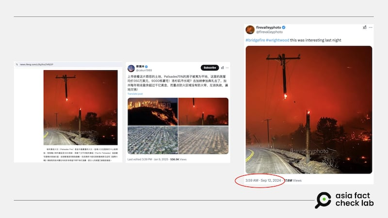
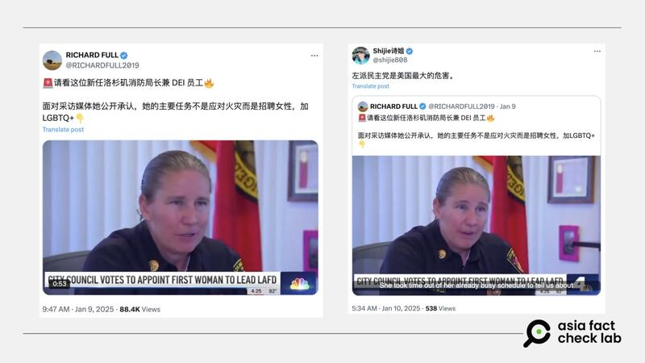

# 事實快查｜舊圖片誤用、消防局長採訪被錯傳…美國野火災情相關假訊息之二

作者：莊敬

2025.01.10 15:18 EST

美國加州洛杉磯7日起發生多起野火災情，火勢迅速擴大，至今持續延燒，逾十萬居民被迫撤離。這幾天，中文網絡流傳大量有關洛杉磯野火的消息與影像，亞洲事實查覈實驗室（Asia Fact Check Lab, AFCL）將就監測到的中文媒體和社交媒體中的不實或誤導內容，持續發佈[查覈報告](2025-01-10_事實快查｜好萊塢地標燒燬了？房屋保險被取消？加州山火肆虐，假消息四起.md)。

## “電線杆燒斷”照片是本次野火災情嗎？

查覈結果：誤導

這張電線杆分爲兩半的照片，出現在[鳳凰網資訊](https://news.ifeng.com/c/8g0kaZM6jGP)、“[百度](https://baijiahao.baidu.com/s?id=1820761142922345592&wfr=spider&for=pc)”、“[網易](https://www.163.com/dy/article/JLG09T870553TF9H.html)”1月9日刊登的文章，也是X“藍勾勾”[中文用戶](https://x.com/cskun1989/status/1877258772877377858)1月9日分享的其中一張照片。這張照片中的浮水印寫着“firevalleyphoto”，而根據上述平臺文章與社媒用戶的文字敘述，這是近期洛杉磯野火主要火場帕利塞茲（Palisades）的景象。

近日網上流傳一張電線杆分爲兩半的照片，配文寫是近期洛杉磯野火的主要火場帕利塞茲（Palisades），但這張照片去年9月已出現在社媒上。 近日網上流傳一張電線杆分爲兩半的照片，配文寫是近期洛杉磯野火的主要火場帕利塞茲（Palisades），但這張照片去年9月已出現在社媒上。 (鳳凰網資訊、X截圖，AFCL標註)

但AFCL以圖反搜後，隨即找到X帳號“firevalleyphoto”於2024年9月中發佈的[同一張照片](https://x.com/firevalleyphoto/status/1833958445202243736)，圖片說明爲橋樑山火（Bridge Fire）。[橋樑山火](https://www.fire.ca.gov/incidents/2024/9/8/bridge-fire)是2024年9月初在洛杉磯周圍爆發的3場失控野火之一。

前述平臺文章與社媒用戶誤用過往事件的影像，傳播了誤導信息。

## 洛杉磯消防局長宣稱“主要任務不是應對火災”？

查覈結果：誤導

X用戶以中文[發帖](https://x.com/RICHARDFULL2019/status/1877170174488445256)（轉發者：[1](https://x.com/shijie808/status/1877468914193461599),[2](https://x.com/freeflightinsky)），文字敘述是“請看這位新任洛杉磯消防局長兼DEI員工，面對採訪媒體她公開承認，她的主要任務不是應對火災而是招聘女性，加LGBTQ+”。這則帖子並附上一段1分多鐘的視頻，前48秒看起來是洛杉磯市消防局長克勞利（Kristin Crowley）的受訪內容，畫面右下方的媒體標誌可知，影像出處爲國家廣播公司洛杉磯分臺（NBCLA）。

社媒用戶傳播一段視頻，稱洛杉磯市消防局長受訪公開承認，其主要任務不是應對火災而是招聘女性與LGBTQ+。 社媒用戶傳播一段視頻，稱洛杉磯市消防局長受訪公開承認，其主要任務不是應對火災而是招聘女性與LGBTQ+。 (X截圖)

但從視頻49秒起，畫面變成野火景象、搭配男聲旁白，這名男子說：“這位新的同性戀洛杉磯消防局長說，我的主要工作是招聘女性及同性戀人士⋯⋯”。緊接着在視頻1分鐘處，出現一名男子講話，畫面的左下角顯示“INFO WARS”、右下方寫着“The Alex Jones show”。亞歷克斯·瓊斯（Alex Jones）因經常傳播虛假信息和毫無證據的指控而知名，他創辦的Infowar網站也因爲傳播假信息和誹謗被判決鉅額賠款，[正面臨破產](https://www.npr.org/2024/11/25/g-s1-35848/infowars-alex-jones-auction-the-onion-bankruptcy-judge-sandy-hook)。

AFCL找到NBCLA於2022年3月播出的克勞利[受訪視頻](https://www.youtube.com/watch?v=cANZI_2J_B4)，根據這段視頻以及克勞利的[自介](https://lafd.org/about/organization/fire-chief)，她確實重視組織的多元與共融，但並沒有在採訪中說出“她的主要任務不是應對火災而是招聘女性”這句話。部分社媒用戶扭曲了克勞利的談話內容，並傳播誤導信息。

*亞洲事實查覈實驗室（Asia Fact Check Lab）針對當今複雜媒體環境以及新興傳播生態而成立。我們本於新聞專業主義，提供專業查覈報告及與信息環境相關的傳播觀察、深度報道，幫助讀者對公共議題獲得多元而全面的認識。讀者若對任何媒體及社交軟件傳播的信息有疑問，歡迎以電郵*[*afcl@rfa.org*](mailto:afcl@rfa.org)*寄給亞洲事實查覈實驗室，由我們爲您查證覈實。*

*亞洲事實查覈實驗室更詳細的介紹請參考*[*本文*](2024-10-09_關於亞洲事實查覈實驗室｜About AFCL.md)*。我們另有X、臉書、IG頻道，歡迎讀者追蹤、分享、轉發。X這邊請進：中文*[*@asiafactcheckcn*](https://twitter.com/asiafactcheckcn)*；英文：*[*@AFCL\_eng*](https://twitter.com/AFCL_eng)*、*[*FB在這裏*](https://www.facebook.com/asiafactchecklabcn)*、*[*IG也別忘了*](https://www.instagram.com/asiafactchecklab/)*。*

[Original Source](https://www.rfa.org/mandarin/shishi-hecha/2025/01/10/fact-check-wild-fire-los-angeles-misinformation/)