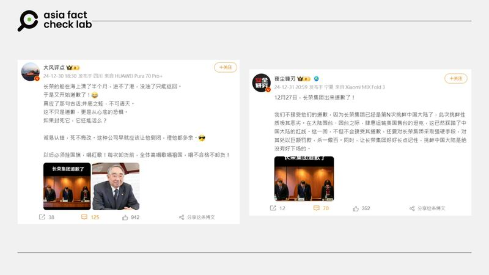
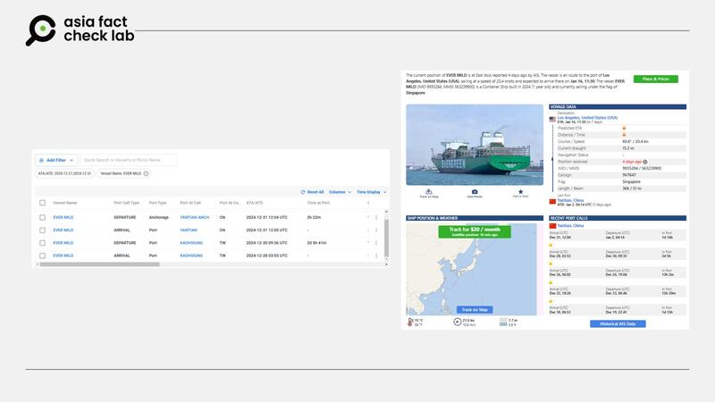

# 事實查覈｜因貨船遭禁入中國港口，長榮海運「出面道歉」，有照爲證？

莊敬、董喆

2025.01.12 08:25 EST

## 查覈結果：錯誤

## 一分鐘完讀：

近日中文社媒流傳長榮海運因爲貨船被拒絕入中國天津港，而出面道歉。發文者並附上一張照片爲證，畫面看起來像是幾名著正裝的人士低頭道歉。但經查發現，這張照片出自2019年長榮航空爲空服員受辱而致歉的新聞，與近期網傳事件無關，部分社媒用戶傳播了錯誤信息。

## 深度分析：

近日有多位粉絲破百萬的微博「大V」用戶（[1](https://weibo.com/6811672042/P7rJKlA6v),[2](https://weibo.com/1380043712/P7hkF8yUT),[3](https://m.weibo.cn/detail/5118441226240407)）發文，宣稱「長榮集團出來道歉了」。有人稱長榮是爲運輸美國售臺坦克而道歉，另有人說是因爲長榮貨船被拒絕進入天津港而道歉。這些用戶發文時附上一張照片，照片中有三名著正裝的人士低着頭，看起來像是正在道歉。

--- 近日中文社媒用戶傳播長榮集團道歉的消息。 (微博截圖)

亞洲事實查覈實驗室（Asia Fact Check Lab, AFCL）以圖反搜，在臺灣網媒[《焦點事件》](https://eventsinfocus.org/news/2930)2019年2月發佈的報道找到同樣照片，另在[《公視新聞》](https://news.pts.org.tw/article/421561)、[《自由時報》](https://news.ltn.com.tw/news/life/breakingnews/2689860)、[《ETtoday新聞雲》](https://www.ettoday.net/news/20190201/1371162.htm)等多家媒體2019年的報道中，發現高度相似的影像。

經比對照片中的人物，以及可辨識全名的桌上名牌「柯金城」（照片中間）、「陸玉娟」（照片右1），確定網傳照片與2019年的新聞事件的畫面相符。根據報道，2019年1月一名外籍旅客搭乘長榮航空班機時要求空服員提供如廁服務，造成該名空服員受辱，引發紛擾，長榮航空管理階層召開記者會向受辱員工和社會致歉，出席者包括時任長榮航空發言人柯金城、空服本部副總陸玉娟等人。

也就是說，近日網傳長榮集團出面道歉的畫面，其實出自6年前的新聞事件，部分社媒用戶挪用過往影像，傳播錯誤信息。

## 長榮貨船禁入天津港？

AFCL注意到，從去年12月底到今年1月初，網上持續傳出有關長榮貨船行駛至天津港被拒絕入港的消息（[搜狐](https://www.sohu.com/a/843098406_122008941)、[微博](https://m.weibo.cn/detail/5120667232766400)、[PTT](https://www.pttweb.cc/bbs/Gossiping/M.1735306604.A.779)），亦有臺灣網媒[《Newtalk新聞》](https://newtalk.tw/news/view/2024-12-30/950976)在報道中提及此傳言，其消息來自中國政法大學教授曹興在《騰訊網》的文章。但AFCL於1月初查詢[級聯](https://news.qq.com/rain/a/20241225A05F0700)已看不到原文，僅在「網路時光機」（Wayback machine）找到2024年12月29日的[版本](https://web.archive.org/web/20241229053026/https://news.qq.com/rain/a/20241225A05F0700)。

其中，港媒[《風火時報》](https://www.flamingwheels.online/html/20241230/114125.htm)在2024年12月30日發佈的評論文章指出，「據臺灣媒體報道，最近，臺灣長榮公司一艘船名爲「EVER MILD」貨船因不合規被大陸拒絕進入天津港。據說被拒絕的原因有兩個，一是未按照大陸相關部門要求懸掛五星紅旗，二是船員的相關證件不合格。 」不過，AFCL以關鍵字查詢，並沒有找到臺灣主流媒體報道「EVER MILD」（長親輪）遭拒絕進入天津港的新聞，僅看到《Newtalk新聞》提到在中國媒體平臺上流傳的消息。「長親輪」成爲謠言標的另一個原因，是因爲它於去年十二月中，將36部M1A2戰車從美國運送到臺灣，這是臺灣向美國採購M1A2戰車的第一批，同時因爲這型戰車也是美軍現役裝備，戰力先進，因爲格外受到注目。

AFCL另運用船舶追蹤服務工具「Marine Traffic」及「Vessel Finder」，查詢長親輪12月底至今的行蹤，查詢結果顯示，這艘懸掛新加坡國旗的貨船，在12月底曾行駛至高雄港、鹽田港，1月2日離開鹽田港後，駛往美國西岸。而根據[「長榮貨櫃通」](https://www.containerlink.com.tw/cl/CLINK_QueryShip)的資訊，長親輪的航線代碼爲HTW，[航線圖](https://www.evergreen-shipping.cn/tvs2/jsp/TVS2_ServiceProfile.jsp?line=HTW&segment=W)上並沒有停靠天津港。

基於長親輪的航線、近期行蹤等公開資訊，都和網傳消息不符，AFCL判斷網傳長榮貨船禁入天津港的消息「證據不足」。

--- 以船舶追蹤服務工具「Marine Traffic」（左圖）及「Vessel Finder」（右圖）查詢「長親輪」動態，結果顯示與網傳消息不符。 (網路截圖)

*亞洲事實查覈實驗室（Asia Fact Check Lab）針對當今複雜媒體環境以及新興傳播生態而成立。我們本於新聞專業主義，提供專業查覈報告及與信息環境相關的傳播觀察、深度報道，幫助讀者對公共議題獲得多元而全面的認識。*

*讀者若對任何媒體及社交平臺傳播的信息有疑問，歡迎以電郵*[*afcl@rfa.org*](mailto:afcl@rfa.org)*寄給亞洲事實查覈實驗室，由我們爲您查證覈實。亞洲事實查覈實驗室更詳細的介紹請參考*[*本文*](2024-10-09_關於亞洲事實查覈實驗室｜About AFCL.md)*。*

*我們另有X、臉書、IG頻道，歡迎讀者追蹤、分享、轉發。 X這邊請進：中文*[*@asiafactcheckcn*](https://twitter.com/asiafactcheckcn)*;英語：*[*@AFCL\_eng*](https://twitter.com/AFCL_eng)*、*[*FB在這裏*](https://www.facebook.com/asiafactchecklabcn)*、*[*IG也別忘了*](https://www.instagram.com/asiafactchecklab/)*。*

[Original Source](https://www.rfa.org/mandarin/shishi-hecha/2025/01/12/fact-check-taiwan-evergreen-marine/)