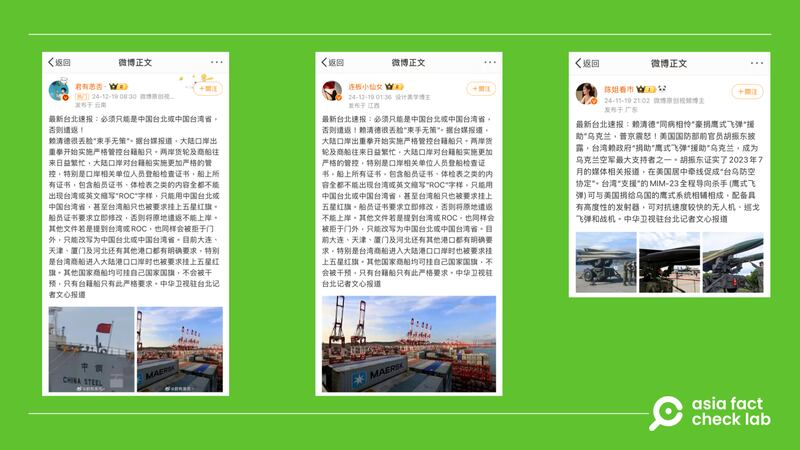

# 事實查覈｜臺灣教育部要“嚴厲處置”舉五星紅旗拍片的高中生？

董喆

2025.01.13 17:53 EST

查覈結果：錯誤

## 一分鐘完讀：

近日臺灣有3名高中生自拍視頻，稱自己來自“臺灣省”並稱呼賴清德爲“賴省長”，要求臺灣2025迴歸祖國，引發臺灣民衆議論。微博有消息稱，臺灣教育單位要嚴厲處置這些高中生。亞洲事實查覈實驗室查證時，臺灣教育部強調，本案並非教育部業務。高中所在地的新北市教育局表示，政治立場表達屬言論自由，提醒學生着校服時要注意言行，但並未提到有任何懲處。

另外，微博消息引述的“中華衛視駐臺記者文心”，經查中華衛視發出的報道，並沒有記者署名“文心”。根據陸委會以及文化部資料，目前中國與港澳臺駐臺媒體並不包含中華衛視。

## 深度分析：

近期傳播於臺灣社羣的一則視頻引發媒體關注，視頻中，新北市某所高中的3名學生手舉五星紅旗，自稱是“臺灣省高中生”，還喊賴清德爲“賴省長”，呼籲“2025之後迴歸祖國”，引發臺灣民衆議論。

事件及影片也傳播到中國社羣平臺微博及網易，有網民以“最新臺北速報”“中華衛視駐臺北記者文心報道”爲開頭，發帖稱臺灣教育部官員要嚴查，並且將嚴厲處置這4名學生。

中國社羣平臺傳播錯誤資訊，稱臺灣教育部嚴懲罰自稱中國臺灣省的高中生。 中國社羣平臺傳播錯誤資訊，稱臺灣教育部嚴懲罰自稱中國臺灣省的高中生。 (圖截取自微博、網易)

亞洲事實查覈實驗室（以下簡稱AFCL）查證，該帖最明顯的錯誤是影片中僅有3名高中生，而非4人。另外，此事登上臺灣新聞媒體版面後，教育主管機關以及校方都有所回應。

臺灣多家媒體如[中央社](https://www.cna.com.tw/news/aipl/202501050171.aspx)、[《聯合報》](https://udn.com/news/story/6898/8470140)和[《自由時報》](https://news.ltn.com.tw/news/NewTaipei/breakingnews/4913965)等皆引述了新北市教育局的說法，表示3名高中生拍攝視頻的動機是爲了博取同儕吸引力，並無特定政治立場，並強調多元社會尊重各種政治立場，惟學生身着校服即代表學校，應留意言行舉止，會要求各校加強宣導網路使用及行爲責任。

亞洲事實查覈實驗室在與臺灣教育部查證時，對方亦告知此事的主管機關爲新北市教育局，並非教育部。另外3位高中生所屬學校校長也公開[接受媒體採訪](https://www.youtube.com/watch?v=aUvGyq3ZJ5A&ab_channel=TVBSNEWS)，表示“他們的想法其實就是博取聲量，吸引小粉紅的注意”並表示學生不知輕重，已口頭告誡。

綜合新北市教育局、教育部以及該高中校長的說法，皆未出現“嚴厲處置”的相關資訊，因此網傳學生受到嚴厲處置的說法是錯誤訊息。

AFCL也發現，微博上有針對臺灣時事的短稿，常以“最新臺北速報”或“中華衛視駐臺北記者文心報道”等名義傳播，但發佈的賬號並不固定，內容取材臺灣時事，不過經常添加評述性內容。

自稱由中華衛視駐臺北記者文心所寫的短文在微博多個賬號廣傳。 自稱由中華衛視駐臺北記者文心所寫的短文在微博多個賬號廣傳。 (圖截取自微博)

又如，2024年臺灣媒體三立新聞接獲讀者爆料，稱有臺灣船員投訴，近期停靠中國港口時，船上所有證書皆不能出現臺灣或是ROC字樣，甚至被要求掛上五星紅旗。主管航港局有回應目前未接獲反應，但“文心”所撰寫的報導中，出現了“賴清德很丟臉束手無策”的情緒性內容。

AFCL進一步搜尋，發現網上有兩家叫做“中華衛視”的媒體。其中一家英文簡稱爲JCHTV，以網站簡介判斷是中國廣西的地方媒體，其記者列表中並未有署名“文心”的記者。另一家則是中華衛視電視集團，根據該集團網站[備份](https://web.archive.org/web/20210111185939/http:/www.chtv.com.hk/index.php/Page/index/id/16.html)，是香港一家衛星電視媒體，但該網站現已關閉，以關鍵字檢索亦沒有找到名叫文心的記者。

根據陸委會資料，目前駐臺中國媒體共計8家、12人，包括人民日報、新華社、中央電視臺、中央人民廣播電臺、中新社、廈門衛視、海峽導報、湖南廣電。其中海峽導報駐點期限至2025年1月23日止，當中不包含中華衛視。

港澳媒體駐臺主管機關文化部回應AFCL，亦表示沒有名爲中華衛視的港澳媒體駐臺。

因此微博傳言宣稱引述自“中華衛視駐臺記者文心”的說法，並無證據。

*亞洲事實查覈實驗室（Asia Fact Check Lab）針對當今複雜媒體環境以及新興傳播生態而成立。我們本於新聞專業主義，提供專業查覈報告及與信息環境相關的傳播觀察、深度報道，幫助讀者對公共議題獲得多元而全面的認識。*

*讀者若對任何媒體及社交平臺傳播的信息有疑問，歡迎以電郵*[*afcl@rfa.org*](mailto:afcl@rfa.org)*寄給亞洲事實查覈實驗室，由我們爲您查證覈實。亞洲事實查覈實驗室更詳細的介紹請參考*[*本文*](2024-10-09_關於亞洲事實查覈實驗室｜About AFCL.md)*。*

*我們另有X、臉書、IG頻道，歡迎讀者追蹤、分享、轉發。 X這邊請進：中文*[*@asiafactcheckcn*](https://twitter.com/asiafactcheckcn)*;英語：*[*@AFCL\_eng*](https://twitter.com/AFCL_eng)*、*[*FB在這裏*](https://www.facebook.com/asiafactchecklabcn)*、*[*IG也別忘了*](https://www.instagram.com/asiafactchecklab/)*。*

[Original Source](https://www.rfa.org/mandarin/shishi-hecha/2025/01/13/fact-check-taiwan-senior-high-students-holding-chinas-flag/)