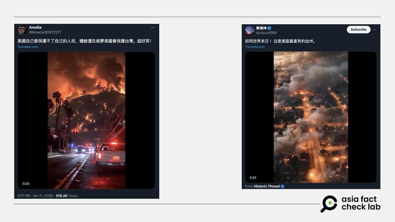
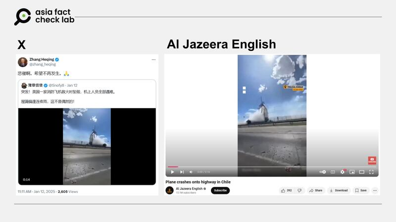

# 事實快查｜AI生成“末日”火災視頻？美國消防飛機救火時墜毀？

莊敬、艾倫

2025.01.14 14:22 EST

美國加州洛杉磯7日起多處發生野火災情，火勢迅速擴大，至今持續延燒，逾十萬居民被迫撤離。火災發生後，中文網絡流傳大量有關洛杉磯野火的影像及信息，亞洲事實查覈實驗室（Asia Fact Check Lab, AFCL）持續監測不實或誤導信息併發布查覈報告。

## 1. 網傳“末日”火災視頻是洛杉磯野火實況嗎？

查覈結果：AI生成

1月11日，X上有中文用戶轉傳一則據稱是洛杉磯野火的實況[視頻](https://x.com/Amelia181672271/status/1878008391957901377)，稱“美國自己都保護不了自己的人民”，嘲諷本次加州大火的嚴重到美國無法挽救，批評臺灣人盲信美國。

獨立評論人“蔡慎坤”也轉發相同[視頻](https://x.com/cskun1989/status/1877975390125441377)，並稱此次災害“如同世界末日”。

社媒平臺傳播的據稱是加州野火實景的視頻 社媒平臺傳播的據稱是加州野火實景的視頻 (圖截取自X)

AFCL將該視頻下載後放進人工智能檢測網站“Hive Ai”進行覈實，得到的結果爲超過97%可能性爲人工智能生成。該視頻也被經常分享AI製圖及動畫的Instagram賬號[“@ai\_creatiions”](https://www.instagram.com/p/DEoJC4HP6e5/)轉發。

人工智能檢測工具的分析結果顯示，此視頻爲AI生成的機率超過九成 人工智能檢測工具的分析結果顯示，此視頻爲AI生成的機率超過九成 (圖截取自“Hive Ai”網站)

臺灣資安專家劉彥伯告訴AFCL，該視頻的畫面過分穩定，“即使用穩定器拍也沒有辦法這樣”，且火焰及煙霧的律動也過於規則，不符合現實野火的情景。

此外，他也強調畫面中出現的警車車牌是個明顯破綻，主因爲目前生成式視頻對文字及數字處理的能力皆不佳，所以通常模糊帶過，除非此處曾進行後製處理。

模糊細節，例如警車車牌號碼，是判定圖片是否爲AI生成的一種依據 模糊細節，例如警車車牌號碼，是判定圖片是否爲AI生成的一種依據 (網傳視頻截圖 AFCL製圖)

專長爲媒體資安的臺灣成功大學統計系教授許志仲則指出，生成式視頻的破綻常出現在移動物件在不同時間的“不一致之處”，例如網傳視頻可以看到，警車經過時，左上方電線不自然晃動的狀況。

他補充，以成大實驗室開發的系統來偵測，判斷該視頻也有85.5%的可能性是由生成式AI製作。

綜合人工智能檢測工具及相關專家的說法，可判定該視頻爲生成式影像，並非真實野火景色。

2. 美國消防飛機救火時墜毀？

查覈結果：錯誤

X上的“藍勾勾”賬號“豫章信使”1月12日以簡體中文[發帖](https://x.com/Snofy8/status/1878244586050502703)，稱“突發！美國一家（應爲架）消防飛機救火時墜毀，機上人員全部罹難。屋漏偏逢連夜雨，這不是偶然的！”文字下方有一段16秒的短視頻，畫面中有架小飛機疑似撞到電線杆，隨即起火併墜落在道路上，而拍攝者似乎坐在汽車上。這則帖子發佈兩天內，已逾20萬次查看，上百人轉傳，其中包括中國外交官[張和清](https://x.com/zhang_heqing/status/1878278573246820735)。

近日在社媒上流傳美國消防飛機救火時墜毀（左）的消息與視頻，但經查網傳畫面爲2024年初智利小飛機事故。 近日在社媒上流傳美國消防飛機救火時墜毀（左）的消息與視頻，但經查網傳畫面爲2024年初智利小飛機事故。 (X、YouTube截圖)

亞洲事實查覈實驗室（Asia Fact Check Lab, AFCL）將視頻截圖反搜後，找到多個相符畫面，包括[半島電視臺英語頻道](https://youtube.com/watch?v=kDpiTmfN9MA)（Al Jazeera English）發佈於YouTube的影像，以及[壹蘋新聞網](https://tw.nextapple.com/international/20240117/E034427D87A20F4F3B1EFE6DE356B5AE)、[《星島日報》](https://www.singtaousa.com/2024-01-16/%e9%a3%9b%e6%a9%9f%e6%92%9e%e9%9b%bb%e7%b7%9a%e6%a1%bf%e7%88%86%e7%82%b8%e6%a9%9f%e5%b8%ab%e6%85%98%e6%ad%bb-%e5%a6%82%e7%81%ab%e7%90%83%e7%9b%b4%e5%a2%ae%e5%85%ac%e8%b7%af%e9%a9%9a%e6%82%9a30/4731351#page8)等媒體報道中的影像。根據他們的說明，這是2024年1月發生在智利的意外事件，當時一架小飛機低飛擦撞電線杆而失控制、爆炸起火，墜毀在高速公路上，造成機師死亡、4人受傷。

經比對2024年1月智利小飛機意外影像，與近日在網路上流傳的視頻畫面內容相同，但網傳視頻經鏡像翻轉處理。前述社媒用戶宣稱“這是美國消防飛機救火時墜毀”的說法，爲錯誤信息。AFCL注意到亦有[英文賬號](https://www.youtube.com/watch?v=Pub1J5uaZrs)傳播這段視頻，宣稱是今年發生在美國加州洛杉磯的墜機事件，已有事實查覈組織發佈[查覈報告](https://newschecker.in/fact-check/old-video-from-chile-shared-as-firefighting-plane-crashing-in-los-angeles/)。

*亞洲事實查覈實驗室（Asia Fact Check Lab）針對當今複雜媒體環境以及新興傳播生態而成立。我們本於新聞專業主義，提供專業查覈報告及與信息環境相關的傳播觀察、深度報道，幫助讀者對公共議題獲得多元而全面的認識。*

*讀者若對任何媒體及社交平臺傳播的信息有疑問，歡迎以電郵*[*afcl@rfa.org*](mailto:afcl@rfa.org)*寄給亞洲事實查覈實驗室，由我們爲您查證覈實。亞洲事實查覈實驗室更詳細的介紹請參考*[*本文*](2024-10-09_關於亞洲事實查覈實驗室｜About AFCL.md)*。*

*我們另有X、臉書、IG頻道，歡迎讀者追蹤、分享、轉發。 X這邊請進：中文*[*@asiafactcheckcn*](https://twitter.com/asiafactcheckcn)*;英語：*[*@AFCL\_eng*](https://twitter.com/AFCL_eng)*、*[*FB在這裏*](https://www.facebook.com/asiafactchecklabcn)*、*[*IG也別忘了*](https://www.instagram.com/asiafactchecklab/)*。*

[Original Source](https://www.rfa.org/mandarin/shishi-hecha/2025/01/14/fast-fact-check-ca-fire-3/)