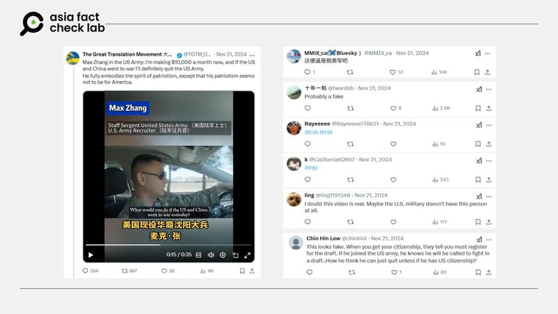

# 事實查覈｜“中美若開戰，我會退出美軍”，視頻中說話的人真是美軍嗎？

作者：莊敬

2025.01.15 16:51 EST

## 查覈結果：正確

## 一分鐘完讀：

2024年底，中文社媒上盛傳一段視頻：一位穿着軍服、自稱爲美國陸軍徵兵官、名爲麥克·張的華裔男子以中文說，如果有一天中美開戰，他會退出美軍，保持中立。這段視頻引起廣泛討論，不少網民質疑其真實性，還有人懷疑張姓男子是“假美軍”。經向美國陸軍查覈，這名張姓男子確實爲陸軍徵兵官，但美國陸軍強調，這則視頻無關官方。

## 深度分析：

2024年11月，X上的[“大翻譯運動”](https://x.com/TGTM_Official/status/1859410556081545616 "https://x.com/TGTM_Official/status/1859410556081545616")上傳了一段35秒的視頻，內容是一位穿着軍服的華裔男子以中文介紹自己是瀋陽人，以及其工作、薪資等資訊。根據視頻上的字幕說明，男子叫麥克‧張（Max Zhang），是名美國陸軍徵兵官。

麥克‧張在視頻中說：“有很多人問我說，如果說某一天，美國和中國打仗，我該怎麼做。第一個如果說美國和中國打仗，我認爲就不現實，因爲美國和中國都屬於強大的國家，所以說我認爲他不會發生的。”

“真假如說發生了打仗了，那我的前提一定會退出美軍，我也不會加入到中國軍隊，因爲我拿的是美國國籍，我會保持一箇中立的態度。”

這則視頻被大量轉發，許多網民留言評論，其中不少人質疑視頻的真實性，也有人懷疑麥克‧張是“假美軍”。

-- 網路盛傳一段華裔美軍談論中美打仗的短視頻，不少網民留言質疑該華裔男子的身份。 (X截圖)

亞洲事實查覈實驗室（Asia Fact Check Lab, AFCL）去年12月初去信美國國防部、陸軍等單位，查詢網傳視頻中“麥克‧張”的身份，並詢問現役軍人在網路上發佈這類言論是否可能違反任何規定。美國陸軍招募司令部發言人Madison Bonzo於今年1月中回覆：“張姓上士是陸軍徵兵官。你所提到的視頻並不是美國陸軍官方的多媒體產品內容。（Staff Sgt. Zhang is an Army Recruiter. The video you are referencing is not an official U.S. Army multi-media product.）”

至於麥克‧張在被公開傳播的視頻裏發表的言論，是否違反相關法律或規定的問題，美國陸軍並沒有回答我們。因此本報告僅確認視頻人物麥克‧張確實美國陸軍徵兵官。至於視頻言論內容和如何傳播等，並不在查覈範疇內。

*亞洲事實查覈實驗室（Asia Fact Check Lab）針對當今複雜媒體環境以及新興傳播生態而成立。我們本於新聞專業主義，提供專業查覈報告及與信息環境相關的傳播觀察、深度報道，幫助讀者對公共議題獲得多元而全面的認識。讀者若對任何媒體及社交軟件傳播的信息有疑問，歡迎以電郵*[*afcl@rfa.org*](mailto:afcl@rfa.org)*寄給亞洲事實查覈實驗室，由我們爲您查證覈實。*

*亞洲事實查覈實驗室更詳細的介紹請參考*[*本文*](2024-10-09_關於亞洲事實查覈實驗室｜About AFCL.md)*。我們另有X、臉書、IG頻道，歡迎讀者追蹤、分享、轉發。X這邊請進：中文*[*@asiafactcheckcn*](https://twitter.com/asiafactcheckcn)*；英文：*[*@AFCL\_eng*](https://twitter.com/AFCL_eng)*、*[*FB在這裏*](https://www.facebook.com/asiafactchecklabcn)*、*[*IG也別忘了*](https://www.instagram.com/asiafactchecklab/)*。*

[Original Source](https://www.rfa.org/mandarin/shishi-hecha/2025/01/15/fact-check-us-army-recruiter-max-zhang/)