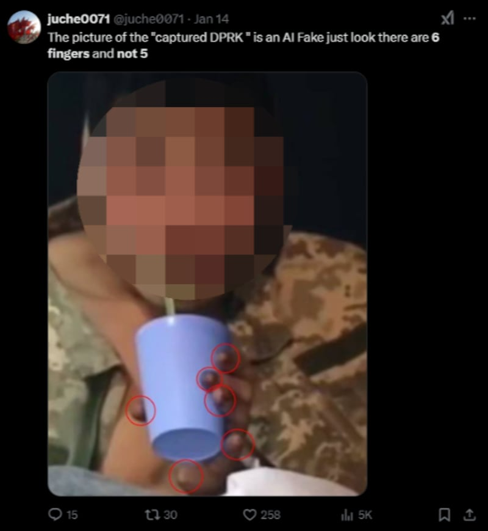
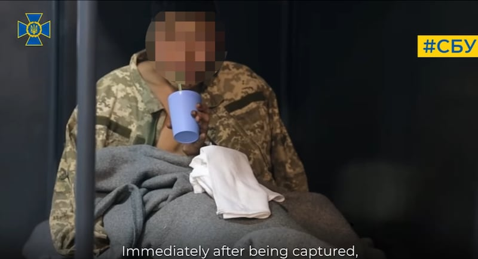
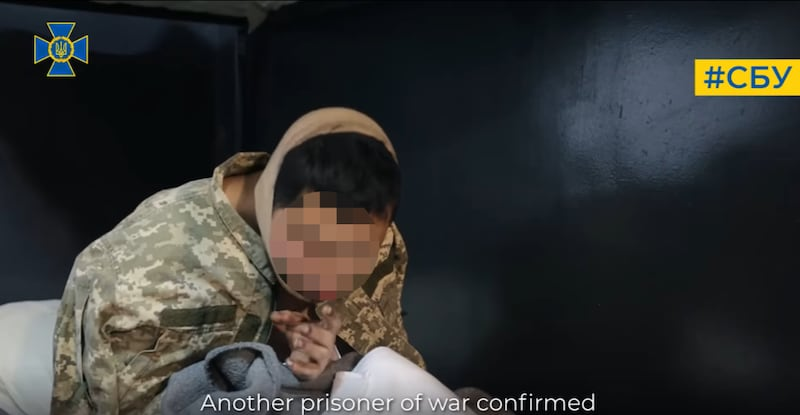
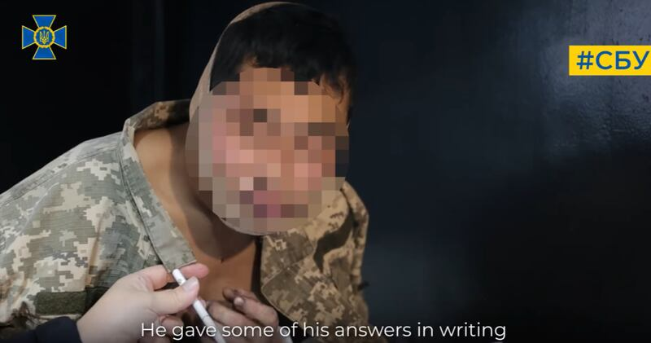
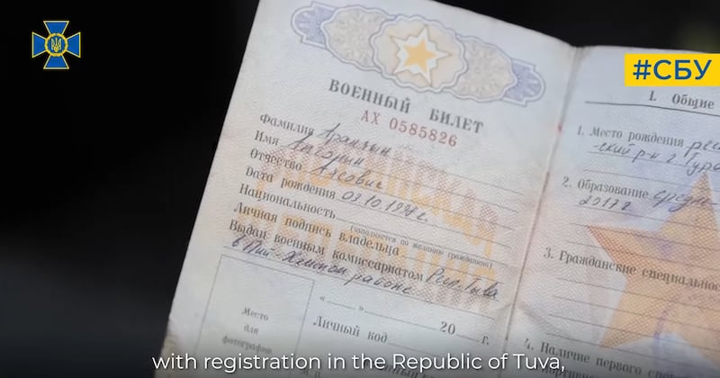
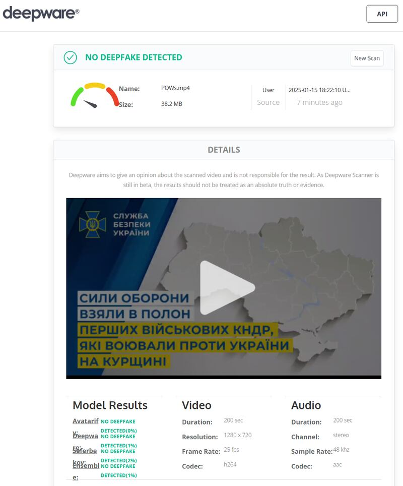
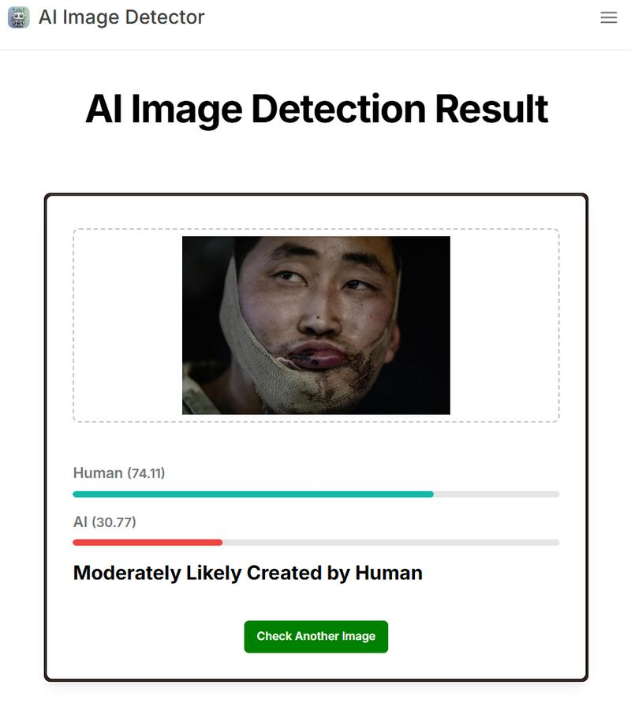

# 事實查覈 |俄烏戰爭中被俘朝鮮士兵視頻是僞造的嗎？

作者：Jamin Anderson、艾倫

2025.01.17 12:53 EST

## 查覈結果：錯誤

## 一分鐘完讀：

近日，烏克蘭發佈了一段朝鮮士兵在俄羅斯庫斯克地區被俘的視頻，引起部分社羣媒體用戶的質疑，認爲這部視頻可能經過變造。

然而，亞洲事實查覈實驗室聯繫的專家分析該視頻後，認爲它是真實的。視頻中受爭議的部分，並非是僞造的痕跡。 多個AI工具程序檢測的結果也顯示，這部該視頻經過數碼變造的可能性很低。對於視頻經過變造的傳言，烏克蘭官方也有否認表態。

## 深度分析：

1月11日，烏克蘭國家安全局（SSU）發佈了[一段視頻](https://www.facebook.com/SecurSerUkraine/videos/1289687142365529/)，聲稱有2名朝鮮士兵在庫斯克被俘虜。

目前，美國和烏克蘭方面的消息稱，有多達1.2萬名朝鮮士兵在庫斯克支援俄羅斯、與烏克蘭對峙，雖然莫斯科和平壤都未承認這一消息。目前，烏克蘭[報告稱](https://www.rfa.org/english/korea/2025/01/06/north-korea-lost-battalion-kursk/)，已有3800餘名朝鮮士兵喪生於戰場。

但一些社羣媒體用戶發文質疑，認爲該視頻似乎被變造過，2025年1月14日在X上發佈的[這則貼文](https://x.com/juche0071/status/1878910778276995447)展示了視頻中男子用吸管喝水的照片，並打下：“被俘獲的DPRK士兵是AI僞造的，看起來有6根手指，而不是5根。”DPRK是朝鮮正式官方名稱“朝鮮民主主義人民共和國”的英文縮寫。

該名X用戶還以紅色圈圈突顯男子的手指，聲稱有6根，並將其視爲AI變造的證據，因爲AI很難精準的描繪手部細節。

有X用戶質疑朝鮮被俘士兵的視頻是被變造的，並圈出可疑之處。但專家分析，這些疑點並不成立。 有X用戶質疑朝鮮被俘士兵的視頻是被變造的，並圈出可疑之處。但專家分析，這些疑點並不成立。 (X截圖)

## 原始視頻中顯示了什麼？

AFCL透過圖片逆向搜尋發現，這張照片是從烏克蘭國家安全局1月11日發佈的[一段視頻](https://www.facebook.com/SecurSerUkraine/videos/1289687142365529/)的第35秒擷取的，前述X帳戶使用的男子照片，可以在視頻的35秒處找到。

烏克蘭方面公佈的視頻35秒處的截圖。 烏克蘭安全部臉書截圖，AFCL對部分圖像模糊處理 (烏克蘭安全部臉書截圖，AFCL對部分圖像模糊處理)

在視頻中，可以看到該男子的左手有點黑色污跡，手掌和手腕交界處的白色區域，似乎造成了第6根手指存在的視錯覺。

對於“第六根手指”的質疑，專長人工智能安全的臺灣國立陽明交通大學副教授遊家牧則說，該處朝鮮士兵的小拇指看起來稍微可疑，但若比對1分32秒後的畫面，看起來又算正常，小拇指的例子難以拿來直接判斷視頻真僞。

細觀視頻其它畫面，包括第2分32秒處，也可以看見該男子的左手有5根手指。

烏克蘭方面公佈的視頻2分32秒處的截圖，顯示視頻中人物左手有五根手指。 烏克蘭方面公佈的視頻2分32秒處的截圖，顯示視頻中人物左手有五根手指。 (烏克蘭安全部臉書截圖，AFCL對部分圖像模糊處理)

因此，“六根手指”的說法是錯誤的，網民質疑的“第六根手指”，其實是截圖時因殘影造成的錯覺。

臺灣資安專家劉彥伯告訴AFCL，視頻中的細節反映出該影像爲真實畫面。

例如，視頻2分36秒處，可以看到一個人將筆遞給朝鮮士兵，“這目前在AI生成上面基本上也會出錯，因爲等於三物件重疊：A手+筆+B手，目前AI處理兩層以上的物件重疊都不太好”。

烏克蘭方面公佈的視頻2分36秒處的截圖，顯示視頻中人物用手接過另一人遞來的筆。 烏克蘭方面公佈的視頻2分36秒處的截圖，顯示視頻中人物用手接過另一人遞來的筆。 (烏克蘭安全部臉書截圖，AFCL對部分圖像模糊處理)

劉彥伯也認爲，視頻中1分43秒出現的身份文件也是判斷關鍵。

“因爲目前AI不可能做出護照上那樣清楚的東西，除非他整個視頻後製過，把真假的東西混在一起”。

烏克蘭方面公佈的視頻1分43秒處的截圖，途中證件的細節清晰可見。 烏克蘭方面公佈的視頻1分43秒處的截圖，途中證件的細節清晰可見。 (烏克蘭安全部臉書截圖)

他補充，比較視頻裏不同時間點朝鮮士兵出現的畫面，無論是臉上的凹陷或手指的傷口位置都一致，這也是判斷視頻爲真的一個原因。

## AI檢測工具怎麼判定？

在使用可檢測AI生成的工具後，也顯示該視頻被變造的可能性低。

AFCL將該視頻用可檢測AI深僞及數位變造的Deepware分析，並沒有發現相關痕跡。深僞是指合成媒體的成果（影像或聲音），可用AI來模仿人臉或人聲，通常生成的效果都很逼真。

可檢測AI深僞及數位變造的Deepware對該視頻的檢測結果爲不存在深僞變造。 可檢測AI深僞及數位變造的Deepware對該視頻的檢測結果爲不存在深僞變造。 (Deepware截圖)

【圖6】可檢測AI深僞及數位變造的Deepware對該視頻的檢測結果爲不存在深僞變造。（Deepware截圖）

此外，Sightengine程式可用於分析影像是否有可能被篡改，AFCL以Sightengine檢查烏克蘭總統澤倫斯基發佈的男子高清照片，判定變造的可能性只有1%；另一項影像分析工具Hive Moderation 評估的可能性僅0.3%。

以上兩種工具得出的結論，皆爲這張照片遭變造、修改的可能性極低。

工具程式“The Image Detector”可評估影像是真人拍攝或AI生成。它對照片的分析也顯示，人類拍的可能性爲74.11%，AI生成的可能性則爲30.77%，人類拍攝的可能性明顯較高。

檢測工具The Image Detector分析顯示，該視頻爲實景拍攝的可能性較高。 檢測工具The Image Detector分析顯示，該視頻爲實景拍攝的可能性較高。 (（The Image Detector截圖）)

【圖7】檢測工具The Image Detector分析顯示，該視頻爲實景拍攝的可能性較高。

烏克蘭官方也回應了網民的質疑。國家安全與國防事務委員會所屬的”虛假資訊打擊中心”，在1月13日於官方X帳號上表示：“政治宣傳管道會散播各種說法，要麼認定這些囚犯來自圖瓦共和國、是俄羅斯人，不然就辯稱他們是南韓人而不是朝鮮人，要不就認爲審訊他們的視頻是自導自演。”

AFCL也針對相關問題發信詢問烏克蘭”虛假資訊打擊中心”，但截至1月15日，該中心尚未回覆自由亞洲電臺的詢問。

*亞洲事實查覈實驗室（Asia Fact Check Lab）針對當今複雜媒體環境以及新興傳播生態而成立。我們本於新聞專業主義，提供專業查覈報告及與信息環境相關的傳播觀察、深度報道，幫助讀者對公共議題獲得多元而全面的認識。讀者若對任何媒體及社交軟件傳播的信息有疑問，歡迎以電郵*[*afcl@rfa.org*](mailto:afcl@rfa.org)*寄給亞洲事實查覈實驗室，由我們爲您查證覈實。*

*亞洲事實查覈實驗室更詳細的介紹請參考*[*本文*](2024-10-09_關於亞洲事實查覈實驗室｜About AFCL.md)*。我們另有X、臉書、IG頻道，歡迎讀者追蹤、分享、轉發。X這邊請進：中文*[*@asiafactcheckcn*](https://twitter.com/asiafactcheckcn)*；英文：*[*@AFCL\_eng*](https://twitter.com/AFCL_eng)*、*[*FB在這裏*](https://www.facebook.com/asiafactchecklabcn)*、*[*IG也別忘了*](https://www.instagram.com/asiafactchecklab/)*。*

[Original Source](https://www.rfa.org/mandarin/shishi-hecha/2025/01/17/fact-check-north-korean-soldier-video-ukraine-russia-war/)