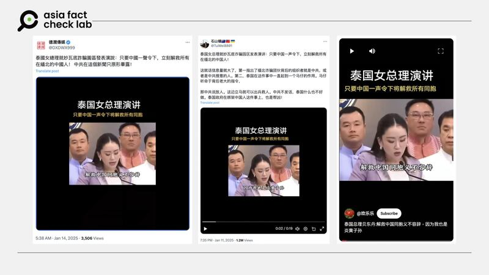

# 事實查覈｜泰國總理說「只要中國一聲令下將解救所有同胞」？

莊敬

2025.01.19 22:16 EST

## 查覈結果：錯誤

## 一分鐘完讀：

近日社媒流傳一則短視頻與相關消息，內容是泰國總理佩通坦宣稱「只要中國一聲令下，立刻解救所有在緬北的中國人！」但查詢泰國政府新聞稿與相關報導，並未查到佩通坦曾發表網傳內容；另請精通泰文的人士檢視視頻，確認佩通坦發言內容和所搭配的中文字幕無關。部分網民將佩通坦的談話配上虛構翻譯字幕，傳播了錯誤信息。

## 深度分析：

近日在[X](https://x.com/DXDWX999/status/1878919575347347623)、[YouTube](https://youtube.com/shorts/cN6gYm4DdBw?feature=shared)等平臺上，流傳一則19秒的短視頻，畫面是泰國總理佩通坦（Paetongtarn Shinawatra）發表談話，視頻搭配的簡體中文字幕寫着「泰國女總理演講，只要中國一聲令下將解救所有同胞」、「解救中國同胞義不容辭，因爲我也是炎黃子孫，我祖籍中國廣東人，透過解救王星得知，還有很多同胞被妙瓦底電詐集團控制人身自由⋯⋯」等內容。

--- 網傳泰國總理發表談話，稱只要中國一聲令下，將解救所有同胞。 (X、YouTube截圖)

亞洲事實查覈實驗室（Asia Fact Check Lab, AFCL）協請一位精通泰文、目前在泰國工作的蔡先生檢視視頻。他表示，影片中佩通坦總理的談話的確與緬甸詐騙有關，內容大致爲：泰國政府成功在美索（泰國邊境城鎮）和人質碰面接應，這件事情很重要，因爲不能影響遊客對泰國的觀感。但受託檢視視頻的蔡先生強調，佩通坦的談話和所搭配的中文字幕沒有關係。

AFCL並將視頻截圖反搜，找到多張相近照片，包括泰國《英文報》（Thai Enquirer）1月7日發佈在X的[帖子](https://x.com/ThaiEnquirer/status/1876523303671910821)，根據其說明，佩通坦表示，網路謠傳泰國對中國旅客來說不安全，她會謹慎處理，以免損害泰國旅遊業。另香港鳳凰衛視在1月7日於X帳號的發文中，也有一段相似的[視頻](https://x.com/PhoenixTV_News/status/1876535838261362690)，其說明泰總理談話與中國演員王星失蹤案相關，但沒有提供詳細內容。

依上述線索，佩通坦發言日期應爲1月7日，場合是當天內閣會議後回應記者提問。根據泰國政府的[新聞稿](https://www.thaigov.go.th/news/contents/details/92092)（以Google翻譯英文），佩通坦表示，失蹤的中國男藝人已找到，並強調政府必須妥善處理此事，以免對旅遊業造成影響，因爲在發生這起事件後，社媒上流傳有關泰國很可怕的謠言。佩通坦並說，泰國與中國一直就此事進行密切磋商。

## 王星失蹤案

據《英國廣播公司》（BBC）[報導](https://www.bbc.com/zhongwen/articles/c9d51p355jdo/trad)，一名中國演員王星1月3日起在泰緬邊境失蹤，1月7日獲救。王星案件引起各界關注，泰國警方稱，王星在泰緬邊境網絡詐騙團伙盤踞的小鎮上被找到，並將他帶到泰國接受訊問。據信他是人口販賣的受害者。

這則報導指出，王星的事件讓一些中國人開始擔心去泰國旅遊是否安全。泰國總理佩通坦週二（1月7日）表示，政府正在盡最大努力減輕該案對泰國作爲旅遊目的地聲譽的影響。

根據泰國官方新聞稿、媒體相關報導，佩通坦並沒有發表網傳內容；精通泰文的蔡先生亦確認佩通坦的發言與視頻上的簡中字幕無關，因此，網傳視頻爲虛構編造的錯誤內容。

*亞洲事實查覈實驗室（Asia Fact Check Lab）針對當今複雜媒體環境以及新興傳播生態而成立。我們本於新聞專業主義，提供專業查覈報告及與信息環境相關的傳播觀察、深度報導，幫助讀者對公共議題獲得多元而全面的認識。讀者若對任何媒體及社交平臺傳播的信息有疑問，歡迎以電郵*[*afcl@rfa.org*](mailto:afcl@rfa.org)*寄給亞洲事實查覈實驗室，由我們爲您查證覈實。*

*亞洲事實查覈實驗室更詳細的介紹請參考*[*本文*](2024-10-09_關於亞洲事實查覈實驗室｜About AFCL.md)*。我們另有X、臉書、IG頻道，歡迎讀者追蹤、分享、轉發。 X這邊請進：中文*[*@asiafactcheckcn*](https://twitter.com/asiafactcheckcn)*;英語：*[*@AFCL\_eng*](https://twitter.com/AFCL_eng)*、*[*FB在這裏*](https://www.facebook.com/asiafactchecklabcn)*、*[*IG也別忘了*](https://www.instagram.com/asiafactchecklab/)*。*

[Original Source](https://www.rfa.org/mandarin/shishi-hecha/2025/01/20/fact-check-thai-premier-chinese-hostage-wangxin/)