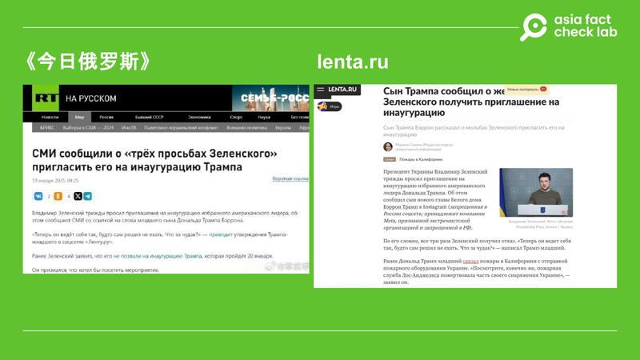
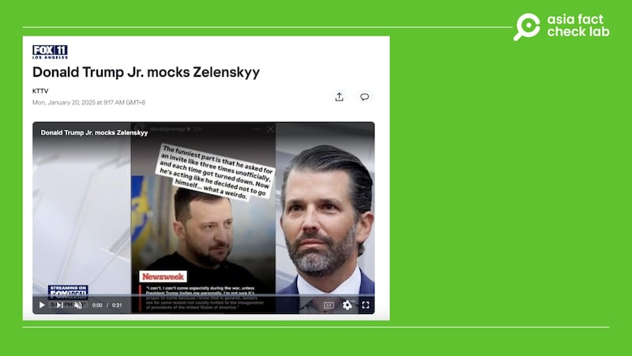

# 事實釐清｜特朗普小兒子巴倫發文嘲諷澤連斯基？

作者：艾倫

2025.01.21 20:39 EST

## 一分鐘完讀：

美國現任總統特朗普於美東時間20日中午宣誓就職。典禮前，中文社媒出現一則消息，內容稱特朗普的小兒子巴倫在Instagram上嘲諷澤連斯基被拒絕參與典禮三次，表現的像個“怪人”，並附上消息來源爲俄羅斯媒體《今日俄羅斯》。

亞洲事實查覈實驗室（Asia Fact Check Lab，下稱AFCL）查證後發現，確實有新聞報道稱特朗普家人在社媒發佈相關言論，但發言的不是巴倫·特朗普（Barron Trump），而是大兒子小唐納德·特朗普（Donald Trump Jr.）。

## 深度分析：

1月20日，微博超過三百萬追蹤的“大V”帳號[軍武季](https://weibo.com/2178514797/Parl8BaRm)轉發一則消息，稱烏克蘭總統澤連斯基曾三度要求參加特朗普的就職典禮，但遭拒絕。消息稱特朗普的小兒子巴倫在社交媒體上寫道：“現在澤連斯基表現得好像離了他，不讓他參加就職典禮效果會不一樣。他是什麼樣的怪人？我們家不歡迎他！”

近期有微博大V發文，稱特朗普的兒子巴倫曾發文嘲諷澤連斯基。 近期有微博大V發文，稱特朗普的兒子巴倫曾發文嘲諷澤連斯基。 (微博截圖)

該微博貼文轉發一張《今日俄羅斯》的報道截圖，AFCL以圖反搜後發現找到[原報道](https://russian.rt.com/world/news/1422837-inauguraciya-tramp-zelenskii)，新聞內容指出巴倫曾在社交媒體上發佈相關說法，引述的來源爲俄羅斯網路新聞媒體“lenta.ru”。

再用關鍵字搜尋“lenta.ru”網站，找到[傳言源頭](https://lenta.ru/news/2025/01/18/syn-trampa-soobschil-o-zhelanii-zelenskogo-poluchit-priglashenie-na-inauguratsiyu/)，該網站指出巴倫曾在社交媒體Instagram上發表相關看法。

相關傳言來自兩個俄羅斯媒體網站。 相關傳言來自兩個俄羅斯媒體網站。 (Russia Today、lenta.ru截圖)

AFCL初步搜尋Instagram，並沒有找到巴倫·特朗普的認證帳號。再以關鍵字於谷歌新聞搜尋，找到美國地方電視臺“洛杉磯FOX 11臺”曾在1月20日發佈報道，指出特朗普的大兒子小唐納德·特朗普（Donald John Trump Jr.）曾在Instagram限時動態（Instagram Stories）中發佈相關說法，並附上截圖。由於Instagram動態並無存檔，AFCL未能獲得該截圖的原始出處，但可以確認截圖顯示中的賬號，確實爲小特朗普的認證賬號。

美國地方電視臺報道，小特朗普曾在社媒上嘲諷澤連斯基。 美國地方電視臺報道，小特朗普曾在社媒上嘲諷澤連斯基。 (洛杉磯FOX 11臺截圖)

因此，網傳“特朗普兒子嘲諷澤連斯基”被拒絕參加就職典禮的消息確有公開報道，但其原始出處爲Instagram限時動態，並無存檔保留。並且，被報道在Instagram做此表態的並非如中國社交媒體和俄羅斯媒體所傳，是特朗普的小兒子巴倫，而是他的大兒子小唐納德·特朗普。

作爲特朗普最小的孩子，18歲的巴倫·特朗普一直備受媒體關注，就職儀式期間，因其高大的身材外貌特徵，巴倫再引社交媒體熱議。然而，據美國媒體《棕櫚灘郵報》（The Palm Beach Post）[報道](https://www.palmbeachpost.com/story/news/2024/09/03/barron-trump-photos-twitter-melania-instagram-facebook-youtube-tiktok/75052160007/ "https://www.palmbeachpost.com/story/news/2024/09/03/barron-trump-photos-twitter-melania-instagram-facebook-youtube-tiktok/75052160007/")，相較特朗普家族裏的其他人，巴倫在社媒上較爲低調，目前並沒有特別經營任何平臺。

*亞洲事實查覈實驗室（Asia Fact Check Lab）針對當今複雜媒體環境以及新興傳播生態而成立。我們本於新聞專業主義，提供專業查覈報告及與信息環境相關的傳播觀察、深度報道，幫助讀者對公共議題獲得多元而全面的認識。讀者若對任何媒體及社交軟件傳播的信息有疑問，歡迎以電郵*[*afcl@rfa.org*](mailto:afcl@rfa.org)*寄給亞洲事實查覈實驗室，由我們爲您查證覈實。*

*亞洲事實查覈實驗室更詳細的介紹請參考*[*本文*](2024-10-09_關於亞洲事實查覈實驗室｜About AFCL.md)*。我們另有X、臉書、IG頻道，歡迎讀者追蹤、分享、轉發。X這邊請進：中文*[*@asiafactcheckcn*](https://twitter.com/asiafactcheckcn)*；英文：*[*@AFCL\_eng*](https://twitter.com/AFCL_eng)*、*[*FB在這裏*](https://www.facebook.com/asiafactchecklabcn)*、*[*IG也別忘了*](https://www.instagram.com/asiafactchecklab/)*。*

[Original Source](https://www.rfa.org/mandarin/shishi-hecha/2025/01/22/fact-check-barron-trump-mocking-zelenskyy/)