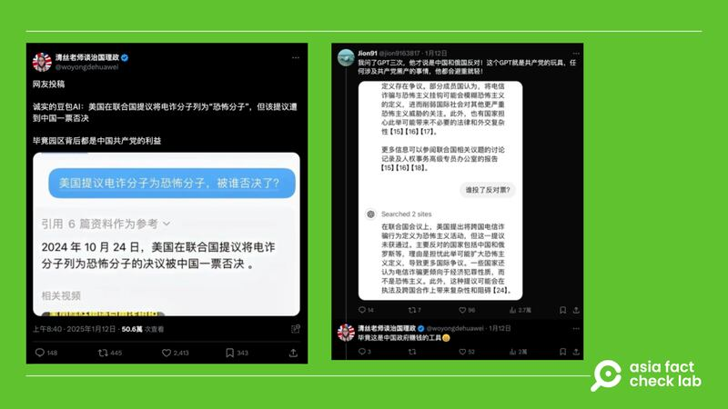
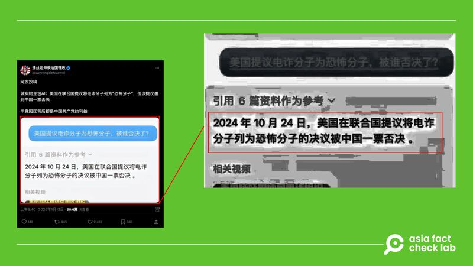
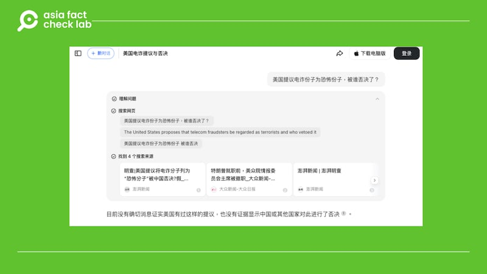

# 事實查覈｜美國在聯合國提議將電詐犯列爲“恐怖分子”，但遭中國否決？

董喆

2025.01.22 19:12 EST

## 查覈結果：錯誤

## 一分鐘完讀：

近日，社媒平臺上有人稱美國曾在聯合國提議將電信詐騙分子列爲恐怖分子，但被中國否決，並附上一張人與生成式AI機器人對話的內容截圖作爲證據。

亞洲事實查覈實驗室查閱聯合國會議記錄，確認迄今並未有任何國家正式提出要將電信詐騙分子列爲恐怖分子，中國也沒有過否決該提議的記錄。此外，該截圖確實與字節跳動旗下AI工具“豆包”形式相同，但以圖片鑑識工具Forensically檢測，可以發現對話有被變造的痕跡。

## 深度分析：

近期，中國藝人王星從緬甸詐騙園區獲救，緬甸電信詐騙問題再次受到討論。X上有中國網友稱，以“美國提議電詐分子爲恐怖分子，被誰否決了？”詢問字節跳動旗下AI“豆包”，結果是被中國否決。另外，留言處有網友稱，他以同樣問題問了OpenAI開發的ChatGPT共3次，ChatGPT才說是中國和俄國反對。

網傳消息以生成式AI的對答，作爲美國提案將電詐分子列爲恐怖分子的證據 網傳消息以生成式AI的對答，作爲美國提案將電詐分子列爲恐怖分子的證據 (圖取自X)

## 美國是否曾提議將電詐分子列入恐怖分子？

亞洲事實查覈實驗室（以下簡稱AFCL）以關鍵字查詢，發現中國社羣媒體上確實傳播“美國提案將緬甸詐騙園區列爲恐怖組織”的[說法](https://www.163.com/dy/article/JLKR49FV055673D0.html)，但以關鍵字查詢，近期美國官方發表與緬甸有關的言論，是美國國務院於2025年1月20日更新的[美緬關係介紹](https://www.state.gov/u-s-relations-with-burma/)，主題在譴責緬甸政府違反人道的行爲，當中並未提到有關詐騙與恐怖分子相關的言論。AFCL以電郵向美國國務院查證，至截稿前未獲回應。

而查詢聯合國安理會2024年至今的[會議記錄](https://research.un.org/en/docs/sc/quick/meetings/2024)，其中也並未有任何國家提案將電詐分子列爲恐怖分子。

## 網傳“豆包”的對話截圖是否真實？

首先，AFCL以抖音上的展示影片，確認網傳截圖和字節跳動於2024年正式推出的AI工具“豆包”格式相同。但進一步利用圖片鑑識工具[Forensically](https://29a.ch/photo-forensics) 檢測，網傳截圖在[“主成份分析（Principal Component Analysis，PCA）”](https://29a.ch/2016/08/11/principal-component-analysis-for-photo-forensics/)這項參數上，顯示有變造痕跡，高度可能經過重製。

以圖片鑑識工具檢測網傳消息中AI的回答截圖，結果顯示有變造痕跡 以圖片鑑識工具檢測網傳消息中AI的回答截圖，結果顯示有變造痕跡 (圖截取自Ｘ、Forensically)

AFCL複製實驗，在“豆包”上輸入相同的問題：“美國提議電詐分子爲恐怖分子，被誰否決了？”。結果顯示“目前沒有確切消息證實美國有過這樣的提議”，也不存在提案被否決的情形。

AFCL詢問“豆包”同樣的問題，顯示結果爲“沒有確切消息證實該提案” AFCL詢問“豆包”同樣的問題，顯示結果爲“沒有確切消息證實該提案” (圖取自豆包)

## 生成式AI是否可信？

臺灣中央研究院資訊科學研究所研究員[王新民](https://homepage.iis.sinica.edu.tw/pages/whm/vita_zh.html)依據字節跳動公開的“豆包算法及模型備案公示說明”向AFCL解釋，豆包與目前市面上常見的大型語言模型（LLM）的原理相同，皆是使用transformer模型，以文字接龍的概念生成對話。

AFCL過去曾針對大型語言模型的原理，推出[專題報道](2023-03-16_事實查覈 ｜ ChatGPT專題之二：爲什麼它有時胡說八道？.md)，說明AI給出的答案未必可信。以ChatGPT爲例，GPT仰賴大量的網路資料學習來完成“文字接龍”，例如使用者給出“今天”，GPT便被訓練要接上“是”; 當看見“今天是”便要學會接上“星期”，循序漸進的完成“今天是星期三”的完整句子。GPT採用文字接龍，但接續的文字有許多種組合的可能，因此模型會針對這些組合列出機率，將爬梳所有文本後較高機率的文字接龍提供給使用者，而非給出正確答案。

[ChatGPT專題之一：當人工智慧遇上敏感詞](2023-03-06_事實查覈 ｜ ChatGPT專題之一：當人工智能遇上敏感詞.md)

[ChatGPT專題之二：爲什麼它有時會胡說八道？](2023-03-16_事實查覈 ｜ ChatGPT專題之二：爲什麼它有時胡說八道？.md)

過去AFCL亦曾探討語言模型的偏見，當時臺灣人工智慧實驗室創辦人杜奕瑾告訴AFCL，人工智慧在做語言模型訓練時，其實會把文本內容偏見及思想學習起來，而偏見的來源即是收集來的語料庫以及人工標註，“用哪個市場訓練，就是那個地方文化思想的輸出。 ”

AFCL亦發現，在與“豆包”的對答之中，其引用的參考資料皆爲中國網站，王新民推測，如果僅出現中國網站，這個生成式AI在訓練時大概率僅使用中國網站的資料。

王新民亦提到，在臺灣也有僅用臺灣資料訓練的模型“TAIDE”。TAIDE模型目的就是要打造一個臺灣在地化的AI對話引擎，促進AI模型更精準的理解與運用繁體中文，其[訓練資料](https://taide.tw/index/training-data?type=0)有被公開披露。

*亞洲事實查覈實驗室（Asia Fact Check Lab）針對當今複雜媒體環境以及新興傳播生態而成立。我們本於新聞專業主義，提供專業查覈報告及與信息環境相關的傳播觀察、深度報道，幫助讀者對公共議題獲得多元而全面的認識。*

*讀者若對任何媒體及社交平臺傳播的信息有疑問，歡迎以電郵*[*afcl@rfa.org*](mailto:afcl@rfa.org)*寄給亞洲事實查覈實驗室，由我們爲您查證覈實。亞洲事實查覈實驗室更詳細的介紹請參考*[*本文*](2024-10-09_關於亞洲事實查覈實驗室｜About AFCL.md)*。*

*我們另有X、臉書、IG頻道，歡迎讀者追蹤、分享、轉發。 X這邊請進：中文*[*@asiafactcheckcn*](https://twitter.com/asiafactcheckcn)*;英語：*[*@AFCL\_eng*](https://twitter.com/AFCL_eng)*、*[*FB在這裏*](https://www.facebook.com/asiafactchecklabcn)*、*[*IG也別忘了*](https://www.instagram.com/asiafactchecklab/)*。*

[Original Source](https://www.rfa.org/mandarin/shishi-hecha/2025/01/23/fact-check-us-suggest-tele-spam-terrorist/)