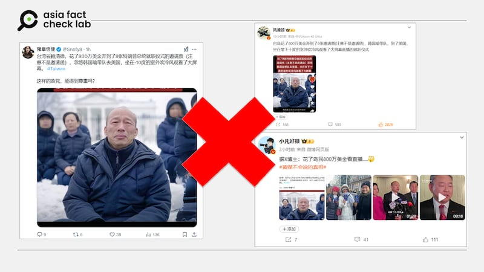
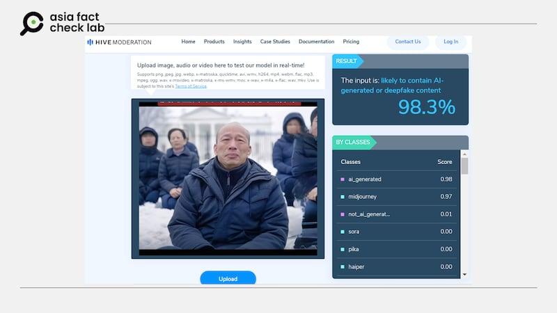
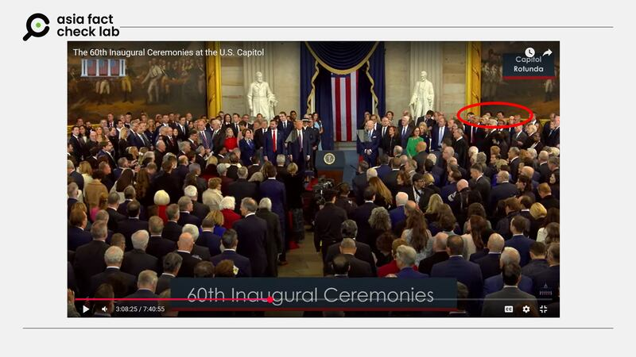
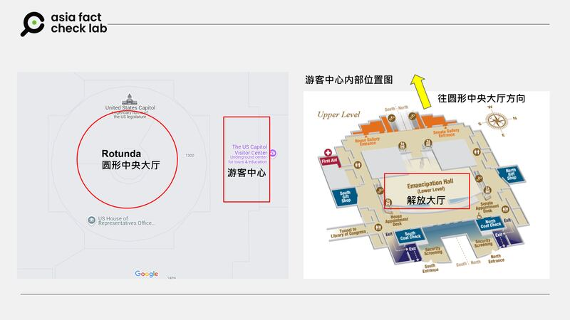
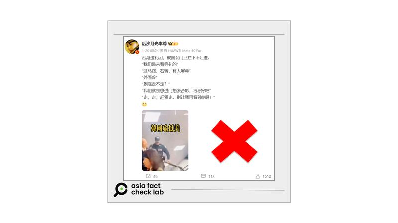

# 事實快查｜特朗普就職典禮，臺灣代表團被攔、在雪地看轉播？

作者：鄭崇生

2025.01.24 14:48 EST

美國總統特朗普（Donald Trump）已於1月20日宣誓就職，因極寒天氣，就職典禮移至室內，各國代表團分別以不同形式觀禮。然而，在中文社媒流傳不少稱臺灣代表團被美國冷落、拒絕的錯假、誤導信息，更有“大V”把人工智能（AI）生成圖像當新聞現場傳播。

亞洲事實查覈實驗室（Asia Fact Check Lab，AFCL）針對以下幾則傳言做了查證、釐清。

## 臺灣立法院長韓國瑜在雪地上看典禮轉播？

## 查覈結果：錯誤

X上名爲“[豫章信使](https://archive.ph/wip/WH1tn)”的用戶、新浪微博上復旦大學教授[沈逸](https://archive.ph/44MXO)與“[小凡好攝](https://archive.ph/ZyKPZ)”等人都使用一張人物面孔極似韓國瑜皺着眉頭、身着深藍色外套坐在雪地上的照片，他的背後是一棟看起來和白宮有相似造型的建築物，並和其他幾個跪坐者聚在一起。“豫章信使”更聲稱，這是“臺灣總統賴清德政府以花錢買票的方式，“忽悠韓國瑜帶隊去美國，坐在-10度的室外吹冷風看了大屏幕。 ”

中文社媒傳播虛假圖片，稱臺灣立法院長韓國瑜被拒絕參加特朗普就職典禮。 中文社媒傳播虛假圖片，稱臺灣立法院長韓國瑜被拒絕參加特朗普就職典禮。 (微博截圖，AFCL加註)

首先，圖片中的主角面孔看起來的確很像韓國瑜，但在他背後的人物五官都相當模糊，這符合AI生成圖片的一般特徵。 因此，AFCL針對這張圖片進行AI生成檢測，工具軟件Hive的判讀結果，本圖以AI生成的機率高達98%。

網傳圖片經檢測，大概率爲AI軟件生成。 網傳圖片經檢測，大概率爲AI軟件生成。 (Hive軟件截圖)

其次，這張合成照的背景建物造型，與美國白宮確實相似，然而，美國總統的就職典禮近一百年中都不是在白宮前舉行的，而是在離白宮不遠處的國會山莊（Capitol Hill）。今年更因爲寒冷天氣，[就職典禮國會聯合委員會](https://www.inaugural.senate.gov/press_release/statement-on-60th-inaugural-ceremonies/)（Joint Congressional Committee on Inaugural Ceremonies, JCCIC）將這次就職儀式從過去常以國會大廈西側廣場的[戶外場地](https://www.aoc.gov/what-we-do/programs-ceremonies/inauguration)，移到國會室內的圓形中央大廳（Rotunda）舉辦，這個做法在1985年裏根總統第二任就職時也有過先例。

根據[媒體報道](https://www.nytimes.com/2025/01/20/us/politics/trumps-indoor-inauguration.html)，就職典禮移至室內後，現場可容納人數大大減少。

中國國家副主席韓正代表習近平出席了就職儀式，他由中國駐美大使謝鋒陪同，和阿根廷總統米萊（Javier Milei）與意大利總理梅洛尼（Giorgia Meloni）都坐在圓形中央大廳的舞臺上，位置是面對舞臺右方的最後一排位置（如下截圖紅圈處）。

美國總統特朗普就職典禮，中國代表團出席現場。 美國總統特朗普就職典禮，中國代表團出席現場。 (JCCIC轉播視頻截圖，AFCL加註)

根據臺灣駐美代表處的新聞稿與所提供的照片，臺灣立法院長韓國瑜確實不在就職宣誓現場，而是在“國會大廈內另一大廳透過轉播觀禮”，這另一大廳實際上就是國會大廈遊客中心（CVC）的解放大廳（Emancipation Hall）。在這個場地的特別賓客還看包括[烏克蘭大使](https://www.thenews.com.pk/print/1274409-giuliani-snags-a-seat-but-vips-lose-theirs-as-inauguration-moves-inside)馬卡洛娃（Oksana Markarova）、[紐約市長亞當斯](https://www.usatoday.com/story/news/politics/2025/01/20/trump-oath-of-office-capitol-rotunda/77836295007/)（Eric Adams）等，因此，臺灣代表受到的接待規格算是適當。

而臺灣代表團這次包括韓國瑜在內共8位成員，都是臺灣的民意代表，由三個政黨的民選區域立委及不分區立委組成，在1月20日就職典禮當天，7位立委都是到華盛頓市中心的第一資本體育場（Capital One Arena）包廂看轉播，並沒有到國會。

關於舉行宣誓就職典禮的圓形中央大廳與遊客中心的相對位置，AFCL根據CVC官網上的地圖與谷歌地圖綜合整理後製如下所示。

就職典禮場地示意圖。 就職典禮場地示意圖。 (素材取自CVC官網與谷歌地圖，AFCL製圖)

## 臺灣代表團觀禮“被國會門衛攔下”？

## 查覈結果：錯誤

微博上，名爲[“月光沙本尊”](https://archive.ph/HoiMd)的用戶則是以一張有韓國瑜及臺灣立委、也是這次臺灣代表團成員之一的陳昭姿移動中的照片，宣稱臺灣代表團成員要“看典禮、國會門衛攔下不讓進”。

但這不是事實。將這個截圖並對比[臺灣媒體報道](https://www.youtube.com/watch?v=4iSh8nIcj98)可以發現，圖片中的場景就職典禮後隔天、臺灣團成員們赴國會拜會美國議員的視頻截圖，並不是就職典禮當天，而報道視頻全景也顯示，臺灣團並未遭到阻攔。

微博上傳播臺灣代表團“被國會門衛攔下”的截圖，並非就職當天現場,也並非事件全貌。 微博上傳播臺灣代表團“被國會門衛攔下”的截圖，並非就職當天現場,也並非事件全貌。 (微博截圖)

## 臺灣代表團成員花了800萬買票看直播？

## 查覈結果：缺乏證據

微博用戶[“小凡好攝”](https://archive.ph/ZyKPZ)以及X用戶[“豫章信使”發文](https://archive.ph/wip/WH1tn)稱，所謂臺灣代表團“花800萬美金弄到8張門票看直播”的說法，則沒有公開資料可證實上述說法是否屬實。

根據參與臺灣代表團成員之一、立委柯志恩在[個人臉書](https://www.facebook.com/KoChihEn/posts/pfbid02qPsV6NP1zSCmEhcE2Z2NGLrGmefSemnQTHwk54x9nfPNPAX3vfTPGQhbhvYtSBfUl?rdid=TkgUgBnzxpd6ZJwN#)（facebook）上的發文和照片，臺灣代表團在第一資本體育場貴賓席觀看轉播。根據[JCCIC](https://www.inaugural.senate.gov/frequently-asked-questions/)，除了就職典禮本身以及在國會內舉行的活動如午宴之外，其他所有慶祝就職的相關正式活動都是由另一個總統就職委員會（Presidential Inaugural Committee, PIC）主辦，這個委員會是代表總統勝選者的非營利組織，接受外界捐款以用於主辦就職相關活動。

根據[《紐約時報》報道](https://www.nytimes.com/2025/01/08/us/politics/trump-inauguration-donors.html)，確實有支持者通過捐款取得就職相關活動的入場機會。但PIC並不公開出售門票，且並非所有觀禮者都是通過捐款獲得入場機會。PIC委員會並不接受外國國籍者捐款。

因此，前述貼文稱臺灣的代表團是“買票進場看直播”，並提出具體金額是800萬美元，並沒有公開證據可以證實。

*亞洲事實查覈實驗室（Asia Fact Check Lab）針對當今複雜媒體環境以及新興傳播生態而成立。我們本於新聞專業主義，提供專業查覈報告及與信息環境相關的傳播觀察、深度報道，幫助讀者對公共議題獲得多元而全面的認識。讀者若對任何媒體及社交軟件傳播的信息有疑問，歡迎以電郵*[*afcl@rfa.org*](mailto:afcl@rfa.org)*寄給亞洲事實查覈實驗室，由我們爲您查證覈實。*

*亞洲事實查覈實驗室更詳細的介紹請參考*[*本文*](2024-10-09_關於亞洲事實查覈實驗室｜About AFCL.md)*。我們另有X、臉書、IG頻道，歡迎讀者追蹤、分享、轉發。X這邊請進：中文*[*@asiafactcheckcn*](https://twitter.com/asiafactcheckcn)*；英文：*[*@AFCL\_eng*](https://twitter.com/AFCL_eng)*、*[*FB在這裏*](https://www.facebook.com/asiafactchecklabcn)*、*[*IG也別忘了*](https://www.instagram.com/asiafactchecklab/)*。*

[Original Source](https://www.rfa.org/mandarin/shishi-hecha/2025/01/24/taiwan-delegation-rejected-trump-inauguration/)