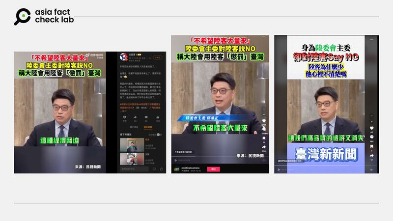

# 事實查覈｜臺灣陸委會主委公開對陸客說不？

董喆

2025.01.23 19:23 EST

## 查覈結果：錯誤、誤導

## 一分鐘完讀：

近期微博上有賬號發佈視頻稱，臺灣陸委會主委邱垂正不希望陸客大量進入臺灣，發佈者諷刺臺灣早就不在中國人的旅遊名單上，要“灣灣(臺灣人)別自嗨”。經查，該視頻原始畫面出自臺灣民視節目“新聞觀測站”，邱垂正當時提到的“不希望陸客大量來臺”是引述他人意見，而非他本人的看法。網傳視頻既有移花接木的錯誤信息，又有過度解讀邱垂正發言的誤導信息。

## 深度分析：

微博賬號“法國漂”於1月13日發帖稱，東南亞國家因爲電信詐騙問題，已不再是中國民衆出國旅遊的選擇。同時該賬號也引用了一則視頻，內容是臺灣陸委會主委邱垂正受訪談話，繁體字幕寫着：“不希望陸客大量來，陸委會主委對陸客說NO，稱大陸會用陸客懲罰臺灣”。該賬號評論稱，臺灣更不在中國人旅遊名單上，要“灣灣”別自嗨。而這則附字幕的視頻並非該賬號首發，可溯源至TikTok。

臺灣陸委會主委邱垂正“向陸客說不”的視頻在中文社媒傳播 臺灣陸委會主委邱垂正“向陸客說不”的視頻在中文社媒傳播 (圖取自微博、TikTok)

從這則視頻右下角的標註可知，其影片的原始出處應爲臺灣民視新聞，亞洲事實查覈實驗室查證，該視頻畫面確實出自民視新聞節目“新聞觀測站”於2025年1月4日播出的邱垂正專訪。視頻引用的內容如下：

[5分35秒](https://youtu.be/HDkhwAkZ47M?si=pr2Y3fylTptHJSod&t=335)起，邱垂正談及上海副市長宣佈積極推動陸客團客來臺，臺灣社會的輿論反應。以下爲該段逐字稿：

“上海副市長宣佈了上海將積極推動陸客組團來臺，我們第二天，陸委會就接到100多通的電話，還有媒體的，就是傳各種的訊息給陸委會，他們反對。他們反對的原因，就是說臺灣的旅遊品質，不希望陸客大量來造成很多混亂，或是說過去陸客是低價團進來，讓高品質的旅遊又消失。包括演唱會一票難求，陸客進來會更壓縮買票的機會，等等很多外部性的問題，臺灣社會是有不同意見的。”

由此可知，“不希望大量陸客來臺”的說法，實際上是邱垂正轉述陸委會收到百通包含民衆與媒體的意見，並非陳述他自己的觀點。

緊接着，[6分24秒](https://youtu.be/HDkhwAkZ47M?si=dgECBvYxehpiSv75&t=384)開始，邱垂正提到陸委會對陸客來臺的關注重點，是“健康、有序”，他並提到陸客來臺並非完全是“市場導向”，旅行者需要向大陸官方申請大通證，這就有了“政策導向”的可能性。因爲如果臺灣有些政策是“大陸不願意看到的”，大陸就可能會利用陸客“作爲籌碼”給臺灣的旅遊業者施壓，用經濟手段懲罰臺灣，以脅迫臺灣的業者表態支持大陸。邱垂正說：“這個我們都要高度地關注。”接着他提到：

“當然，陸客來臺對於促進兩岸人民瞭解，是一個非常重要的渠道，也是緩和兩岸關係的一個重要的交流政策。”

由此可見，邱垂正對開放大陸游客到臺灣的政策本身持正面態度，而網傳視頻中解讀邱垂正說“大陸會用陸客懲罰臺灣”是斷章取義和過度解讀。在民視專訪視頻中，邱垂正僅表示要“高度關注”是否有經濟脅迫或政治脅迫的風險，以防一線的業者屆時蒙受損失。

臺灣2011年開放陸客自由行，範圍包含中國47個城市居民，採行前申請。2019年中國文旅部[宣佈](https://www.mct.gov.cn/whzx/ggtz/201907/t20190731_845439.htm)自該年8月1日起暫停47個城市的人民來臺自由行，緊接2020年新冠疫情爆發，兩岸旅遊業陷入停擺。臺灣亦基於防疫宣佈中國人士暫緩入境。

2023年5月新冠肺炎在臺降級至第4類傳染病，陸委會同年[恢復](https://www.mac.gov.tw/News_Content.aspx?n=05B73310C5C3A632&sms=1A40B00E4C745211&s=6245AA71E1396CC6)探親與陸生、部分商務交流等大陸人士入境，以及第三地陸客來臺觀光，其餘事由爲專案申請。

2025年1月17日，中國文旅部開放福建、上海兩地[赴臺團體旅遊](https://www.mct.gov.cn/whzx/whyw/202501/t20250117_957922.htm)。

由上述歷史脈絡可知，除了疫情期間以防疫爲由禁止大陸人士來臺，2011年至今，陸委會皆採取有條件開放的政策，爲大陸游客訪臺提供便利。

*亞洲事實查覈實驗室（Asia Fact Check Lab）針對當今複雜媒體環境以及新興傳播生態而成立。我們本於新聞專業主義，提供專業查覈報告及與信息環境相關的傳播觀察、深度報道，幫助讀者對公共議題獲得多元而全面的認識。*

*讀者若對任何媒體及社交平臺傳播的信息有疑問，歡迎以電郵*[*afcl@rfa.org*](mailto:afcl@rfa.org)*寄給亞洲事實查覈實驗室，由我們爲您查證覈實。亞洲事實查覈實驗室更詳細的介紹請參考*[*本文*](2024-10-09_關於亞洲事實查覈實驗室｜About AFCL.md)*。*

*我們另有X、臉書、IG頻道，歡迎讀者追蹤、分享、轉發。 X這邊請進：中文*[*@asiafactcheckcn*](https://twitter.com/asiafactcheckcn)*;英語：*[*@AFCL\_eng*](https://twitter.com/AFCL_eng)*、*[*FB在這裏*](https://www.facebook.com/asiafactchecklabcn)*、*[*IG也別忘了*](https://www.instagram.com/asiafactchecklab/)*。*

[Original Source](https://www.rfa.org/mandarin/shishi-hecha/2025/01/24/fact-check-taiwan-mac-say-no-to-mainland-tourist/)