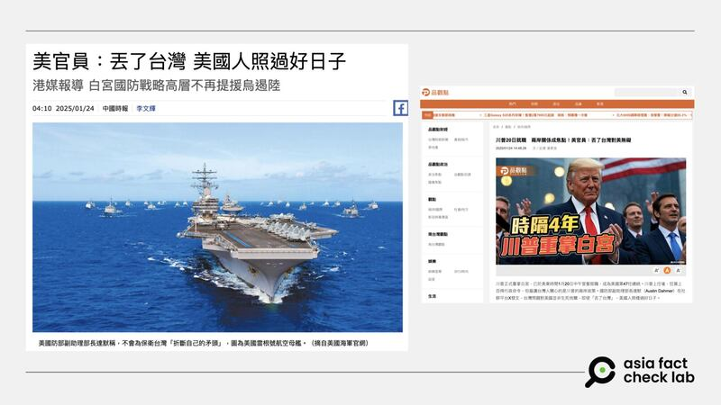
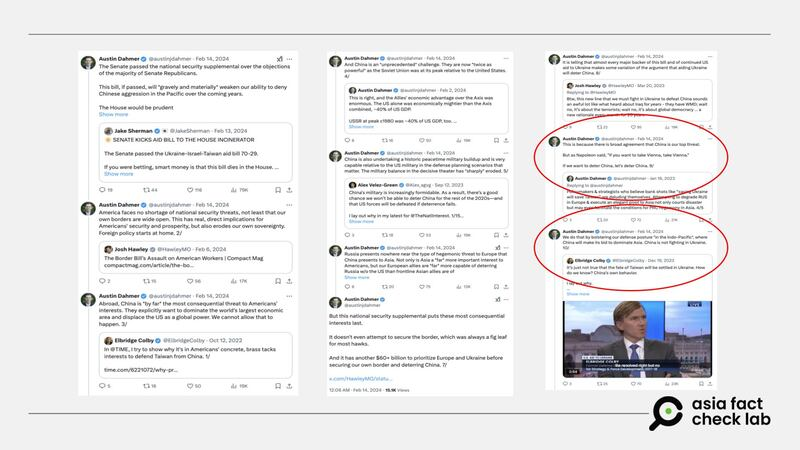
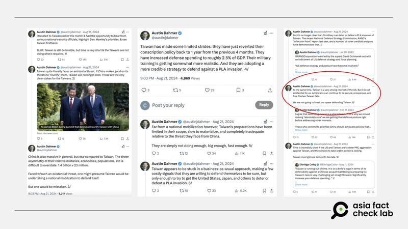

# 事實釐清｜特朗普政府高官說“丟了臺灣 美國人照過好日子”？

作者：莊敬

2025.01.27 13:21 EST

## 一分鐘完讀：

近日，有臺灣媒體報道，美國特朗普政府的國防官員達默（Austin Dahmer）說“丟了臺灣 美國人照過好日子”。這番言論引發討論，並有大量中國網絡媒體轉載，稱這是特朗普政府釋放“微妙的信號”。亞洲事實查覈實驗室檢視相關報道與達默在社媒上發佈的原文後，認爲有些部分需要釐清。達默的言論發表於去年，當時其身份並非國防官員，並不能代表新政府表態，並且，他原文是爲強調臺灣應更積極投入防衛，但報道過於簡化其觀點。

## 深度分析：

臺灣媒體《[中國時報](https://www.chinatimes.com/newspapers/20250124000447-260119?chdtv)》引述香港《[南華早報](https://www.scmp.com/news/china/military/article/3295874/pentagon-appointments-suggest-trumps-scepticism-about-ukraine-and-its-impact-taiwan)》1月23日報道，指美國總統特朗普（Donald Trump, 又譯川普）走馬上任，五角大廈負責印太事務的一些高層官員，已不再將臺灣問題與烏克蘭類比，也不再提倡“援烏能遏制中國”等觀點。

“被任命爲負責戰略事務的國防部副部長達默（Austin Dahmer）在社羣平臺X直言，臺灣問題對美國並非生死攸關，即使’丟了臺灣’（When Taiwan falls），美國人照樣過好日子。”《中國時報》在1月24日刊出題爲《美官員：丟了臺灣美國人照過好日子》的報道中這樣寫。

這篇報道介紹達默以及其他獲任命國防官員的背景，並在報道後段說明了達默發文的時間是在“去年”。然而，部分報道如“品觀點”、“風傳媒”等翻譯、改寫後，未提供達默發言的來龍去脈，以及其發言時的時間與身份等重要信息，恐誤導民衆。更有一些中國社媒賬號也紛紛跟進，並進一步將達默的發言稱爲“[微妙的信號](https://h5.ifeng.com/c/vivo/v002Qh9W6AJl5oGJbsr0eSE1wX--uUIqHpxNYRyAsO1hyUGA__)”，以及特朗普已經準備“[棄臺”](https://baijiahao.baidu.com/s?id=1822034118841452253&wfr=spider&for=pc)。

但達默是2024年8月在X上發佈[一連串帖子](https://x.com/austinjdahmer/status/1826243636851318857)，當時他是美國聯邦參議員霍利（Josh Hawley）的幕僚。因此，無論《中國時報》或其他網絡媒體報道在標題或內文中，以“美官員”、“國防部副助理部長”頭銜報道達默去年中的發言，都是不正確的陳述。

近日華文媒體報道美國特朗普政府官員說“丟了臺灣 美國人照過好日子”。 近日華文媒體報道美國特朗普政府官員說“丟了臺灣 美國人照過好日子”。 (中國時報、“品觀點”網站截圖)

## 達默在社媒上說了什麼？

《中國時報》的報道寫道：去年，美國參議院通過950億美元援助烏克蘭和以色列的預算後，達默在社羣平臺X指出，向烏克蘭輸送大量武器，會削弱美國相對於中國的軍事平衡。達默發文稱，“若想遏制中國，就直接針對中國，要加強在印太地區防禦態勢，中國又不在烏克蘭作戰。”

達默認爲，與歐洲相比，亞洲對美國利益更爲重要，他說，歐洲盟友應加大力度圍堵俄羅斯。即使在他訪臺後，達默依然相信，美國不會“折斷自己的矛頭”以保衛臺灣。他在X平臺上說，“臺灣的確是美國的重大利益所在，但並非生死攸關。即使臺灣丟了，美國民衆仍能繼續安全、繁榮且自由地生活。”

亞洲事實查覈實驗室（Asia Fact Check Lab, AFCL）檢視了達默的X帳號，發現他確實曾發表過相關言論，但上述兩段內容出自不同時間，而且這兩段僅是達默當時發佈一系列帖子的其中一部分。

## 報道拼湊達默不同時間的發言

“若想遏制中國，就直接針對中國，要加強在印太地區防禦態勢，中國又不在烏克蘭作戰。”這句話是達默[2024年2月](https://x.com/austinjdahmer/status/1757435960663429517)中在X上發佈一系列帖子中的其中一則（如圖2）。

達默發文的時間點，是在美國聯邦參議院通過對烏克蘭、以色列和臺灣的援助法案之後，他當時表達的是，俄羅斯對歐洲的霸權威脅遠不及中國對亞洲的威脅，但美國把資金用於優先支持歐洲和烏克蘭，而不是優先保護美國的邊境與遏制中國。

被任命爲負責戰略事務的美國國防部副部長達默，曾在2024年2月發文，表達“若想遏制中國，就直接針對中國”。 被任命爲負責戰略事務的美國國防部副部長達默，曾在2024年2月發文，表達“若想遏制中國，就直接針對中國”。 (X截圖，AFCL加註)

“臺灣的確是美國的重大利益所在，但並非生死攸關。即使臺灣丟了，美國民衆仍能繼續安全、繁榮且自由地生活。”這句話是達默[2024年8月底](https://x.com/austinjdahmer/status/1826243648079720715)在X上發佈一系列帖子的其中一則（如圖3）。

根據達默的說明，他2024年8月初赴臺灣與多位國安官員交流，親身瞭解臺灣的情況。他發文所表達的重點是，臺灣仍具備防禦能力，但時間非常緊迫，臺灣方面卻未採取所需的行動；臺灣在自衛方面所取得進展有限，速度緩慢，相對臺灣所面臨的中國威脅而言是完全不夠的，臺灣必須趁早認清事實。達默的原文是爲呼籲臺灣更積極投入防衛。

被任命爲負責戰略事務的美國國防部副部長達默，曾在2024年8月發文，呼籲臺灣更積極投入防衛。 被任命爲負責戰略事務的美國國防部副部長達默，曾在2024年8月發文，呼籲臺灣更積極投入防衛。 (X截圖，AFCL加註)

AFCL另注意到有社媒用戶批評《南華早報》等媒體的報道造假，宣稱達默在X上的發文通篇沒有講到臺灣，並附上的是達默2023年2月發文截圖。不過，經檢視達默的社媒發文，前述媒體並未造假，然而部分報道拼湊達默在不同時間、針對不同事件的社媒發文，卻未提供他發言的時間、身份、事件背景、前後文等重要信息。

在進一步傳播中，達默在獲得任命之前的網絡發言被多個媒體和社媒賬號稱爲新任政府釋放的“信號”，恐誤導受衆。

*亞洲事實查覈實驗室（Asia Fact Check Lab）針對當今複雜媒體環境以及新興傳播生態而成立。我們本於新聞專業主義，提供專業查覈報告及與信息環境相關的傳播觀察、深度報道，幫助讀者對公共議題獲得多元而全面的認識。讀者若對任何媒體及社交軟件傳播的信息有疑問，歡迎以電郵*[*afcl@rfa.org*](mailto:afcl@rfa.org)*寄給亞洲事實查覈實驗室，由我們爲您查證覈實。*

*亞洲事實查覈實驗室更詳細的介紹請參考*[*本文*](2024-10-09_關於亞洲事實查覈實驗室｜About AFCL.md)*。我們另有X、臉書、IG頻道，歡迎讀者追蹤、分享、轉發。X這邊請進：中文*[*@asiafactcheckcn*](https://twitter.com/asiafactcheckcn)*；英文：*[*@AFCL\_eng*](https://twitter.com/AFCL_eng)*、*[*FB在這裏*](https://www.facebook.com/asiafactchecklabcn)*、*[*IG也別忘了*](https://www.instagram.com/asiafactchecklab/)*。*

[Original Source](https://www.rfa.org/mandarin/shishi-hecha/2025/01/27/fact-check-dahmer-giving-up-taiwan-claim/)