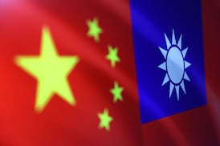
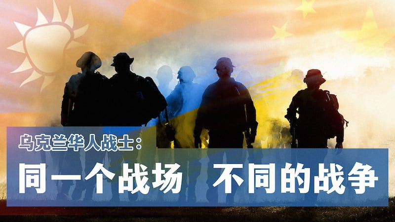
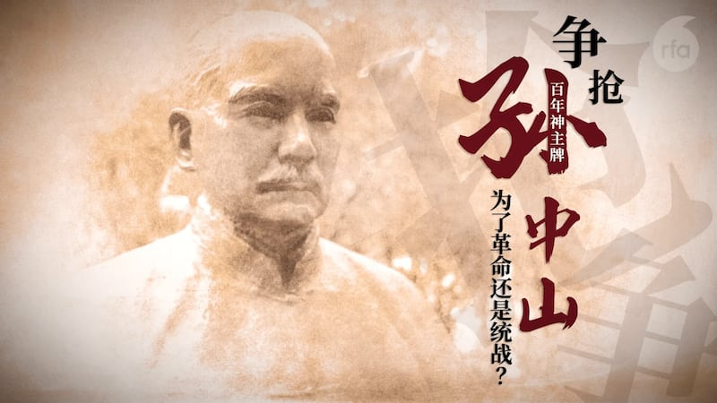
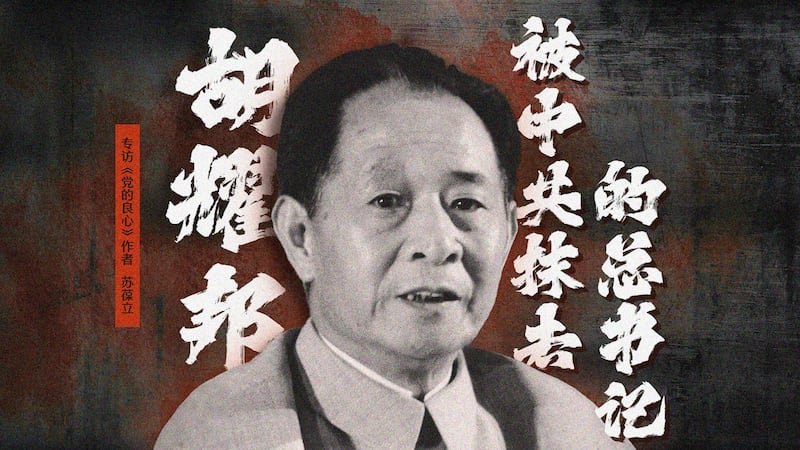
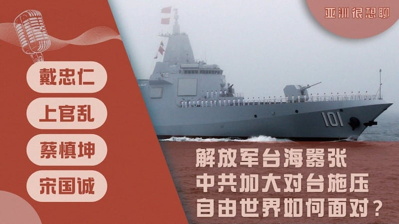
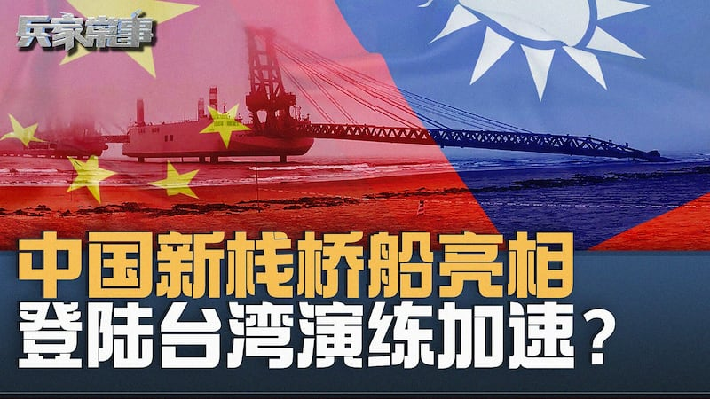
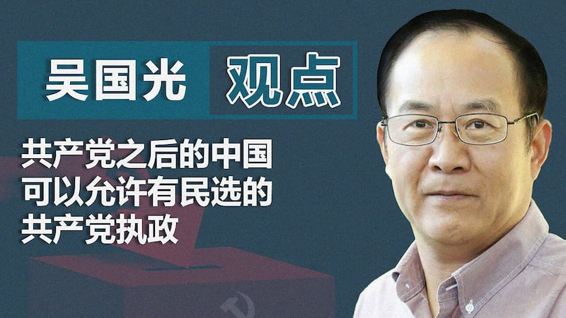

# 視頻專題：中共外宣在臺灣（下）

## 中共對臺灣的外宣和統戰攻勢，許多被發掘的案件都是透過福建的媒體機構執行。亞洲事實查覈實驗室的影音專題，透過詳細解說「指傳媒案」和「張孟崇案」兩起案件，揭露「福建網絡」對臺外宣攻勢的冰山一角。

## 熱門文章  RFA

1.

[### 抗戰勝利80週年 兩岸爭奪國際話語權 還原歷史找真相](/mandarin/zhengzhi/2025/05/07/china-history-antijapanesewar-worldwarii-taiwan-interpretation/)

---

2.

[### 黃雪琴首獲美國會議員提名角逐諾貝爾和平獎 好友：努力獲國際肯定](/mandarin/zhengzhi/renquan/2025/05/07/china-humanrights-nobelpeaceprizenomination-huangxueqin/)

---

3.

[### 中國決定與美國接觸 何立峯將與貝森特週末在瑞士舉行會談](/mandarin/xinwenkuaixun/2025/05/07/china-vice-premier-helifeng-will-meet-us-treasury-secretary-scottbessent-in-switzerland/)

---

4.

[### 企圖借第三國迴避美關稅 中國“洗產地”廣告充斥](/mandarin/shangye/jingji/2025/05/06/trump-reciprocal-tariffs-origin-laundering-china-southeast-asia/)

---

5.

[### 官場腐敗“分層化” 知情者：腐敗更隱蔽 中紀委難查覈](/mandarin/shehui/2025/05/08/china-corruption-bribery-method-corrupt-officials/)

## [烏克蘭華人戰士：同一個戰場 不同的戰爭](/mandarin/video/2025/04/25/768f010c-d46b-40e4-ba00-a0ee167897c7/)

## [爭搶孫中山百年神主牌](/mandarin/video/2025/04/17/03361347-cdac-4792-bece-164d2043a68e/)

## [胡耀邦：三度被禁的中共總書記 | 專訪《黨的良心》作者蘇葆立](/mandarin/video/2025/03/25/9204e5b8-0736-4ebc-951f-47adf9823f32/)

---

## [解放軍臺海囂張 中共加大對臺施壓 自由世界如何面對？ | 亞洲很想聊](/mandarin/video/2025/03/21/de3df33c-d931-4440-8586-f02c431ffadf/)

## [解放軍新型棧橋船問世 灘頭攻勢升級？臺灣危矣？| 兵家常事](/mandarin/video/2025/03/19/77148d8e-f4e1-44fa-a38f-6dff4da10579/)

## [吳國光教授：共產黨之後的中國 可以允許有民選的共產黨執政｜觀點](/mandarin/video/2025/03/17/21597c99-6615-4c43-a1e7-899f56028b16/)

## 熱門文章  RFA

1.

[### 抗戰勝利80週年 兩岸爭奪國際話語權 還原歷史找真相](/mandarin/zhengzhi/2025/05/07/china-history-antijapanesewar-worldwarii-taiwan-interpretation/)

---

2.

[### 黃雪琴首獲美國會議員提名角逐諾貝爾和平獎 好友：努力獲國際肯定](/mandarin/zhengzhi/renquan/2025/05/07/china-humanrights-nobelpeaceprizenomination-huangxueqin/)

---

3.

[### 中國決定與美國接觸 何立峯將與貝森特週末在瑞士舉行會談](/mandarin/xinwenkuaixun/2025/05/07/china-vice-premier-helifeng-will-meet-us-treasury-secretary-scottbessent-in-switzerland/)

---

4.

[### 企圖借第三國迴避美關稅 中國“洗產地”廣告充斥](/mandarin/shangye/jingji/2025/05/06/trump-reciprocal-tariffs-origin-laundering-china-southeast-asia/)

---

5.

[### 官場腐敗“分層化” 知情者：腐敗更隱蔽 中紀委難查覈](/mandarin/shehui/2025/05/08/china-corruption-bribery-method-corrupt-officials/)

[Original Source](https://www.rfa.org/mandarin/video/2025/01/27/9e6e86c0-6590-48ed-b69a-533cb8eaeddc/)