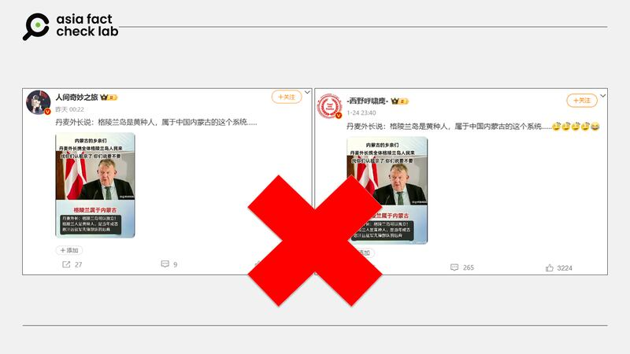
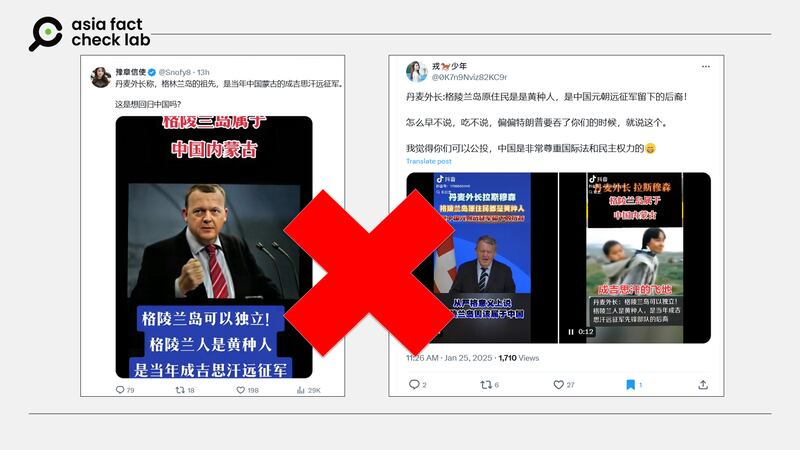
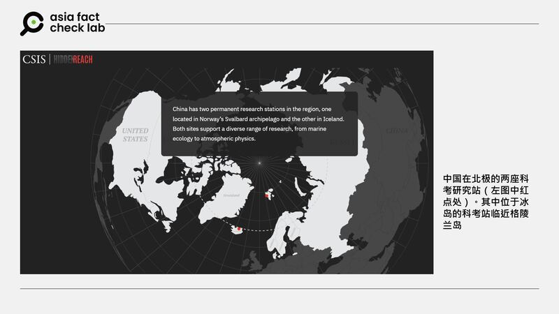

# 事實查覈｜丹麥外長說格陵蘭島人是中國內蒙古人後裔？

鄭崇生

2025.01.28 17:04 EST

查覈結果：錯誤

## 一分鐘完讀：

在美國總統特朗普（Donald Trump,又譯川普）多次表達想要取得格陵蘭島的控制權後，[微博](https://archive.ph/wip/iVwKD)和[X](https://archive.ph/wip/dQHuN)等社交媒體平臺開始傳播丹麥外長拉斯穆森（Lars Løkke Rasmussen）說格陵蘭島居民是成吉思汗的遠征軍後裔的說法。經查覈得知，拉斯穆森近期的確針對格陵蘭島的相關議題有多次表態，但並沒有表達過這種觀點，“丹麥外長要格陵蘭島人認祖歸宗”的說法，完全是無中生有的虛假信息。

## 深度分析：

近日，格陵蘭島的歸屬權問題成了國際熱點話題後，在微博上有大V（[1](https://archive.ph/iVwKD)、[2](https://archive.ph/wip/0cNWu)）以拉斯穆森的照片發文稱，“丹麥外長說：格陵蘭島（人）是黃種人，屬於中國內蒙古的這個系統”，在照片上更有“格陵蘭屬於內蒙古”的標題，並寫着“丹麥外長：格陵蘭可以獨立！格陵蘭是黃種人，是當年成吉思汗遠征軍先鋒部隊的後裔。”相似的說法隨後也在[X](https://archive.ph/FeRn5)上傳播。

中文社媒上傳播“丹麥外長”關於格陵蘭島居民溯源的言論 中文社媒上傳播“丹麥外長”關於格陵蘭島居民溯源的言論 (圖截取自微博)

根據[路透社的報道](https://www.reuters.com/world/greenland-leader-meet-danish-king-amid-trump-bid-take-over-territory-2025-01-08/)，拉斯穆森今年1月初的確說了“格陵蘭島是有實現獨立的可能性”，但他接着指出，“格陵蘭島不太可能成爲美國的一州”。還有[媒體提到](https://www.france24.com/en/europe/20250108-denmark-open-dialogue-with-us-arctic-cooperation-despite-incindiary-trump-comments)，拉斯穆森指出，對於維護美國在北極的利益，丹麥願意與美國展開對話，探討合作的方式。

目前可查到的報道都沒有提到拉斯穆森有針對格陵蘭島居民或當地原住民的起源發表看法。然而，相關消息在X上卻引發格陵蘭島“是否想要回歸中國？”的話題。

中文社媒上傳播的關於格陵蘭島主權歸屬的討論 中文社媒上傳播的關於格陵蘭島主權歸屬的討論 (圖截取自X)

丹麥外長辦公室告訴AFCL，“丹麥外長沒有發表過所謂格陵蘭島原住民是蒙古人，格陵蘭屬於內蒙古的聲明”。

至於格陵蘭島上的原住民因紐特人（Inuit）究竟從何而來？北美人類學主流的[觀點](https://www.journals.uchicago.edu/doi/abs/10.1086/202192#:~:text=A%20prevailing%20view%20in%20North,Asiatic%20Mongoloids%20than%20to%20Indians.)是，他們是西伯利亞的移民後裔，比起北美原住民，與亞洲蒙古人種的關係更爲密切，但關於因紐特人的溯源不在本次查覈範圍之內。

格陵蘭島是世界上最大的島嶼，面積達216萬平方公里，在丹麥管轄下享有高度自治權，近年來當地居民追求完全獨立的呼聲升高。這個北極島嶼蘊藏豐富天然資源，再加上地緣政治的因素，備受各國關注。

[美國智庫戰略暨國際研究中心](https://features.csis.org/hiddenreach/china-polar-research-facility/)（CSIS）指出， 中國目前在北極有兩個科考研究站，其中位於冰島的研究站鄰近格陵蘭島，中國2019年打算在瑞典建立第三個科考研究站時，引發外界質疑相關設施與中國解方軍的關係而延宕。

中國在北極的兩個科考站 中國在北極的兩個科考站 (AFCL製圖)

中國官方2018年發表[《中國的北極政策》](https://www.gov.cn/zhengce/2018-01/26/content_5260891.htm)白皮書，稱自己爲“近北極國家”，中國願與各方共建“冰上絲綢之路”，包括“參與北極航道開發利用”以及“參與油氣和礦產等非生物資源的開發利用”。

*亞洲事實查覈實驗室（Asia Fact Check Lab）針對當今複雜媒體環境以及新興傳播生態而成立。我們本於新聞專業主義，提供專業查覈報告及與信息環境相關的傳播觀察、深度報道，幫助讀者對公共議題獲得多元而全面的認識。*

*讀者若對任何媒體及社交平臺傳播的信息有疑問，歡迎以電郵*[*afcl@rfa.org*](mailto:afcl@rfa.org)*寄給亞洲事實查覈實驗室，由我們爲您查證覈實。亞洲事實查覈實驗室更詳細的介紹請參考*[*本文*](2024-10-09_關於亞洲事實查覈實驗室｜About AFCL.md)*。*

*我們另有X、臉書、IG頻道，歡迎讀者追蹤、分享、轉發。 X這邊請進：中文*[*@asiafactcheckcn*](https://twitter.com/asiafactcheckcn)*;英語：*[*@AFCL\_eng*](https://twitter.com/AFCL_eng)*、*[*FB在這裏*](https://www.facebook.com/asiafactchecklabcn)*、*[*IG也別忘了*](https://www.instagram.com/asiafactchecklab/)*。*

[Original Source](https://www.rfa.org/mandarin/shishi-hecha/2025/01/28/fact-check-demark-said-gleenland-belongs-to-china/)