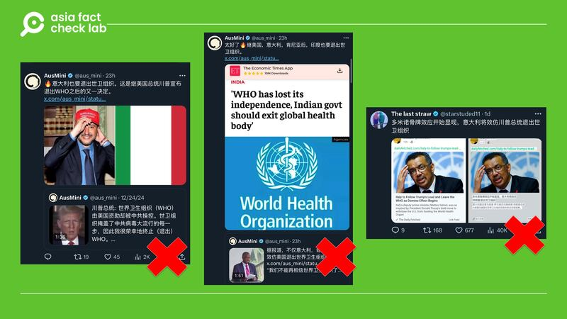
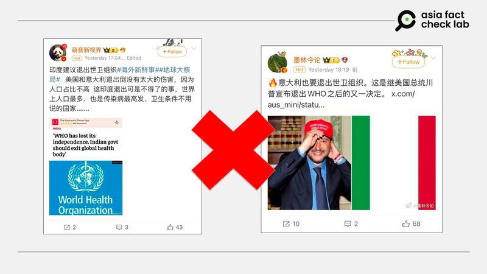
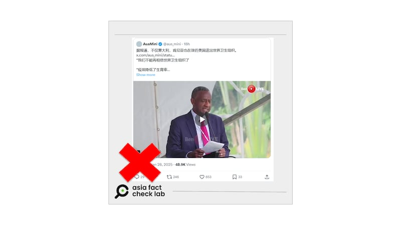

# 事實查覈｜多國效仿美國要退出世界衛生組織？

鄭崇生

2025.01.30 14:35 EST

查覈結果：誤導

## 一分鐘完讀：

[美國總統特朗普](https://www.whitehouse.gov/presidential-actions/2025/01/withdrawing-the-united-states-from-the-worldhealth-organization/)宣佈美國退出世界衛生組織（WHO）後，中文世界開始流傳意大利、肯尼亞與印度都要跟隨美國的步伐，退出世界衛生組織的消息。

亞洲事實查覈實驗室（Asia Fact Check Lab, AFCL）發現，這些資訊或者將相關國家專家觀點和建議解讀成官方立場，或是將議員剛提出的議案認定爲已成事實，都是誤導信息。

## 深度分析：

美國總統特朗普（Donald Trump，又譯川普）1月20日簽署退出世界衛生組織的總統令後，[聯合國發言人辦公室證實](https://news.un.org/zh/story/2025/01/1135461)，美國已於2025年1月22日正式向聯合國提交退出世衛組織的申請。根據世衛組織章程，美國將於一年後正式退出。但特朗普25日在拉斯維加斯的演說中又[表示](https://www.reuters.com/world/us/trump-says-he-may-consider-rejoining-world-health-organization-2025-01-25/)，美國可能考慮重新加入世界衛生組織。

美國退出世界衛生組織的消息在中文世界也引發討論。 X上名爲[“The last straw”的用戶](https://archive.ph/wip/OKcyB)截圖引用網絡媒體“daily feched”的報道稱，“意大利將效仿川普（又譯特朗普）總統退出世衛組織”，並稱這是特朗普所引發的“多米諾骨牌效應”。還有X用戶[“AusMini”發文稱](https://archive.ph/bdMsM)，包括意大利、肯尼亞與印度都要退出世界衛生組織。

中文社媒流傳意大利和印度效仿美國退出WHO的消息 中文社媒流傳意大利和印度效仿美國退出WHO的消息 (圖截取自X)

隨後，微博上也流傳着相似資訊（[1](https://archive.ph/dtHiK)、[2](https://archive.ph/wip/0JYXv)）。

微博上轉發的印度、意大利退出WHO的消息 微博上轉發的印度、意大利退出WHO的消息 (圖截取自微博)

上述這些說法都不是事實。

首先，稱意大利要退出WHO的說法是誤導信息。

根據[Politico 歐洲版](https://www.politico.eu/article/italys-far-right-league-party-backs-trumps-pullout-from-who/)報道，意大利副總理薩爾維尼（Matteo Salvini）在[個人X賬號上](https://x.com/matteosalvinimi/status/1882485386712436942)宣佈，他已經向意大利國會提交退出WHO的議案，他認爲，意大利不再需要將納稅人的鉅額稅款交給和跨國製藥公司密切合作的“超國家機構”。

但這只是薩爾維尼向國會提交的議案（bill），還未經國會表決通過。意大利是內閣制國家，國會組織架構類似於美國，是兩院制。另據[法新社](https://www.barrons.com/articles/italy-s-far-right-league-backs-who-pullout-627b5aa7)（AFP），意大利總理梅洛尼（Giorgia Meloni）對內閣成員的提案尚未發表看法。

根據[意大利國會](https://www.senato.it/en/parliamentary-business/powers-senate)，議員提案需經國會兩院一致同意通過後才生效成法。也因此，把薩爾維尼的提案直接當成已經是意大利政府的立場，是過度解讀。

其次，微博用戶[“萌音新世界”](https://archive.ph/dtHiK)以及X用戶[“AusMini”](https://archive.ph/bdMsM)都引用了一篇印度[《經濟時報》](https://economictimes.indiatimes.com/news/india/who-has-lost-its-independence-indian-govt-should-exit-global-health-body/articleshow/105678716.cms?from=mdr#google_vignette)的報道稱，印度也要退出世界衛生組織。

但AFCL發現，這是一篇《經濟時報》引用印度新聞信託社（PTI）2023年刊發的內容，其實是根據印度裔英國心臟科專家馬洛特拉（Aseem Malhotra）的觀點撰寫，他認爲，WHO已失去獨立性，他建議印度政府應該要忽視WHO在衆多議題上提出的建議，並退出這一組織。

這篇報道的背景是馬洛特拉兩年前在印度一家醫學機構發表了題爲“企業掌控的醫藥與公共衛生”的演說。

微博與X上的用戶將學者兩年前的觀點當成是印度政府的官方立場，也是誤導資訊。

AusMini的另一則發文中還引用了一段視頻稱，“肯尼亞也在效仿美國退出世界衛生組織”，發文還提到“不能再相信世界衛生組織”“疫苗降低了生育率”等。

AusMini發文稱肯尼亞也在效仿美國退出世界衛生組織 AusMini發文稱肯尼亞也在效仿美國退出世界衛生組織 (圖截取自X)

AFCL以圖反搜發現，早在2024年6月就有[X用戶分享同一視頻](https://x.com/SizweLo/status/1796839614528864448)，內容是提到一名肯尼亞的醫生恩加雷（Wahome Ngare）對疫苗有疑慮，並聲稱非洲人不應該相信世界衛生組織。他發表的HPV疫苗會降低婦女生育率等陰謀論，已經被[法新社事實查覈](https://factcheck.afp.com/doc.afp.com.34XK9LQ)認證爲不實資訊。

而且恩加雷的說法並不能代表肯尼亞官方，公開資訊顯示，在特朗普宣佈美國退出WHO後，肯尼亞媒體[《星報》](https://www.the-star.co.ke/news/2025-01-28-ps-kenya-to-seek-alternatives-if-us-pulls-out-of-who)報道，肯尼亞公共服務和人力資源發展部副部長加特查（Amos Gathecha）表示，美國停止資助世界衛生組織後，肯尼亞將尋求應對之道，因爲肯尼亞衛生部門多年來都受到WHO關鍵性的幫助。

也因此，所謂“肯尼亞也效仿美國宣佈退出WHO”的說法，是不實資訊。

*亞洲事實查覈實驗室（Asia Fact Check Lab）針對當今複雜媒體環境以及新興傳播生態而成立。我們本於新聞專業主義，提供專業查覈報告及與信息環境相關的傳播觀察、深度報道，幫助讀者對公共議題獲得多元而全面的認識。*

*讀者若對任何媒體及社交平臺傳播的信息有疑問，歡迎以電郵afcl@rfa.org寄給亞洲事實查覈實驗室，由我們爲您查證覈實。亞洲事實查覈實驗室更詳細的介紹請參考*[*本文*](2024-10-09_關於亞洲事實查覈實驗室｜About AFCL.md)*。*

*我們另有X、臉書、IG頻道，歡迎讀者追蹤、分享、轉發。 X這邊請進：中文*[*@asiafactcheckcn*](https://twitter.com/asiafactcheckcn)*;英語：*[*@AFCL\_eng*](https://twitter.com/AFCL_eng)*、*[*FB在這裏*](https://www.facebook.com/asiafactchecklabcn)*、*[*IG也別忘了*](https://www.instagram.com/asiafactchecklab/)*。*

[Original Source](https://www.rfa.org/mandarin/shishi-hecha/2025/01/30/fact-check-multi-quit-who/)