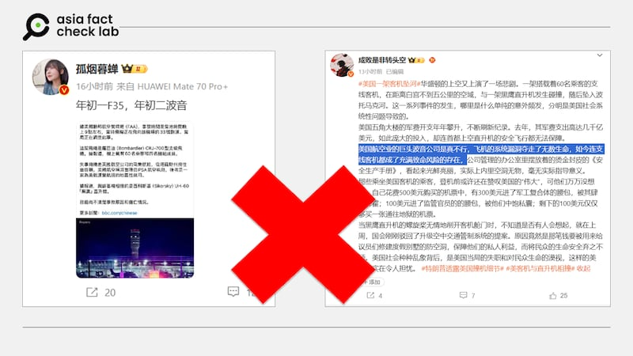
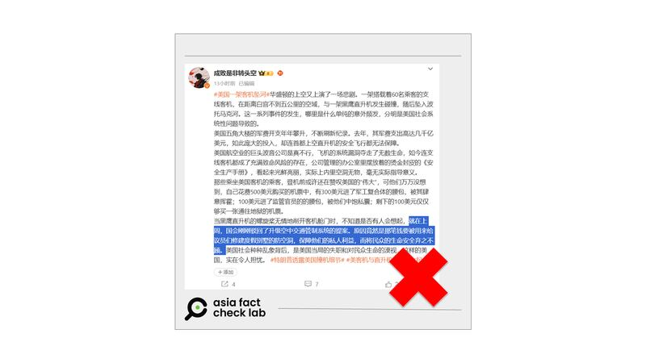

# 事實快查|美國華盛頓撞機事件與波音有關？國會剛剛駁回空管預算？

鄭崇生

2025.01.31 11:55 EST

1月29日晚間，一架美國航空支線客機約9時在降落鄰近首都華盛頓特區的里根機場（Ronald Reagan Airport）途中，與一架美國陸軍黑鷹直升機（UH-60）發生撞擊，於空中爆炸，兩機隨後墜入機場附近的波多馬克河。客機搭載60名乘客、4名機組人員；直升機上則有3名軍人。至發稿時，救援搜尋工作還在進行，但官方已認爲事故中將無人生還。

這是美國民航業自2009年以來最嚴重的空難事故，救難人員仍在搜尋、事故原因仍待調查，全球媒體和社媒都對此討論熱烈，亞洲事實查覈實驗室（Asia Fact Check Lab, AFCL）對中文社交媒體上流傳的兩則可疑信息進行查覈。

## 一、此次撞擊事件與波音公司相關？

這是錯誤信息。

在微博上，大V“[孤煙暮蟬](https://archive.ph/jdSfb)”等中國網民，將這次的撞機意外說成是波音公司的飛機出事，名爲“[成敗是非轉頭空](https://archive.ph/3kKWC)”的微博用戶撰文聲稱“美國航空業的巨頭波音真不行，飛機系統漏洞奪走無數生命，如今連支線客機都成了充滿致命風險的存在？”

一些微博用戶稱此次撞擊事故涉及波音飛機，這是錯誤信息。（微博截圖，AFCL標註） 一些微博用戶稱此次撞擊事故涉及波音飛機，這是錯誤信息。 (微博截圖，AFCL標註)

但這次發生事故的是美國航空子公司PSA航空（PSA Airlines）執飛編號5342的航班，根據[美國聯邦航空管理局（FAA）](https://www.faa.gov/newsroom/statements/accident_incidents)，這是加拿大龐巴迪公司（Bombardier）出產的CRJ700區域客機，並不是波音客機。

## 二、美國國會剛剛駁回空中交通管制系統升級的提案？

這是錯誤資訊。

在上述用戶“成敗是非轉頭空”的文章末段，他指控稱，“就在上週，國會剛剛駁回了升級空中交通管制系統的提案。原因竟然是那筆錢要被用來給議員們修建度假別墅的防空洞，保障他們的私人利益，而將民衆的生命安全棄之不顧。”

社媒帖文稱國會上週剛剛駁回了升級空管系統的提案，該說法無中生有。 社媒帖文稱國會上週剛剛駁回了升級空管系統的提案，該說法無中生有。 (微博截圖，AFCL標註)

首先，AFCL查詢審議美國交通運輸部與聯邦航空管理局（FAA）預算的[參院](https://www.commerce.senate.gov/hearings)與衆院（[1](https://appropriations.house.gov/schedule)、[2](https://transportation.house.gov/calendar/?EventTypeID=541)）相關委員會，公開資訊顯示，上週兩院都沒有舉行與預算審查有關的聽證或會議。

此外，上述說法並不符合美國國會的預算審查與運作。

美國各行政部門的預算以[財政年度](https://www.usa.gov/federal-budget-process)（fiscal year）爲計，從每年的10月1日起到下一年的9月30日爲一個財年。根據[聯邦衆議院預算委員會](https://budget.house.gov/about/budget-framework/)，一般來說，總統率各行政部門通常於每年2月初向國會提交預算計劃書，國會參衆兩院各委員會隨後分別舉行公開聽證會、審理預算，在最好的情況下是每年6月底能完成下一個財政年度的預算審查。

與美國交通運輸部及聯邦航空管理局2025財年有關的主要預算，則大致可分成兩筆。根據美國[國會研究處](https://crsreports.congress.gov/product/pdf/R/R48253)資料，交通運輸部2025財年預算已經於2024年9月26日由時任總統拜登簽署生效，涉[及FAA的預算金額](https://www.transportation.gov/briefing-room/statement-secretary-buttigieg-presidents-fiscal-year-2025-budget)約爲218億美元；爲支持聯邦航空管理局的營運，國會2024年還另外通過《[聯邦航空管理局再授權法案2024](https://www.congress.gov/bill/118th-congress/house-bill/3935)》，也同樣由拜登簽署生效，讓FAA有至少[1050億美元的預算](https://www.commerce.senate.gov/2024/5/senate-overwhelmingly-approves-faa-reauthorization-act)用來擴大招聘空中交通管制員、升級新一代空中交通管制系統的改革，維持營運至2028財年。

因此，“美國國會剛剛駁回空中交通管制系統升級的提案”的說法是錯誤信息。

亞洲事實查覈實驗室（Asia Fact Check Lab）針對當今複雜媒體環境以及新興傳播生態而成立。我們本於新聞專業主義，提供專業查覈報告及與信息環境相關的傳播觀察、深度報道，幫助讀者對公共議題獲得多元而全面的認識。讀者若對任何媒體及社交軟件傳播的信息有疑問，歡迎以電郵[afcl@rfa.org](mailto:afcl@rfa.org)寄給亞洲事實查覈實驗室，由我們爲您查證覈實。

亞洲事實查覈實驗室更詳細的介紹請參考[本文](2024-10-09_關於亞洲事實查覈實驗室｜About AFCL.md)。我們另有X、臉書、IG頻道，歡迎讀者追蹤、分享、轉發。X這邊請進：中文[@asiafactcheckcn](https://twitter.com/asiafactcheckcn)；英文：[@AFCL\_eng](https://twitter.com/AFCL_eng)、[FB在這裏](https://www.facebook.com/asiafactchecklabcn)、[IG也別忘了](https://www.instagram.com/asiafactchecklab/)。

[Original Source](https://www.rfa.org/mandarin/shishi-hecha/2025/01/31/fact-check-dc-plane-crash-rumors/)