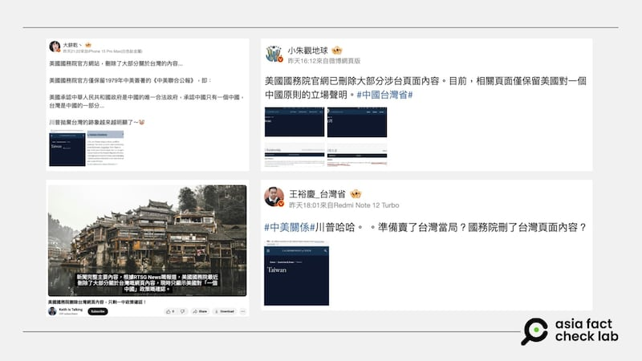
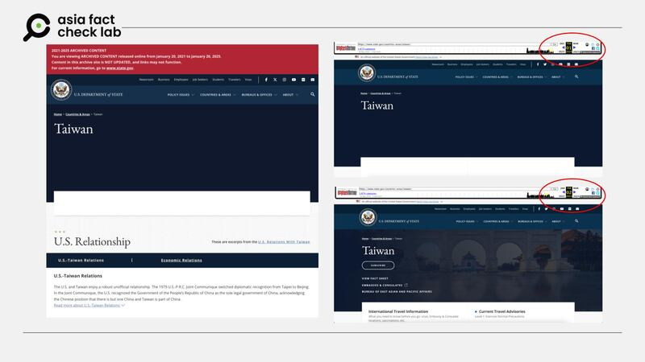
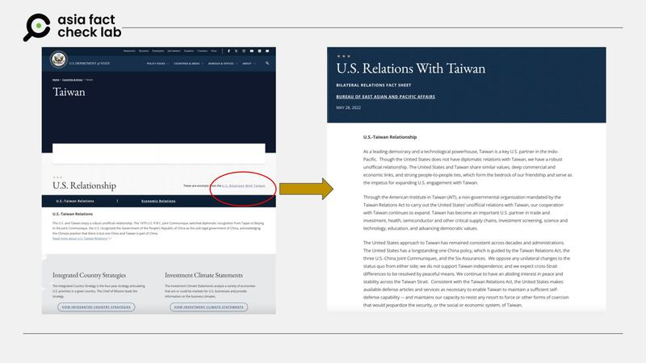
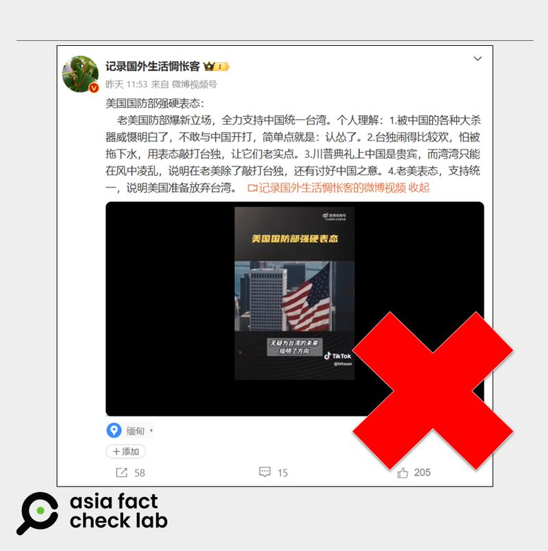

# 事實查覈｜美新政府刪改臺灣關係介紹？國防部支持兩岸統一？

莊敬、鄭崇生

2025.02.05 16:52 EST

## 查覈結果：錯誤

## 一分鐘完讀：

美國新任總統特朗普上任後，中文社媒平臺上流傳不少關於美國與臺灣關係的可疑信息，有人稱：美國國務院最近刪除了官網上大部分關於臺灣的內容，僅保留“一箇中國”政策，並解讀爲“特朗普拋棄臺灣的跡象”；也有網文稱美國國防部表態新立場：全力支持中國統一臺灣。

經查證發現，國務院網站介紹臺灣的頁面自拜登政府時期沿用至今，至少有一年沒有改變。所謂“美國國防部支持中國統一臺灣”，也是錯誤信息。

## 深度分析：

美國總統特朗普（Donald Trump，又譯川普）上任後，兩岸“疑美論”再起。亞洲事實查覈實驗室（Asia Fact Check Lab, AFCL）注意到，近日在微博（[1](https://m.weibo.cn/detail/5130076260401783),[2](https://m.weibo.cn/detail/5130025689680219),[3](https://m.weibo.cn/detail/5129998329449762)）、X（[1](https://x.com/kinglinzhuhui/status/1886351765672726541),[2](https://x.com/zmx8067/status/1886421190534963590),[3](https://x.com/RTSG_News/status/1886270810320421216)）、[YouTube](https://www.youtube.com/watch?v=gsQTkzXqeKo)等平臺上流傳一則消息：“美國國務院網站刪除了大部分關於臺灣的內容，只保留‘一箇中國’政策”，附有國務院介紹臺灣頁面的截圖爲證，發佈者稱這是特朗普政府所爲，並解讀成“特朗普拋棄臺灣的跡象越來越明顯”。

網傳美國國務院最近刪除官網上大部分關於臺灣的內容。 網傳美國國務院最近刪除官網上大部分關於臺灣的內容。 (微博、YouTube截圖)

AFCL查詢前總統拜登政府時期的[國務院網站檔案](https://2021-2025.state.gov/countries-areas/taiwan/)，發現在拜登政府任內，國務院官網上介紹美國和臺灣關係的頁面和近日網傳截圖高度相似。AFCL另透過“網絡時光機”（Wayback Machine）查詢，[2024年2月](https://web.archive.org/web/20240102021228/https:/www.state.gov/countries-areas/taiwan/)時，臺灣頁面和現在相同，但與[2023年2月](https://web.archive.org/web/20230202234611/https:/www.state.gov/countries-areas/taiwan/)時臺灣頁面上的內容不同。從網路上的檔案資料研判，刪、修國務院網站上臺灣頁面的內容，是拜登政府任內發生的事。

也就是說，目前國務院網站上的[臺灣關係頁面](https://www.state.gov/countries-areas/taiwan/)（[Archive](https://archive.ph/ecxdB)）是沿用自前任政府，且至少一年未變。截至本文發稿前，國務院並未更改介紹臺灣的頁面。

左圖爲美國前總統拜登政府任內國務院網站檔案的臺灣頁面，右圖上爲“網絡時光機”2024年2月的頁面庫存，兩者都與近日網傳截圖高度相似。“網絡時光機”2023年2月的頁面庫存則不相同（右圖下）。 左圖爲美國前總統拜登政府任內國務院網站檔案的臺灣頁面，右圖上爲“網絡時光機”2024年2月的頁面庫存，兩者都與近日網傳截圖高度相似。“網絡時光機”2023年2月的頁面庫存則不相同（右圖下）。 (美國國務院網站檔案、網絡時光機截圖)

## 國務院官網如何介紹美臺關係

而網文宣稱國務院官方網站僅保留《中美聯合公報》，承認臺灣是中國的一部分，這些陳述並不正確。根據美國國務院網站，其陳述是“acknowledging the Chinese position that there is but one China and Taiwan is part of China.” 美國“認知到“中方的立場是”臺灣是中國的一部分”。

至於部分社媒用戶宣稱美國國務院上介紹臺灣的網頁僅保留了“一箇中國”政策，也是不正確的說法。該頁面下方除了多個臺灣美國人學校的介紹鏈接，在頁面右上方明顯的位置也有[“美國與臺灣關係”](https://www.state.gov/u-s-relations-with-taiwan/)的鏈接，點入後可以看到2022年5月版本的文字內容，詳細介紹了美國與臺灣之間的關係，並且說明美國長期奉行的“一箇中國政策”，乃是基於《臺灣關係法》、中美三個聯合公報和“六項保證”。

目前美國國務院網站上介紹臺灣的頁面，點擊鏈接（上圖紅圈處）有美國與臺灣關係的詳細介紹。 目前美國國務院網站上介紹臺灣的頁面，點擊鏈接（上圖紅圈處）有美國與臺灣關係的詳細介紹。 (美國國務院官網截圖)

## 美國國防部新立場：支持中國統一臺灣？

此外，中國微博大V[“記錄國外生活惆悵客”](https://archive.ph/N6WeR)引用一段視頻聲稱，美國國防部強硬表態新立場，全力支持中國統一臺灣。這名在緬甸發文的博主還附上了一段視頻，明確說道“美國國防部在1月30日突然轉變態度，明確表示，支持中國大陸與臺灣和平統一。”更聲稱，“美國此次的公開表態，也暗示了臺灣對美國的價值已大幅下降。”

網傳“美國防部支持中國統一臺灣”的信息 。 網傳“美國防部支持中國統一臺灣”的信息 。 (微博截圖)

亞洲事實查覈實驗室向國防部查詢上述說法，至截稿，尚未得到回覆。但查詢1月20日特朗普上任以來的英文與中文報道，都沒有符合上述說法的資料。

另外，新任國防部長海格塞斯（Pete Hegseth）上任以來的公開發言中也查不到相關言論。而他在上任前的[國會提名聽證會](https://www.armed-services.senate.gov/hearings/to-conduct-a-confirmation-hearing-on-the-expected-nomination-of-mr-peter-b-hegseth-to-be-secretary-of-defense)上回答議員提出的“如果中國威脅臺灣，美國是否該出兵協防”時，他則是重申了美國《臺灣關係法》，美中“三個公報”與“六項保證”，並未表態支持中國統一臺灣。

細看美國官方在兩岸上的長期立場，在[《臺灣關係法》](https://www.ait.org.tw/taiwan-relations-act-public-law-96-8-22-u-s-c-3301-et-seq/)第二條中，美國認爲，任何企圖以非和平方式來決定臺灣前途的舉動——包括使用經濟抵制及禁運手段在內，都被視爲對西太平洋地區和平與安定的威脅，爲美國所嚴重關切；在已解密的[“六項保證”](https://www.ait.org.tw/zhtw/six-assurances-1982-zh/)中，美國亦承諾不會對臺施壓，要求臺灣與中華人民共和國談判。

另根據[美國國會研究處的資料](https://crsreports.congress.gov/product/pdf/IF/IF10275)，有不具名官員曾在華盛頓的背景簡報中指出，美國支持兩岸對話，而美國期待兩岸間的歧見能以和平、非脅迫，以及兩岸人民都能接受的方式解決。美國對解決兩岸分歧的最終方式不持立場，也就是說，美國一直以來關切且支持的是和平解決分歧，並不是和平統一。

因此，公開資訊中並沒有網民所稱“美國國防部轉變立場，支持中國和平統一臺灣”的說法。

*亞洲事實查覈實驗室（Asia Fact Check Lab）針對當今複雜媒體環境以及新興傳播生態而成立。我們本於新聞專業主義，提供專業查覈報告及與信息環境相關的傳播觀察、深度報道，幫助讀者對公共議題獲得多元而全面的認識。*

*讀者若對任何媒體及社交平臺傳播的信息有疑問，歡迎以電郵*[*afcl@rfa.org*](mailto:afcl@rfa.org)*寄給亞洲事實查覈實驗室，由我們爲您查證覈實。亞洲事實查覈實驗室更詳細的介紹請參考*[*本文*](2024-10-09_關於亞洲事實查覈實驗室｜About AFCL.md)*。*

*我們另有X、臉書、IG頻道，歡迎讀者追蹤、分享、轉發。 X這邊請進：中文*[*@asiafactcheckcn*](https://twitter.com/asiafactcheckcn)*;英語：*[*@AFCL\_eng*](https://twitter.com/AFCL_eng)*、*[*FB在這裏*](https://www.facebook.com/asiafactchecklabcn)*、*[*IG也別忘了*](https://www.instagram.com/asiafactchecklab/)*。*

[Original Source](https://www.rfa.org/mandarin/shishi-hecha/2025/02/05/fact-check-us-change-taiwan-page/)