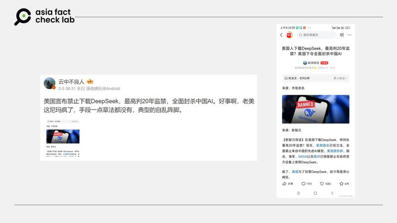
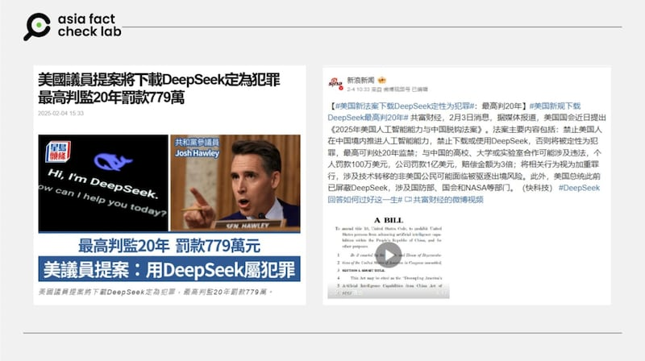

# 事實查覈｜美國已立法禁止下載DeepSeek，違法可判刑20年？

莊敬

2025.02.06 16:12 EST

## 查覈結果：錯誤

## 一分鐘完讀：

近期，有網民稱，在美國下載DeepSeek“將判處最高20年監禁”，另有部分社媒帳號宣稱美國“已經立法”，全面禁止來自中國的先進AI模型。亞洲事實查覈實驗室查覈後認爲，相關言論爲錯誤、誤導信息，確實近期有參議員提出針對中國AI產業的立法建議，但並非針對具體公司，也尚未完成立法。

## 深度分析：

一位[微博大V](https://m.weibo.cn/detail/5130606883112147)近日發文稱，“美國宣佈禁止下載DeepSeek，最高判20年監禁”，並附上一篇新浪財經的文章截圖，該文章稱，美國國會“已經立法”、全面禁止來自中國的AI模型。

## 美國全面查禁DeepSeek了嗎？

經查覈，截至目前，美國尚未統一發布對DeepSeek的禁令。根據[美國媒體報道](https://www.cnbc.com/2025/02/02/why-deleting-chinas-deepseek-ai-may-be-next-for-millions-of-americans.html)，有一些地方政府部門發佈禁令，包括德州公共部門、美國海軍、美國太空總署（NASA）等單位，禁止這些部門使用該軟件。

微博傳言美國宣佈禁止下載Deepseek，違反者面臨監禁，這是不實信息。 微博傳言美國宣佈禁止下載Deepseek，違反者面臨監禁，這是不實信息。 (微博、新浪財經截圖)

另外，美國聯邦參議員霍利（Josh Hawley）於今年一月底提出《[2025年美國人工智能能力與中國脫鉤法案](https://www.hawley.senate.gov/wp-content/uploads/2025/01/Hawley-Decoupling-Americas-Artificial-Intelligence-Capabilities-from-China-Act.pdf)》（Decoupling America’s Artificial Intelligence Capabilities from China Act of 2025），旨在禁止美國人協助中國推動人工智能（Artificial Intelligence, AI）。

因此，時值中國公司推出AI模型“DeepSeek”（深度求索）引爆話題，多家[中](https://std.stheadline.com/realtime/article/2050764/%E5%8D%B3%E6%99%82-%E4%B8%AD%E5%9C%8B-%E7%BE%8E%E5%9C%8B%E8%AD%B0%E5%93%A1%E6%8F%90%E6%A1%88%E5%B0%87%E4%B8%8B%E8%BC%89DeepSeek%E5%AE%9A%E7%82%BA%E7%8A%AF%E7%BD%AA-%E6%9C%80%E9%AB%98%E5%88%A4%E7%9B%A320%E5%B9%B4%E7%BD%B0%E6%AC%BE779%E8%90%AC)、[英文](https://mashable.com/article/josh-hawley-bill-deepseek-ai-crime-for-americans)媒體在報道霍利提出的法案時，帶入使用中國AI產品的情境，包括當前最具新聞性的DeepSeek，以“美國議員提案將下載DeepSeek定爲犯罪 最高判監20年”爲題報道。

然而，稱該法案“禁止下載DeepSeek”的說法並不準確。根據新聞稿引述的法案內容，該案擬禁止從中國進口或向中國出口人工智能技術，禁止美國公司在中國進行相關研究或與中國公司合作研究人工智能技術，禁止美國公司對於中國發展人工智能進行任何投資。

法案並沒有點名“DeepSeek”，而是提議禁止進出口中華人民共和國開發或生產的人工智能，或生成式人工智能技術，及相關知識產權。

## 禁止中國AI產品，違規最高監禁20年？

至於一些新聞媒體和網絡傳言中稱美國對中國AI模型“已經立法”、違規者“監禁20年”的說法，也並不正確。

這些文章中所指法案正是霍利提出的《2025年美國人工智能能力與中國脫鉤法案》，此法案目前在“[提案”階段](https://www.congress.gov/bill/119th-congress/senate-bill/321/text)，並非網傳“已經立法”。從提案到成爲法律，還要經過參議院、衆議院分別表決，再經兩院協商確認版本後，送交白宮，由總統簽署。

多家媒體報道，美國參議員提出有關美中人工智能能力脫鉤的法案，但該法案並不針對特定公司。 多家媒體報道，美國參議員提出有關美中人工智能能力脫鉤的法案，但該法案並不針對特定公司。 (星島網、微博截圖)

而《2025年美國人工智能能力與中國脫鉤法案》內所寫的處罰，是依據2018年《[出口管制改革法](https://www.bis.doc.gov/index.php/enforcement/oee/penalties)》。違反出口管制條例者，可能會受到刑事和行政處罰，可包括最高20年監禁，以及每次違規最高罰款100萬美元，或兩者並罰。

因此，多家媒體綜合報道稱“美國議員提案下載DeepSeek將判處最高20年監禁”的說法並不準確。而稱美國“已經立法”的說法，則是錯誤信息。

*亞洲事實查覈實驗室（Asia Fact Check Lab）針對當今複雜媒體環境以及新興傳播生態而成立。我們本於新聞專業主義，提供專業查覈報告及與信息環境相關的傳播觀察、深度報道，幫助讀者對公共議題獲得多元而全面的認識。讀者若對任何媒體及社交軟件傳播的信息有疑問，歡迎以電郵*[*afcl@rfa.org*](mailto:afcl@rfa.org)*寄給亞洲事實查覈實驗室，由我們爲您查證覈實。*

*亞洲事實查覈實驗室更詳細的介紹請參考*[*本文*](2024-10-09_關於亞洲事實查覈實驗室｜About AFCL.md)*。我們另有X、臉書、IG頻道，歡迎讀者追蹤、分享、轉發。X這邊請進：中文*[*@asiafactcheckcn*](https://twitter.com/asiafactcheckcn)*；英文：*[*@AFCL\_eng*](https://twitter.com/AFCL_eng)*、*[*FB在這裏*](https://www.facebook.com/asiafactchecklabcn)*、*[*IG也別忘了*](https://www.instagram.com/asiafactchecklab/)*。*

[Original Source](https://www.rfa.org/mandarin/shishi-hecha/2025/02/06/fact-check-us-banning-deepseek/)