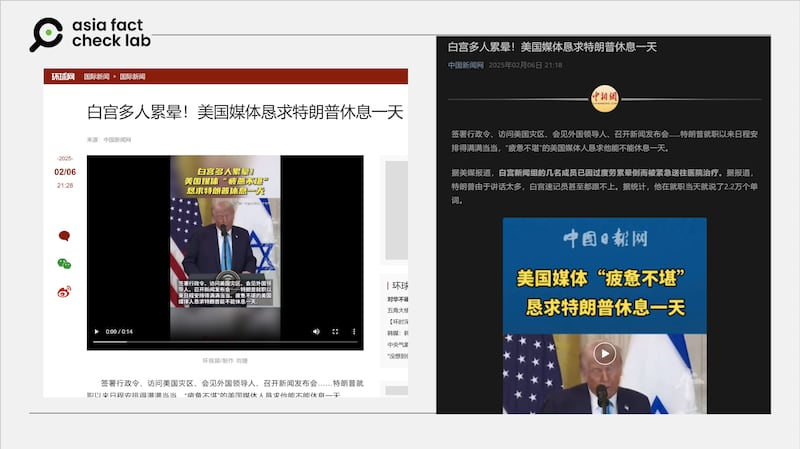
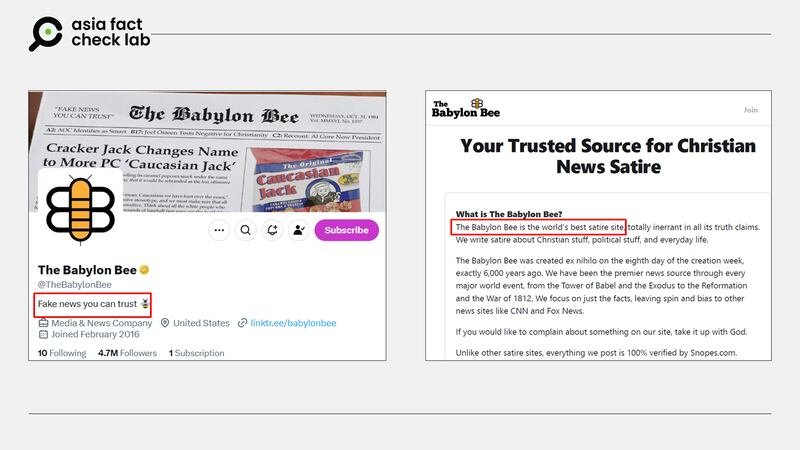
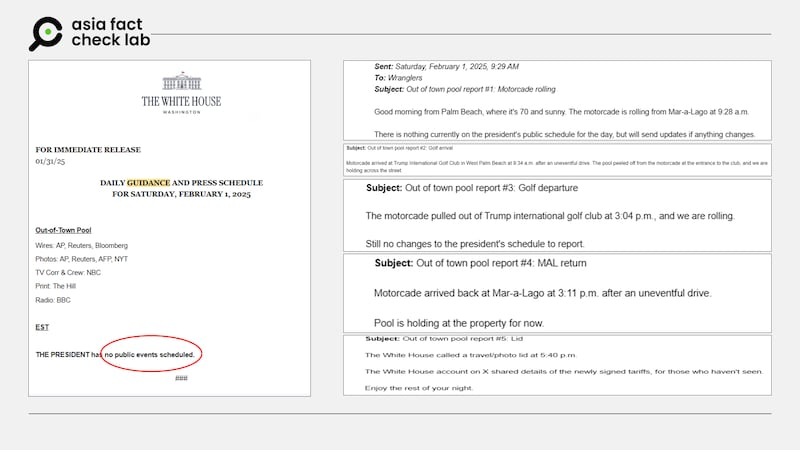

# 事實查覈｜白宮多人累暈，美國媒體求特朗普休息一天？

鄭崇生

2025.02.07 20:03 EST

## 查覈結果：錯誤

## 一分鐘完讀：

近日，一篇題爲“筋疲力竭的媒體求特朗普放假一天”的英文推文截圖轉傳到新浪微博上，引發討論。隨後，中國新聞網、環球網等中國國家級的新聞媒體將其援引爲“外媒”消息，當作國際新聞刊發了報道，並稱“白宮多人累暈送醫”。

亞洲事實查覈實驗室則發現，最初的消息來源其實是專門撰寫諷刺文章的網站“巴比倫蜜蜂”（The Babylon Bee），網站文章並非新聞，特朗普上任後也並非沒有休假，更無可靠媒體報道白宮多人“累昏送醫”的消息。中國媒體把諷刺文章當成真實新聞報道，傳播了錯誤信息。

中國媒體發佈的白宮多人累暈，美國媒體懇求特朗普休息的報道 中國媒體發佈的白宮多人累暈，美國媒體懇求特朗普休息的報道 (環球網、中新網報道截圖)

## 深度分析：

1月27日，“巴比倫蜜蜂”網站刊出這篇[報道體的嘲諷文章](https://archive.ph/pEadh)，當天也在其X賬號上推播這則內容。這篇推文很快在中文社媒上引發議論，有[大V](https://archive.ph/XqNIb)轉發時說，“美國媒體應該高興纔對，特朗普來了，每天都是大新聞”，也有人[指出](https://archive.ph/wip/TmybU)美國媒體疲憊不堪是因爲特朗普“太能做妖”。

而轉發者們並沒注意到，“巴比倫蜜蜂”在X的賬號自我簡介寫着：“你可以信賴的假新聞”；在“巴比倫蜜蜂”官網上的介紹則寫到這是“世界上最棒的嘲諷網站”。隨後，[中新社](https://mp.weixin.qq.com/s/L9NpoAjN7URA2_cw23yBKQ)、[環球網](https://world.huanqiu.com/article/4LO3CvEOW1R)等媒體開始將這一消息作爲新聞報道，引起更大規模的傳播。

“巴比倫蜜蜂”社媒賬號和官網上的介紹 “巴比倫蜜蜂”社媒賬號和官網上的介紹 (“巴比倫蜜蜂”官推及官網截圖)

另外，特朗普上任後，也並非沒有休假。

以最近一次的週末爲例，2月1日，他就曾返回佛州海湖莊園打高爾夫，白宮也按照慣例提前一天宣佈了總統週六沒有公開行程。

即使總統沒有公開或是公務行程，媒體負責採訪白宮新聞的[特派記者團（WHCA）](https://whca.press/covering-the-white-house/resources/guide-to-the-white-house-beat/)也會發布總統的行蹤。這是因爲白宮隨行記者輪值供稿機制（pool report）確保了總統到哪，總會有負責當班白宮隨行記者跟着，一年365天不間斷的記錄和發佈總統行蹤。

以上週六行程爲例：即使特朗普當天表定沒有公開行程，輪值供稿的當班記者一樣上班，記錄下特朗普當天幾點出門、去高爾夫球場打球，幾點打完結束行程，幾點出發回家，而根據WHCA提供的資訊，當天值班記者一共發了五則簡訊分享給白宮記者團。

左爲白宮公佈的2/1總統行程電郵，右爲WHCA當天發出的五則記錄內容 左爲白宮公佈的2/1總統行程電郵，右爲WHCA當天發出的五則記錄內容 (白宮官網截圖)

根據WHCA，隨行記者供稿機制始於1930年代羅斯福總統時期（Franklin Roosevelt），美國[媒體傳統認爲](https://whca.press/covering-the-white-house/resources/guide-to-the-white-house-beat/)，“不論哪一黨，執政者的目標都是統整資訊喂記者，而記者的目標則是要克服這種帶風向”（No matter the administration, their goal is to curate information. Yours is to get past the spin.），由第四權的眼睛記錄歷史，和官方主動提供資訊是不一樣的。

*亞洲事實查覈實驗室（Asia Fact Check Lab）針對當今複雜媒體環境以及新興傳播生態而成立。我們本於新聞專業主義，提供專業查覈報告及與信息環境相關的傳播觀察、深度報道，幫助讀者對公共議題獲得多元而全面的認識。*

*讀者若對任何媒體及社交平臺傳播的信息有疑問，歡迎以電郵*[*afcl@rfa.org*](mailto:afcl@rfa.org)*寄給亞洲事實查覈實驗室，由我們爲您查證覈實。亞洲事實查覈實驗室更詳細的介紹請參考*[*本文*](2024-10-09_關於亞洲事實查覈實驗室｜About AFCL.md)*。*

*我們另有X、臉書、IG頻道，歡迎讀者追蹤、分享、轉發。 X這邊請進：中文*[*@asiafactcheckcn*](https://twitter.com/asiafactcheckcn)*;英語：*[*@AFCL\_eng*](https://twitter.com/AFCL_eng)*、*[*FB在這裏*](https://www.facebook.com/asiafactchecklabcn)*、*[*IG也別忘了*](https://www.instagram.com/asiafactchecklab/)*。*

[Original Source](https://www.rfa.org/mandarin/shishi-hecha/2025/02/08/fact-check-media-beg-trump-take-a-rest/)