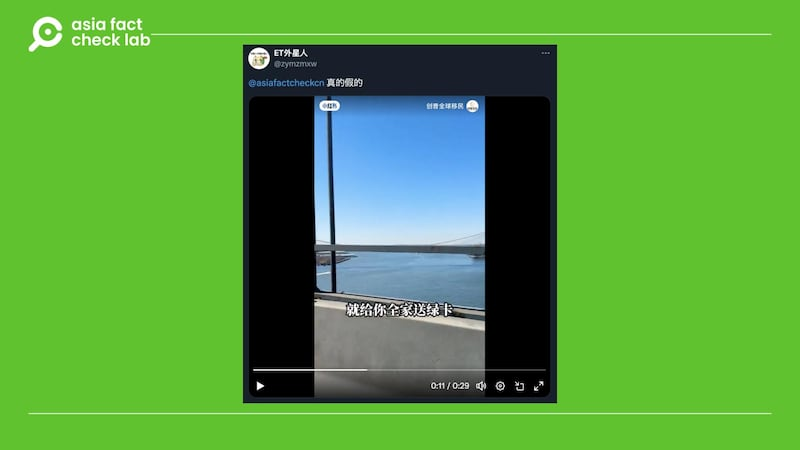

# 答讀者問｜“買基金送綠卡”，是美國效率部新政策？

艾倫

2025.02.10 09:07 EST

## 查覈結果：錯誤

## 一分鐘完讀：

2月初，社媒平臺X上一個中文帳戶轉發了一段視頻，稱美國效率部推出了“買基金送綠卡”政策：只要購買足夠的基金，全家都可拿到綠卡。該網民詢問此消息是否屬實。

亞洲事實查覈實驗室查覈後發現，相關投資移民計劃早在1990年就由國會創立，與近期成立的機構無關。查覈進一步發現，美國的投資移民計劃要求投資者至少創造10個就業機會或直接投入80萬美元，這些投資並不等同於購買證券市場的基金，不構成獲得綠卡的條件。

## 深度分析：

2月4日，有X用戶轉發一則[視頻](https://x.com/zymzmxw/status/1886358225240420538)，影音內容稱美國新成立的”效率部“（Department of Government Efficiency，DOGE）推出”買基金送綠卡政策”，且只要購買一定數量的基金，就能夠全家獲得綠卡，網民詢問AFCL此消息是否爲真。

--- 二月初，有讀者在X上向我們提問，詢問美國投資移民相關消息的正確性。 (AFCL製圖)

亞洲事實查覈實驗室（Asia Fact Check Lab, AFCL）首先檢視了美國公民及移民局（USCIS）的[公共資料](https://www.uscis.gov/working-in-the-united-states/permanent-workers/employment-based-immigration-fifth-preference-eb-5/about-the-eb-5-visa-classification)，其中顯示投資移民（EB-5）計劃早在1990年就由美國國會創立，和近期成立的任何部門都無關。再查看媒體公開報道，都沒有顯示美國政府效率部曾有類似的公開聲明。

此外，美國的投資移民計劃並非單買基金就能獲得綠卡。根據USCIS，綠卡申請者有兩種途徑：創造就業機會或直接投入資本。

以創造就業機會來說，每位EB-5投資者必須在美國創造至少10個全職就業機會；而直接投入資本的投資人則有兩種選擇，一是投資總額達105萬美元、二是在美國劃定的“目標就業區”（如鄉村、高失業率地區）投資達80萬美元，即符合標準。投資的內容可以是現金、設備、庫存、其他有形資產、現金等，但不包括以債務安排形式進行的投資。

在臺灣從事美國移民的喬盟國際移民顧問公司的王先生接受AFCL採訪時表示，美國移民法屬聯邦法律，須經參衆兩院通過纔有效，馬斯克的效率部職權不在此。此外，最近一次相關法案的更動是出現在2021年、拜登時期推出的[《2022年EB-5改革與誠信法案》](https://www.congress.gov/bill/117th-congress/house-bill/2901)，與剛就任的特朗普政府無關。

王先生另外表示，若投資經移民局覈准的、目標就業區裏的合作公司相關基金，可以作爲申請投資移民計劃的證明，但“不是直接到證券市場買投資”。

簡單來說，EB-5計劃是希望鼓勵透過非本國籍公民的投資振興美國經濟，以及增加美國境內的就業機會，而一般證券市場上的基金交易並無法達成這個目標。因此網傳只要購買一定量的基金，美國就會“給你全家送綠卡”的說法，過度簡化投資移民的細節。

AFCL已聯絡USCIS求證投資移民相關細節，至截稿日（2月7日）未獲回應。

*亞洲事實查覈實驗室（Asia Fact Check Lab）針對當今複雜媒體環境以及新興傳播生態而成立。我們本於新聞專業主義，提供專業查覈報告及與信息環境相關的傳播觀察、深度報道，幫助讀者對公共議題獲得多元而全面的認識。讀者若對任何媒體及社交軟件傳播的信息有疑問，歡迎以電郵*[*afcl@rfa.org*](mailto:afcl@rfa.org)*寄給亞洲事實查覈實驗室，由我們爲您查證覈實。*

*亞洲事實查覈實驗室更詳細的介紹請參考*[*本文*](2024-10-09_關於亞洲事實查覈實驗室｜About AFCL.md)*。我們另有X、臉書、IG頻道，歡迎讀者追蹤、分享、轉發。X這邊請進：中文*[*@asiafactcheckcn*](https://twitter.com/asiafactcheckcn)*；英文：*[*@AFCL\_eng*](https://twitter.com/AFCL_eng)*、*[*FB在這裏*](https://www.facebook.com/asiafactchecklabcn)*、*[*IG也別忘了*](https://www.instagram.com/asiafactchecklab/)*。*

[Original Source](https://www.rfa.org/mandarin/shishi-hecha/2025/02/10/fact-check-immigration-fund-trump-doge/)