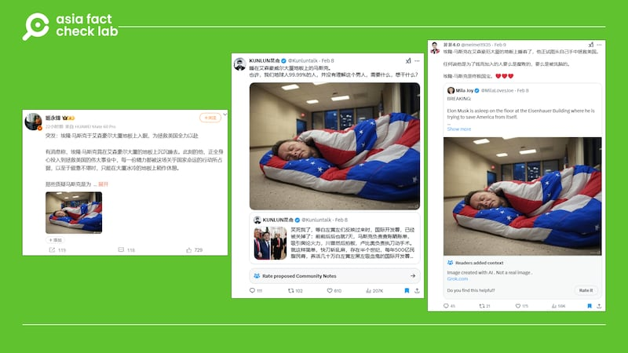
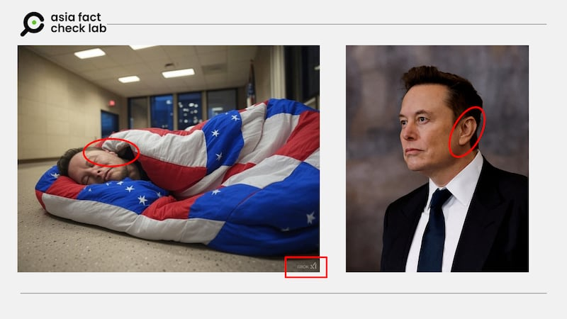
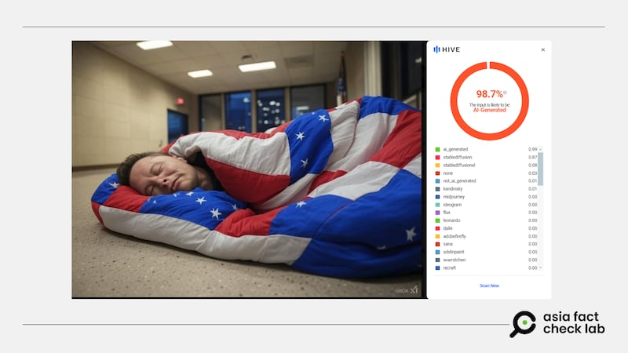
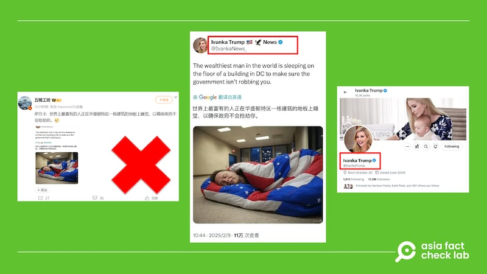

# 事實查覈｜這張照片是馬斯克睡在政府辦公樓的景象？

鄭崇生

2025.02.11 12:14 EST

## 查覈結果：錯誤

## 一分鐘完讀：

近日，“馬斯克在艾森豪威爾大廈的地板上睡着了”的說法，搭配上一張看起來神似特斯拉（Tesla）執行長埃隆·馬斯克（Elon Musk）、裹着印有美國國旗的睡袋躺地上的照片，在[微博](https://archive.ph/jlene)與X上瘋傳，一些大V更指出，他這麼做是爲了“[拯救美國](https://archive.ph/wip/qYHxo)”。

亞洲事實查覈實驗室（Asia Fact Check Lab）則通過分析與軟件判讀發現，這張最早來自英文X帳號傳播的影像，其實是AI生成照。

## 深度分析：

馬斯克主導美國新成立的政府效率部（Department of Government Efficiency, DOGE）後，他的一舉一動也在中文世界成爲焦點。

中文社交媒體廣傳一張“馬斯克睡地板”的圖片，經查覈此圖應爲AI生成。 中文社交媒體廣傳一張“馬斯克睡地板”的圖片，經查覈此圖應爲AI生成。 (微博、X截圖)

但仔細看這張在中文網絡廣爲流傳的照片可發現，這個神似馬斯克的人物左耳呈現不自然的形狀。對照路透社拍攝馬斯克在1月20日美國總統特朗普（Donald Trump）就職典禮時的照片，他的左耳有清楚輪廓，因此，社交媒體平臺上流傳的這張圖片，符合AI生成圖常難以處理五官細節的特色。

對比網傳照片與馬斯克照片，可發現五官細節有扭曲之處。 對比網傳照片與馬斯克照片，可發現五官細節有扭曲之處。 (網傳圖片、路透社新聞圖片截圖，AFCL加註)

另外，細看這張所謂“馬斯克拿睡袋睡地板”的影像，在右下角有一個標註爲“Grok”的浮水印，因此，這極可能是由AI軟件[Grok生成的影像](https://x.com/i/grok?focus=1)。

AFCL進一步以[AI判讀軟件Hive](https://thehive.ai/)輔助識別，軟件認定，這張照片極有可能是AI生成的。

使用AI判讀軟件Hive查覈，結果爲該圖極可能AI生成。 使用AI判讀軟件Hive查覈，結果爲該圖極可能AI生成。 (Hive軟件截圖)

另外，微博上還有用戶[聲稱](https://archive.ph/TboGB)，特朗普的長女伊萬卡·特朗普（Ivanka Trump）轉發了上述AI生成照，並稱“世界上最富有的人正在華盛頓特區一棟建築的地板上睡覺，以確保政府不會搶劫你”，這也是錯誤資訊。

網傳伊萬卡·特朗普亦轉發照片並讚賞馬斯克，然而，該網貼中的截圖並非伊萬卡特朗普官方X賬號。 網傳伊萬卡·特朗普亦轉發照片並讚賞馬斯克，然而，該網貼中的截圖並非伊萬卡特朗普官方X賬號。 (微博截圖、X截圖)

細看這一用戶取自X的截圖可以發現，雖然這名X用戶有認證信息，且其頭像照片和伊萬卡官方X帳號一樣，但並非真正的伊萬卡的官方帳號。 該用戶的帳號拼寫爲Ivanka Trump News，在用戶名稱中間還使用美國國旗與老鷹的圖案，對照伊凡卡的[官方帳號](https://x.com/IvankaTrump)，其拼寫爲“Ivanka Trump”。 經查覈，伊萬卡的官方賬號並未轉發或評論這張圖片。

馬斯克上任以來，美國媒體Wired的確曾[報道](https://www.wired.com/story/elon-musk-sleeping-doge-office/)，他以白宮旁的艾森豪威爾行政大樓（Eisenhower Executive Office Building）爲辦公地點，就睡在辦公室，他甚至還獲邀可以入住白宮的林肯臥室（Lincoln Bedroom）。

然而，上述AI生成照並不是馬斯克以辦公室爲家的影像，伊萬卡·特朗普也沒有轉發這張AI生成照。

*亞洲事實查覈實驗室（Asia Fact Check Lab）針對當今複雜媒體環境以及新興傳播生態而成立。我們本於新聞專業主義，提供專業查覈報告及與信息環境相關的傳播觀察、深度報道，幫助讀者對公共議題獲得多元而全面的認識。讀者若對任何媒體及社交軟件傳播的信息有疑問，歡迎以電郵*[*afcl@rfa.org*](mailto:afcl@rfa.org)*寄給亞洲事實查覈實驗室，由我們爲您查證覈實。*

*亞洲事實查覈實驗室更詳細的介紹請參考*[*本文*](2024-10-09_關於亞洲事實查覈實驗室｜About AFCL.md)*。我們另有X、臉書、IG頻道，歡迎讀者追蹤、分享、轉發。X這邊請進：中文*[*@asiafactcheckcn*](https://twitter.com/asiafactcheckcn)*；英文：*[*@AFCL\_eng*](https://twitter.com/AFCL_eng)*、*[*FB在這裏*](https://www.facebook.com/asiafactchecklabcn)*、*[*IG也別忘了*](https://www.instagram.com/asiafactchecklab/)*。*

[Original Source](https://www.rfa.org/mandarin/shishi-hecha/2025/02/11/fact-check-ai-generated-picture-elon-musk-sleep-bag/)