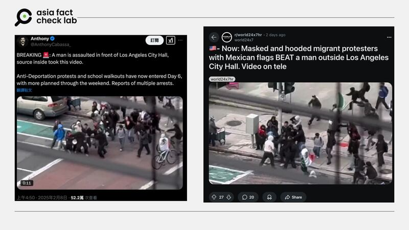

# 事實查覈｜影片顯示哈馬斯在美支持者收到驅逐令後追打工作人員？

董喆

2025.02.12 12:52 EST

## 查覈結果：證據不足

## 一分鐘完讀：

網易和微博近期出現一段視頻，稱一羣在美的哈馬斯支持者因收到驅逐令而追逐圍毆發佈通知的工作人員。亞洲事實查覈實驗室查證後發現，視頻中出現的是墨西哥國旗，而非哈馬斯或巴勒斯坦旗幟。因此，儘管缺乏暴力事件的具體細節，但無證據顯示影片內容與哈馬斯有關。

## 深度分析：

美國總統特朗普的移民政策近期在中國社交平臺引發熱議。廣泛流傳的[一段視頻](https://archive.ph/vX7qE)稱，在美哈馬斯支持者收到政府驅逐令後，追逐圍毆發佈通知的工作人員。

近日網易和微博等平臺出現視頻稱美國的哈馬斯支持者追逐圍毆發佈驅逐通知的工作人員。 近日網易和微博等平臺出現視頻稱美國的哈馬斯支持者追逐圍毆發佈驅逐通知的工作人員。 (圖取自網易、微博)

亞洲事實查覈實驗室（AFCL）首先針對“驅逐哈馬斯支持者”的行政令進行查證。白宮於1月29日發佈的[行政命令](https://www.whitehouse.gov/presidential-actions/2025/01/additional-measures-to-combat-anti-semitism/)中的確包含了打擊校園反猶太主義行動條款，授權調查並驅逐可能違反相關法律者，包括學生羣體。

特朗普在另一份[事實清單](https://www.whitehouse.gov/fact-sheets/2025/01/fact-sheet-president-donald-j-trump-takes-forceful-and-unprecedented-steps-to-combat-anti-semitism/)中明確表示：

“對所有參與支持‘聖戰主義’抗議活動的外籍居民，我們警告：2025年我們將找到並驅逐你們。我將立即取消所有在大學校園支持哈馬斯的留學生簽證——這些校園從未被如此激進的意識形態侵蝕。”

由此可見，特朗普確實公開宣稱將驅逐哈馬斯支持者。

AFCL進一步覈查視頻內容後發現：

1. 視頻中出現的是**墨西哥國旗**，而非哈馬斯或巴勒斯坦旗幟；
2. 通過反向圖片搜索，該視頻於2月8日在X（原Twitter）和Reddit傳播，背景信息均指向**洛杉磯市政廳的反驅逐抗議**。

中國社交平臺視頻於2月8日在X（原Twitter）廣傳，背景信息顯示爲洛杉磯市政廳的反驅逐抗議。 中國社交平臺視頻於2月8日在X（原Twitter）廣傳，背景信息顯示爲洛杉磯市政廳的反驅逐抗議。 (圖取自X、Reddit)

經Google街景比對，確認事發地爲洛杉磯市政廳外。結合時間線索檢索，可找到[KTLA5](https://ktla.com/news/local-news/massive-fight-breaks-out-as-students-protest-trumps-immigration-policies-in-los-angeles/)和[《洛杉磯時報》](https://www.hindustantimes.com/trending/sunita-williams-captures-the-ultimate-selfie-during-her-9th-spacewalk-incredible-nasa-pic-wows-internet-101738801862639.html)等當地媒體的報道，證實視頻內容應爲**2月2日起洛杉磯市中心爆發的反大規模驅逐移民抗議**。

根據Google街景比對，網傳視頻事發地爲洛杉磯市政廳。 根據Google街景比對，網傳視頻事發地爲洛杉磯市政廳。 (Google截圖，AFCL製圖)

然而，關於視頻中的鬥毆行爲，多數媒體未提及具體細節。雖有報道稱2月7日示威中一名17歲青少年被刺傷，但無“通知人員遭毆打”的記錄。因此，網傳視頻的說法缺乏證據支持。

*亞洲事實查覈實驗室（Asia Fact Check Lab）針對當今複雜媒體環境以及新興傳播生態而成立。我們本於新聞專業主義，提供專業查覈報告及與信息環境相關的傳播觀察、深度報道，幫助讀者對公共議題獲得多元而全面的認識。*

*讀者若對任何媒體及社交平臺傳播的信息有疑問，歡迎以電郵*[*afcl@rfa.org*](mailto:afcl@rfa.org)*寄給亞洲事實查覈實驗室，由我們爲您查證覈實。亞洲事實查覈實驗室更詳細的介紹請參考*[*本文*](2024-10-09_關於亞洲事實查覈實驗室｜About AFCL.md)*。*

*我們另有X、臉書、IG頻道，歡迎讀者追蹤、分享、轉發。 X這邊請進：中文*[*@asiafactcheckcn*](https://twitter.com/asiafactcheckcn)*;英語：*[*@AFCL\_eng*](https://twitter.com/AFCL_eng)*、*[*FB在這裏*](https://www.facebook.com/asiafactchecklabcn)*、*[*IG也別忘了*](https://www.instagram.com/asiafactchecklab/)*。*

[Original Source](https://www.rfa.org/mandarin/shishi-hecha/2025/02/12/fact-check-hamas-beat-uscis-staff/)