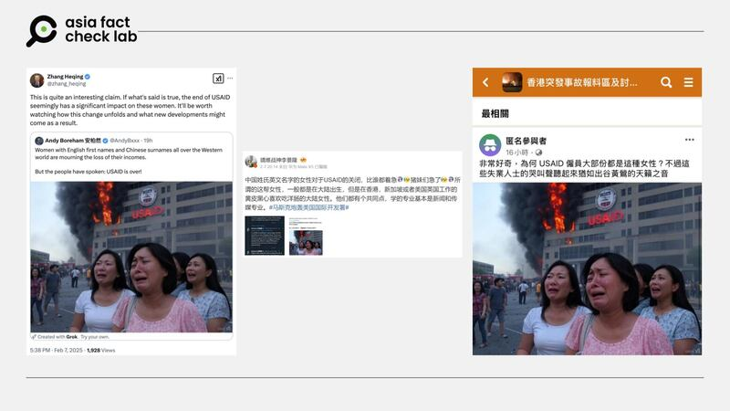
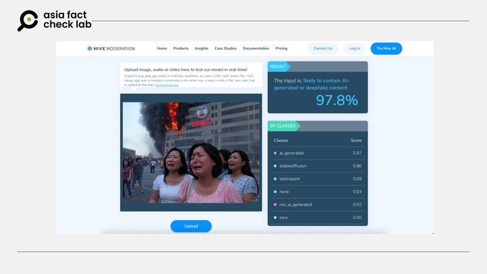

# 事實查覈｜網傳圖片是USAID員工在哭泣嗎？

莊敬

2025.02.12 12:43 EST

## 查覈結果：錯誤

## #

## 一分鐘完讀：

近日社媒流傳一張圖片，畫面顯示數位亞裔女性在燃燒的USAID（美國國際開發署）建築前哭泣。部分轉發者質疑“爲何USAID僱員多爲這類女性”。經查證，圖片右下角標註AI生成工具“Grok”，亞洲事實查覈實驗室（AFCL）以工具檢測亦顯示97.8%概率爲AI生成。

## 深度分析：

中國外交官[張和清](https://x.com/zhang_heqing/status/1887798153056858404)2月7日於X平臺轉發藍勾賬號“Andy Boreham 安柏然”帖文，內容爲多名亞裔女性在燃燒的USAID建築前哭泣，配文稱“這羣擁有英文名、中文姓氏的女性正爲損失收入而痛哭”。

社媒用戶傳播圖片顯示亞裔女性在燃燒的USAID建築前哭泣。 社媒用戶傳播圖片顯示亞裔女性在燃燒的USAID建築前哭泣。 (X、微博、臉書截圖)

經檢視，該圖右下角標註“Grok”生成器，左下方註明“Created with Grok”，明確爲AI生成圖像。AFCL於2月11日已無法查看原始帖文，張和清轉發內容亦顯示“此貼文無法查看”。

然而張和清與其他[臉書用戶](https://www.facebook.com/groups/HKGuy/posts/2439810033057340/)、[微博大V](https://m.weibo.cn/detail/5131508781945580)仍採信該圖，轉發時評論“若說法屬實，解散USAID恐嚴重影響這些女性”“好奇USAID爲何多僱用此類女性”等。AFCL另以AI辨識工具“Hive”檢測，結果顯示97.8%概率爲AI生成。

AI辨識工具“Hive”檢測結果截圖顯示極高AI生成概率。 AI辨識工具“Hive”檢測結果截圖顯示極高AI生成概率。 (Hive截圖)

*亞洲事實查覈實驗室（Asia Fact Check Lab）針對當今複雜媒體環境以及新興傳播生態而成立。我們本於新聞專業主義，提供專業查覈報告及與信息環境相關的傳播觀察、深度報道，幫助讀者對公共議題獲得多元而全面的認識。*

*讀者若對任何媒體及社交平臺傳播的信息有疑問，歡迎以電郵*[*afcl@rfa.org*](mailto:afcl@rfa.org)*寄給亞洲事實查覈實驗室，由我們爲您查證覈實。亞洲事實查覈實驗室更詳細的介紹請參考*[*本文*](2024-10-09_關於亞洲事實查覈實驗室｜About AFCL.md)*。*

*我們另有X、臉書、IG頻道，歡迎讀者追蹤、分享、轉發。 X這邊請進：中文*[*@asiafactcheckcn*](https://twitter.com/asiafactcheckcn)*;英語：*[*@AFCL\_eng*](https://twitter.com/AFCL_eng)*、*[*FB在這裏*](https://www.facebook.com/asiafactchecklabcn)*、*[*IG也別忘了*](https://www.instagram.com/asiafactchecklab/)*。*

[Original Source](https://www.rfa.org/mandarin/shishi-hecha/2025/02/12/fact-check-usaid-crying-pic/)