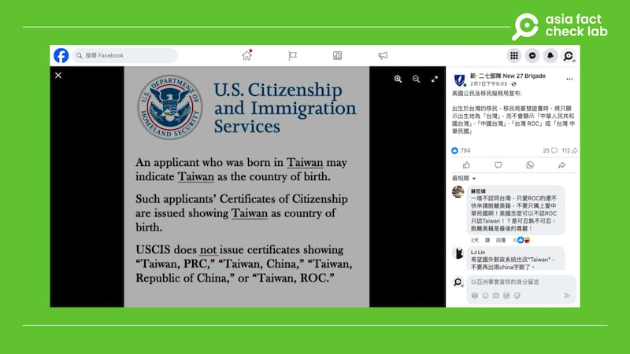
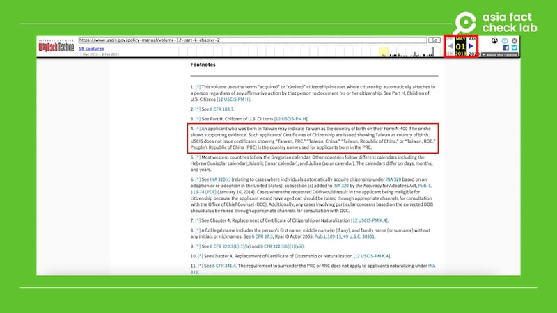

# 事實查覈｜特朗普上臺後，美國承認臺灣是個國家？

艾倫

2025.02.13 15:08 EST

## 查覈結果：誤導

## 一分鐘完讀：

近期數個社媒平臺上有中文用戶發文，稱美國移民局在特朗普就任後，開放“臺灣”作爲國籍選項。有用戶宣稱這是特朗普政府“承認臺灣是一個國家”的證據。但亞洲事實查覈實驗室查證後發現，美國移民局至少早在2019年就使用同一份啓事，填寫國籍欄可以使用“臺灣”，該規定一直沿用至今。

## 深度分析：

二月初，[X](https://x.com/guozhanshi/status/1888062479403765835)、[Facebook](https://www.facebook.com/New27b/posts/pfbid02WT7ohjhoyTjXJ3YiREtTfsKvrpeZY2MHgLmArHUmLgokwCcGMZoweS7Pc6dCk5fnl?rdid=vjjPsUeBk3P25Fc3)及[Threads](https://www.threads.net/@imhungryimfoolish/post/DFwl4PbPRto)等社媒平臺流傳一張美國公民及移民服務局（USCIS，簡稱移民局）網站的截圖，稱臺灣申請移民者在填國籍時只需填寫“臺灣”，許多用戶稱這代表特朗普新政府終於“承認臺灣是一個國家”，有人稱這是“歷史的一刻”，有人稱“我川威武”，還有人稱這是USCIS的聲明。

近期網上出現一張美國移民局網站的截圖，有網民稱這是特朗普當局“承認臺灣是國家”的證據。 近期網上出現一張美國移民局網站的截圖，有網民稱這是特朗普當局“承認臺灣是國家”的證據。 (圖截自Facebook)

亞洲事實查覈實驗室（Asia Fact Check Lab，AFCL）查看了移民局的“第2章 - 公民身份證書”（USCIS Chapter 2 - Certificate of Citizenship）[頁面](https://www.uscis.gov/policy-manual/volume-12-part-k-chapter-2#footnote-5)，下方“備註五”解釋：

“申請人若出生於臺灣，可在其N-400表格上將出生國家填寫爲‘臺灣’，前提是提供相關證明文件。對於這類申請人，美國公民及移民服務局（USCIS）在頒發入籍公民證書（Certificate of Citizenship）時，出生國家將標示爲‘臺灣’。

USCIS不會在證書上使用‘臺灣，中華人民共和國（Taiwan, PRC）’‘臺灣，中國（Taiwan, China）’‘臺灣，中華民國（Taiwan, Republic of China）’或‘臺灣，ROC（Taiwan, ROC）’等標示。

若申請人出生於中華人民共和國（PRC），則USCIS在文件上標示的國家名稱爲‘中華人民共和國（People’s Republic of China, PRC）’。”

由此可知，網傳在移民局國籍處填寫“臺灣”是正確消息。不過，這項政策並不是特朗普這一任期纔開始，使用網絡時光機（Wayback Machine）回溯該頁面，發現[2019年](https://web.archive.org/web/20190501160337/https:/www.uscis.gov/policy-manual/volume-12-part-k-chapter-2)就已經有相同說法，[2020年](https://web.archive.org/web/20200315053412/https:/www.uscis.gov/policy-manual/volume-12-part-k-chapter-2)拜登就任後，移民局也沒有改變措辭。

網絡時光機顯示，2019年5月移民局針對臺灣的措辭就已經和近期相同。 網絡時光機顯示，2019年5月移民局針對臺灣的措辭就已經和近期相同。 (圖截自USCIS網站)

至於“承認臺灣是個國家”這個說法，AFCL已多次發佈[查覈報告](2023-02-10_事實查覈│和蔡英文通電話，捷克準總統違背了“一中原則”的政治承諾？.md)，解釋美國“一箇中國政策”立場。

1979年1月1日，美國與中華人民共和國互相承認並建立外交關係。美國承認中華人民共和國政府是中國的唯一合法政府。但對於中國宣稱臺灣爲其一部分，美國僅是“認知”（acknowledge）而非“承認”。同時在此範圍內，美國人民將同臺灣人民保持文化、商務和其他非官方關係。

也因此，美國官方網站的國籍選單在提及臺灣時，通常直接使用“臺灣”（Taiwan）而非“中華民國”（R.O.C.），例如[國務院](https://www.state.gov/countries-areas/taiwan/)、[美國貿易代表署](https://ustr.gov/countries-regions/china/taiwan)等，移民局並非唯一。

*亞洲事實查覈實驗室（Asia Fact Check Lab）針對當今複雜媒體環境以及新興傳播生態而成立。我們本於新聞專業主義，提供專業查覈報告及與信息環境相關的傳播觀察、深度報道，幫助讀者對公共議題獲得多元而全面的認識。*

*讀者若對任何媒體及社交平臺傳播的信息有疑問，歡迎以電郵*[*afcl@rfa.org*](mailto:afcl@rfa.org)*寄給亞洲事實查覈實驗室，由我們爲您查證覈實。亞洲事實查覈實驗室更詳細的介紹請參考*[*本文*](2024-10-09_關於亞洲事實查覈實驗室｜About AFCL.md)*。*

*我們另有X、臉書、IG頻道，歡迎讀者追蹤、分享、轉發。 X這邊請進：中文*[*@asiafactcheckcn*](https://twitter.com/asiafactcheckcn)*;英語：*[*@AFCL\_eng*](https://twitter.com/AFCL_eng)*、*[*FB在這裏*](https://www.facebook.com/asiafactchecklabcn)*、*[*IG也別忘了*](https://www.instagram.com/asiafactchecklab/)*。*

[Original Source](https://www.rfa.org/mandarin/shishi-hecha/2025/02/13/fact-check-us-admit-taiwan-as-a-country/)