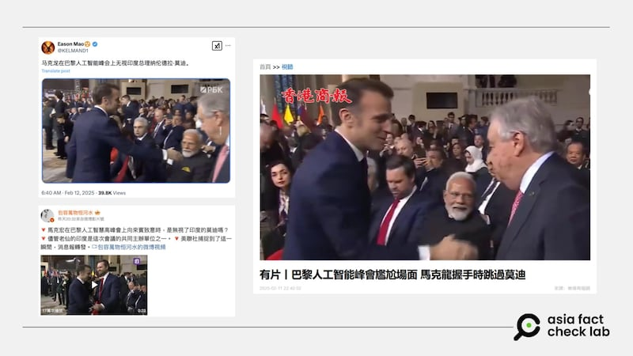
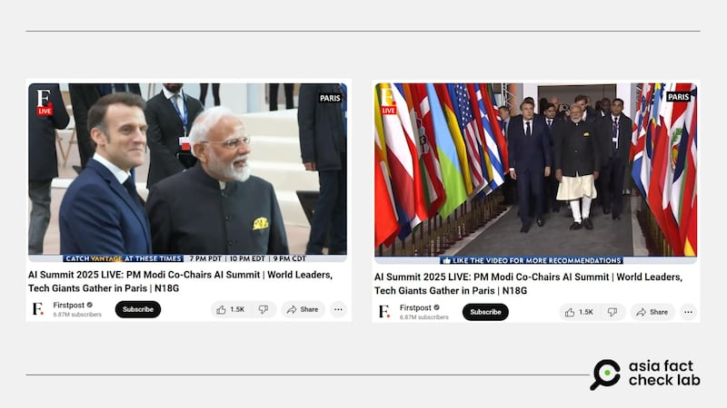

# 事實查覈｜巴黎AI峯會上 法國總統馬克龍“無視”印度總理莫迪？

莊敬

2025.02.14 13:48 EST

## 查覈結果：誤導

## 一分鐘完讀：

近日網上流傳法國總統馬克龍在巴黎AI峯會上“無視”印度總理莫迪的消息，並附帶短視頻，顯示馬克龍在會場向嘉賓一一握手致意，卻跳過莫迪。經檢視較完整的現場畫面後，發現在這段迎賓視頻前後，馬克龍與莫迪均有互動、交談。然而網傳視頻刻意擷取了兩人沒有互動的的特定時間段，誤導受衆。

深度分析：

“[人工智能行動峯會](https://www.elysee.fr/en/sommet-pour-l-action-sur-l-ia)”（AI Action Summit）2月10日、11日在法國巴黎舉行，由法國總統馬克龍（Emmanuel Macron）與印度總理莫迪（Narendra Modi）[共同主持](https://www.mea.gov.in/press-releases.htm?dtl/39023/Prime_Minister_cochairs_AI_Action_Summit_in_Paris_February_11_2025)，100多國政府與商界領袖、學術界及非政府組織代表齊聚一堂。

峯會期間，微博（[1](https://m.weibo.cn/detail/5132962686833263),[2](https://m.weibo.cn/detail/5132998418632042)）、X（[1](https://x.com/KELMAND1/status/1889444404894867593),[2](https://x.com/NiKiTa_32156/status/1889310266804097176)）等平臺流傳馬克龍在會上“無視”莫迪的消息，發文者並附上一段短視頻，畫面顯示，馬克龍在會場與美國副總統萬斯（JD Vance）握手後，未與莫迪握手，而是與下一位嘉賓握手致意。 《[香港商報網](https://www.hkcd.com.hk/hkcdweb/content/2025/02/11/content_8680038.html)》也在網站上發佈11秒的短視頻，並寫道“2月11日，法國總統馬克龍在巴黎人工智能峯會期間與各國領導人握手時，不知出於什麼原因直接跳過印度總理莫迪。”

網傳法國總統馬克龍在巴黎AI峯會無視印度總理莫迪、場面尷尬。 網傳法國總統馬克龍在巴黎AI峯會無視印度總理莫迪、場面尷尬。 (微博、X、香港商報網截圖)

亞洲事實查覈實驗室（Asia Fact Check Lab, AFCL）檢視印度媒體《第一郵報》（Firstpost）發佈在YouTube上的[現場畫面](https://www.youtube.com/watch?v=RGJMUYJ4OcU)，自6分38秒起，馬克龍與莫迪並肩走向會場，兩人不時交談，並握手、合影；8分39秒起，馬克龍與莫迪一同步入會場，接着兩人分別與各國領袖握手致意，莫迪先就坐。

現場畫面顯示，法國總統馬克龍與印度總理莫迪並肩步入巴黎AI峯會的會場，兩人互動頻繁。 現場畫面顯示，法國總統馬克龍與印度總理莫迪並肩步入巴黎AI峯會的會場，兩人互動頻繁。 (YouTube截圖)

馬克龍與坐在莫迪旁邊的萬斯握手後，確實沒有與莫迪握手，而是與其他嘉賓致意。但這並不代表馬克龍“無視”莫迪，視頻顯示，兩人在此之前已見面致意、交談握手併合影，然而網傳視頻僅擷取馬克龍未與莫迪握手的片段，誤導受衆。

*亞洲事實查覈實驗室（Asia Fact Check Lab）針對當今複雜媒體環境以及新興傳播生態而成立。我們本於新聞專業主義，提供專業查覈報告及與信息環境相關的傳播觀察、深度報道，幫助讀者對公共議題獲得多元而全面的認識。讀者若對任何媒體及社交軟件傳播的信息有疑問，歡迎以電郵*[*afcl@rfa.org*](mailto:afcl@rfa.org)*寄給亞洲事實查覈實驗室，由我們爲您查證覈實。*

*亞洲事實查覈實驗室更詳細的介紹請參考*[*本文*](2024-10-09_關於亞洲事實查覈實驗室｜About AFCL.md)*。我們另有X、臉書、IG頻道，歡迎讀者追蹤、分享、轉發。X這邊請進：中文*[*@asiafactcheckcn*](https://twitter.com/asiafactcheckcn)*；英文：*[*@AFCL\_eng*](https://twitter.com/AFCL_eng)*、*[*FB在這裏*](https://www.facebook.com/asiafactchecklabcn)*、*[*IG也別忘了*](https://www.instagram.com/asiafactchecklab/)*。*

[Original Source](https://www.rfa.org/mandarin/shishi-hecha/2025/02/14/fact-check-ai-summit-macron-ignore-modi/)