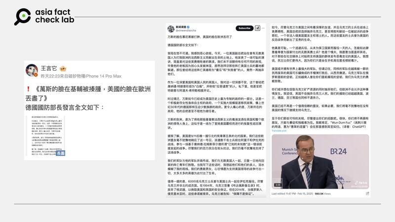

# 事實查覈｜德國防長以“可恥”“噁心欲嘔”批評美副總統？

作者：莊敬

2025.02.17 22:53 EST

## 查覈結果：錯誤

## 一分鐘完讀：

近日社媒流傳一份德國國防部長皮斯托裏烏斯在慕尼黑安全會議的“演說全文”，這份以簡體中文流傳的“譯文”，內容不僅批評美國副總統範斯的演講“可恥”，還稱自己“怒不可遏，感到噁心欲嘔”。經檢視，皮斯托裏烏斯的演說雖然曾表達“不可接受”範斯的主張，但他並沒有說出“可恥”等激烈言詞。經進一步比對，網傳“演說稿”內容和皮斯托裏烏斯實際演說內容完全不符，通篇爲虛構。

## 深度分析：

第61屆慕尼黑安全會議（慕尼黑安全會議， MSC）14日至16日舉行，德國總統施泰因邁爾（Frank-Walter Steinmeier）、美國副總統萬斯（JD Vance）等與會者相繼發表演說。[萬斯演說](https://www.youtube.com/watch?v=pCOsgfINdKg)指出，歐洲目前面臨的最大威脅並非來自俄羅斯或中國，而是來自內部。在萬斯之後發表講話的德國國防部長皮斯托裏烏斯（Boris Pistorius，又譯皮斯托瑞斯）在演說一開始就反駁萬斯，稱其言論“不可接受”。

雙方的發言引起廣泛報道與討論之際，微博（[1](https://m.weibo.cn/detail/5134802732451703),[2](https://m.weibo.cn/detail/5134610327929850)）、X（[1](https://x.com/xinwendiaocha/status/1890789919624441925),[2](https://x.com/Hvq2eW/status/1890713951509328168)）等社媒平臺傳出一份簡體中文版的“德國國防部長全文”，部分傳播者提供的[來源出處](https://x.com/politicsusa46/status/1890535997978402907)（[頁面存檔](https://archive.ph/193aN)）是X平臺上的一個英文賬號，還附有皮斯托裏烏斯在TikTok上的發言短視頻，網傳的中文翻譯則標註是以ChatGPT翻譯，以下是其中一部分內容：

“我現在怒不可遏。我感到噁心欲嘔。今天，一位美國副總統站在曾有無數美國人爲打敗歐洲的法西斯主義而獻出生命的土地上，他發表了一場可恥的演講，簡直是對這些英勇犧牲者的褻瀆。”

--- 網傳德國國防部長在慕尼黑安全會議演說時，批評美國副總統萬斯所言“可恥”。

經比對，傳播者附上的皮斯托裏烏斯發言視頻，與他們發佈的簡體中文版“德國國防部長髮言全文”的文字稿，內容完全不符。

亞洲事實查覈實驗室（Asia Fact Check Lab, AFCL）另檢視[德國媒體BR24](https://www.youtube.com/watch?v=S7Rl6XgkWUg)發佈在YouTube的皮斯托裏烏斯演說（提供英文翻譯），以及[路透社](https://www.reuters.com/world/europe/german-president-accept-that-us-wont-heed-international-rules-2025-02-14/)等媒體的報道，皮斯托裏烏斯確實在演講開場時反駁萬斯談及歐洲的言論，並表示萬斯所言“不可接受”，但他沒有批評萬斯的演講“可恥”，也沒有說出網傳的“怒不可遏”“噁心欲嘔”等內容。

AFCL進一步依BR24的翻譯內容和網傳“德國國防部長髮言全文”相比，確認兩篇文章內容完全不同，部分社媒用戶傳播的中文版“全文”爲捏造的內容。

*亞洲事實查覈實驗室（Asia Fact Check Lab）針對當今複雜媒體環境以及新興傳播生態而成立。我們本於新聞專業主義，提供專業查覈報告及與信息環境相關的傳播觀察、深度報導，幫助讀者對公共議題獲得多元而全面的認識。讀者若對任何媒體及社交平臺傳播的信息有疑問，歡迎以電郵*[*afcl@rfa.org*](mailto:afcl@rfa.org)*寄給亞洲事實查覈實驗室，由我們爲您查證覈實。*

*亞洲事實查覈實驗室更詳細的介紹請參考*[*本文*](2024-10-09_關於亞洲事實查覈實驗室｜About AFCL.md)*。我們另有X、臉書、IG頻道，歡迎讀者追蹤、分享、轉發。 X這邊請進：中文*[*@asiafactcheckcn*](https://twitter.com/asiafactcheckcn)*;英語：*[*@AFCL\_eng*](https://twitter.com/AFCL_eng)*、*[*FB在這裏*](https://www.facebook.com/asiafactchecklabcn)*、*[*IG也別忘了*](https://www.instagram.com/asiafactchecklab/)*。*

[Original Source](https://www.rfa.org/mandarin/shishi-hecha/2025/02/18/fact-check-munich-summit-pistorius-vance/)