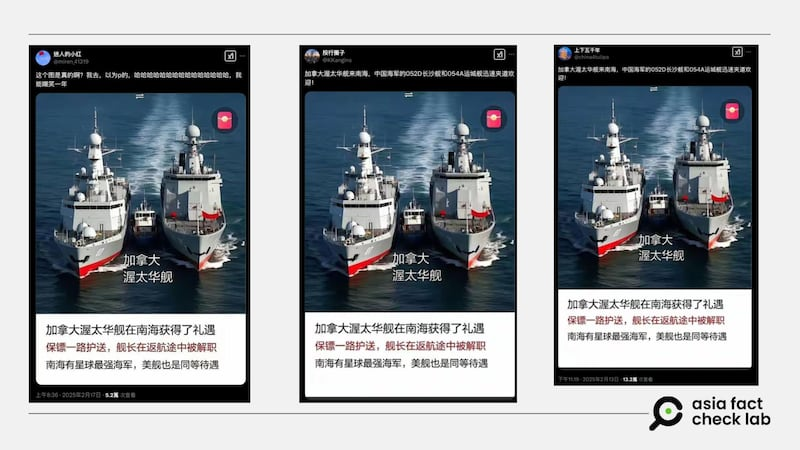
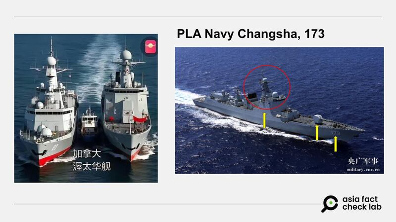
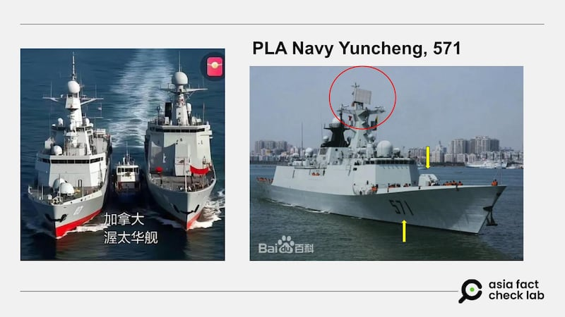
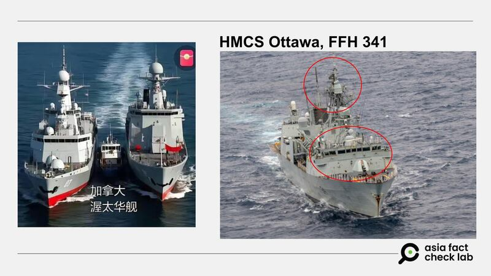
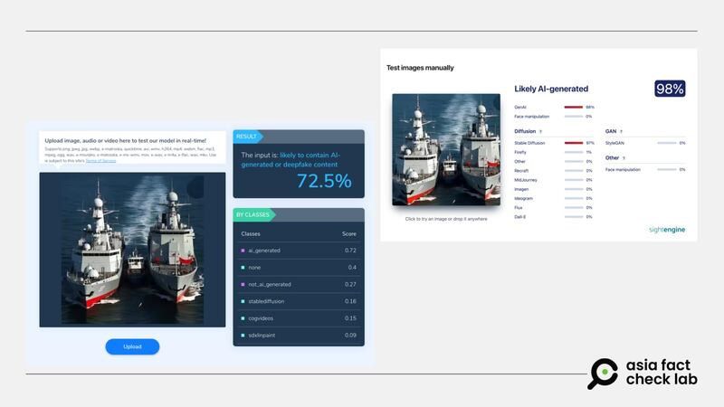

# 事實查覈｜這張圖是加拿大軍艦被中國軍艦包夾嗎 ？

董喆

2025.02.19 12:55 EST

## 查覈結果：錯誤

## 一分鐘完讀：

近日Ｘ上有多個賬號同時貼出一張照片，稱是加拿大渥太華艦行經南海時，遭中國海軍長沙艦與運城艦“夾道歡迎”。亞洲事實查覈實驗室以三艘船艦的外型與尺寸進行比對，發現圖片中3艘船艦的比例並不符合真實情形，且兩種AI檢測工具分別偵測顯示，此張照片極有可能是AI生成。

## 深度分析

社羣平臺X上近日有多個賬號轉貼一張照片（[1](https://archive.ph/mqZeF)，[2](https://archive.ph/u40oz)，[3](https://archive.ph/IWkBW)，[4](https://archive.ph/ycZqE)），爲兩艘大船艦包夾一艘小船艦，貼文指出，這是加拿大渥太華艦（HMCS Ottawa, FFH 341）行經南海時“獲得禮遇”，遭中國的長沙艦（PLA Navy Changsha, 173）以及運城艦（PLA Navy Yuncheng, 571）“夾道歡迎”，且該艦的船長在返航途中遭解職。

貼文並稱南海有“星球最強海軍”，就算美艦通過也會獲得相同待遇，暗指中國在南海的軍事實力強大。貼文有留言稱中國軍艦把加拿大“小土豆”嚇破膽了，但亦有人質疑真實性。

社羣平臺上流傳加拿大海軍渥太華號遭中國軍艦包圍的影像。 社羣平臺上流傳加拿大海軍渥太華號遭中國軍艦包圍的影像。 (X截圖)

根據渥太華號的[官方資料](https://web.archive.org/web/20110613060157/http://www.navy.forces.gc.ca/ottawa/0/0-s_eng.asp)，船體全長134米，寬度16米，根據臺灣海軍[學術雙月刊](https://navy.mnd.gov.tw/Files/Paper/1-%E4%B8%AD%E5%85%B1%E6%B5%B7%E8%BB%8D%E7%99%BC%E5%B1%95%E4%BB%BF%E7%A5%9E%E7%9B%BE%E8%89%A6.pdf)，長沙艦全長則爲156米，艦寬爲17.5米。根據[美國海軍學會資料](https://www.usni.org/magazines/proceedings/2020/june/chinas-multipurpose-ffg)，同屬054A型護衛艦的運城艦長度則爲134米，寬度16米。因此3艘船艦相較之下，渥太華號與運城艦長度幾乎一樣，而長沙艦比兩艦略長15%左右。而網傳圖片中的兩艘“中國艦艇”比“渥太華號”大出幾倍，呈現比例明顯不相符。

以外觀判斷，網圖中包夾小艦艇的兩艘大船艦的編號不是長沙艦的173，亦不是運城艦的571，船隻外觀配置也與實際不符合，圖中“渥太華艦”的外觀也與官方資料不符。

網傳照片中的編號與長沙艦不相符，船隻外觀亦不同。 網傳照片中的編號與長沙艦不相符，船隻外觀亦不同。 (X、央視軍事截圖，AFCL加註)

網傳照片中的編號與運城艦不相符，船隻外觀亦不同。 網傳照片中的編號與運城艦不相符，船隻外觀亦不同。 (X、百度截圖，AFCL加註)

網傳照片中的船隻外觀與渥太華艦不相符。 網傳照片中的船隻外觀與渥太華艦不相符。 (X、渥太華號臉書截圖，AFCL 加註)

AFCL將畫面文字去除後，再以AI檢測工具“hive moderation”檢測，結果顯示有72.5%的幾率是AI生成或是深僞技術，另以“sightengine”檢驗，則是98％幾率爲AI生成。

網傳照片經AI檢測工具“hive moderation”以及“sightengine”檢驗，皆有高几率爲AI生成。 網傳照片經AI檢測工具“hive moderation”以及“sightengine”檢驗，皆有高几率爲AI生成。 (hive moderation、sightengine截圖)

不過，渥太華艦在南海被中國軍艦尾隨，以及該船指揮官遭解職一事屬實，但官方公佈的具體情節與網絡流傳的版本有出入。

根據加拿大電視網CTV隨艦記者阿德里安‧戈布里亞爾（Adrian Ghobrial）於[1月9日](https://www.ctvnews.ca/world/article/amid-tense-backdrop-canadian-warship-gets-friendly-message-from-chinese-vessel-tracking-movements/)以及[10日](https://www.ctvnews.ca/world/article/multiple-chinese-warships-track-canadian-hmcs-ottawa-through-the-south-china-sea/)的報導，當中提到“中國海軍的一艘大型驅逐艦——“長沙號”(Changsha) 以及一艘護衛艦——“運城號”(Yuncheng) 的輪廓可見，它們在地平線上若隱若現，鏡像般地模仿渥太華號的行動”。由此可知確實有中國兩艘艦艇在南海靠近加國艦艇渥太華號，但報道沒有提到渥太華艦如網傳圖片中被近距離緊緊“包夾”的情形。

另外，渥太華號艦長遭解職一事屬實，2月7日加拿大海軍[發表聲明](https://www.canada.ca/en/department-national-defence/news/2025/02/statement-by-the-royal-canadian-navy.html)，當中提到“加拿大皇家海軍司令安格斯·託普希海軍中將（Vice-Admiral Angus Topshee）已解除阿德里亞諾·洛澤（Adriano Lozer）指揮官的職務，他原爲渥太華號的指揮官，該艦目前正在執行地平線行動（Operation HORIZON）。此決定是基於對其領導能力失去信心。”但並未提到是否與其在南海的行動有所關聯。

*亞洲事實查覈實驗室（Asia Fact Check Lab）針對當今複雜媒體環境以及新興傳播生態而成立。我們本於新聞專業主義，提供專業查覈報告及與信息環境相關的傳播觀察、深度報道，幫助讀者對公共議題獲得多元而全面的認識。讀者若對任何媒體及社交軟件傳播的信息有疑問，歡迎以電郵*[*afcl@rfa.org*](mailto:afcl@rfa.org)*寄給亞洲事實查覈實驗室，由我們爲您查證覈實。*

*亞洲事實查覈實驗室更詳細的介紹請參考*[*本文*](2024-10-09_關於亞洲事實查覈實驗室｜About AFCL.md)*。我們另有X、臉書、IG頻道，歡迎讀者追蹤、分享、轉發。X這邊請進：中文*[*@asiafactcheckcn*](https://twitter.com/asiafactcheckcn)*；英文：*[*@AFCL\_eng*](https://twitter.com/AFCL_eng)*、*[*FB在這裏*](https://www.facebook.com/asiafactchecklabcn)*、*[*IG也別忘了*](https://www.instagram.com/asiafactchecklab/)*。*

[Original Source](https://www.rfa.org/mandarin/shishi-hecha/2025/02/19/fact-check-ottawa-vessel-escorted-north-china-sea/)