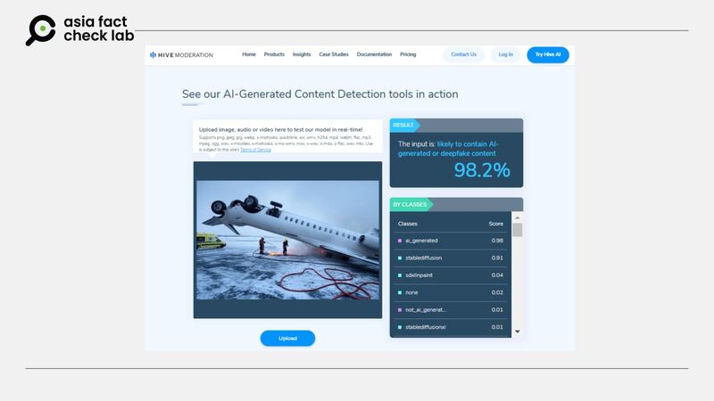

# 事實查覈｜這張圖是達美航空客機翻覆現場照片？

莊敬

2025.02.20 11:25 EST

## 查覈結果：錯誤

## 一分鐘完讀：

美國達美航空一架客機日前降落加拿大多倫多機場時翻覆，事故發生後，有華文媒體與社媒用戶傳播一張“事故現場”圖片，畫面與其他多家機構媒體發佈的事故現場影像不符。亞洲事實查覈實驗室發現圖片上有人工智能軟件的標記，另以工具檢測發現，該圖片大概率爲AI生成。

## 深度分析：

美國達美航空一架載有80名乘客的客機於2月17日降落加拿大多倫多皮爾遜（Pearson）機場時發生事故，重落地後機身翻轉，據[美聯社](https://apnews.com/article/delta-plane-flip-toronto-canada-airport-minneapolis-6d064bbc7a3bb8595183d6765d61a0ee)等媒體報道，這起事故造成21人受傷。報道中的現場畫面顯示，機身腹部朝天，從頭到尾緊貼地面“躺”在雪地上。

臺灣網路媒體[“上報”](https://www.upmedia.mg/news_info.php?Type=3&SerialNo=224027)（[archive](https://archive.ph/2uo6R)）2月18日發佈有關達美航空翻覆事故的報道，搭配了一張飛機形態與美聯社等媒體發佈的報道不一樣的圖片。畫面中，有救援人員正在飛機翹起的尾翼下方滅火，一旁還停着黃色的救援車輛。圖片說明爲“美國達美航空客機17日在多倫多皮爾遜機場降落時，因強風天氣翻覆。（取自X）”。這則報道經新聞資訊平臺[“LINE TODAY”](https://today.line.me/tw/v2/article/2D5ynRa)轉載，擴大了傳播。

華文媒體與社媒用戶近日傳播一張白色飛機翻覆的圖片，稱該圖是達美航空客機翻覆事故的影像。 華文媒體與社媒用戶近日傳播一張白色飛機翻覆的圖片，稱該圖是達美航空客機翻覆事故的影像。 (LINE TODAY、X截圖)

亞洲事實查覈實驗室（Asia Fact Check Lab, AFCL）注意到，該圖片有多處細節與事故現場不同。比如該圖中飛機尾翼爲白色，但達美航空飛機尾翼爲紅、藍色。進一步比對可靠機構媒體發佈的達美航空翻覆事故的[視頻](https://www.youtube.com/watch?v=XEhHvk3THt4)與[照片](https://www.reuters.com/pictures/pictures-plane-flips-upside-down-landing-toronto-airport-2025-02-18/)可發現，“上報”使用的這張圖中，飛機造型、起落架位置、救援車輛等諸多細節都與上述媒體發佈的事故現場畫面不同。

AFCL以圖反搜發現，多個[中文](https://m.weibo.cn/detail/5135492179821154)、[英文](https://x.com/100NEWS/status/1891597037965033627)社媒用戶在微博、X等平臺上傳播同一張照片，但他們發佈的照片右下方標註“GROK”記號，表明該圖可能是由在線人工智能工具[GROK](https://x.ai/grok)生成而並非現實照片。然而，“上報”報道中的配圖卻沒有“GROK”標記，圖片說明中也沒有提及該圖是否由AI生成。

AFCL另使用AI檢測工具“Hive”對該圖進行檢測，結果顯示其爲AI生成的可能性高達98.2%。[法新社](https://factcheck.afp.com/doc.afp.com.36Y44YQ)（AFP）也已就該圖片發佈相關查覈報告，認爲該圖片極高概率爲AI生成。

以“Hive”檢測網傳圖片，結果顯示該圖極大概率爲AI生成。 以“Hive”檢測網傳圖片，結果顯示該圖極大概率爲AI生成。 (Hive截圖)

*亞洲事實查覈實驗室（Asia Fact Check Lab）針對當今複雜媒體環境以及新興傳播生態而成立。我們本於新聞專業主義，提供專業查覈報告及與信息環境相關的傳播觀察、深度報道，幫助讀者對公共議題獲得多元而全面的認識。*

*讀者若對任何媒體及社交平臺傳播的信息有疑問，歡迎以電郵*[*afcl@rfa.org*](mailto:afcl@rfa.org)*寄給亞洲事實查覈實驗室，由我們爲您查證覈實。亞洲事實查覈實驗室更詳細的介紹請參考*[*本文*](2024-10-09_關於亞洲事實查覈實驗室｜About AFCL.md)*。*

*我們另有X、臉書、IG頻道，歡迎讀者追蹤、分享、轉發。 X這邊請進：中文*[*@asiafactcheckcn*](https://twitter.com/asiafactcheckcn)*;英語：*[*@AFCL\_eng*](https://twitter.com/AFCL_eng)*、*[*FB在這裏*](https://www.facebook.com/asiafactchecklabcn)*、*[*IG也別忘了*](https://www.instagram.com/asiafactchecklab/)*。*

[Original Source](https://www.rfa.org/mandarin/shishi-hecha/2025/02/20/fact-check-delta-plane-turn-over-pic/)