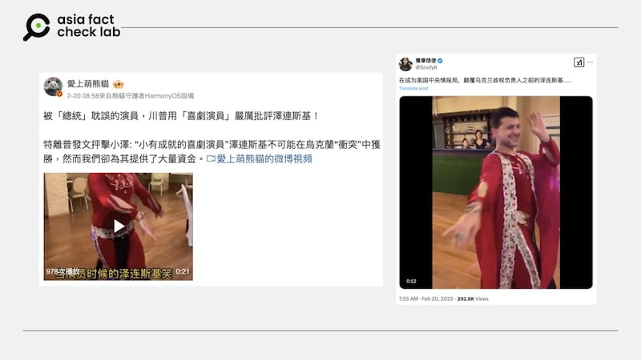
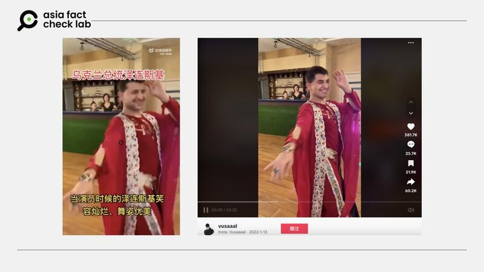

# 事實查覈｜網傳視頻是烏克蘭總統澤連斯基跳舞嗎？

莊敬

2025.02.21 18:57 EST

## 查覈結果：錯誤

## 一分鐘完讀：

近日有中文社媒用戶傳播一段紅衣男子跳舞的短視頻，聲稱視頻中的人物是烏克蘭總統澤連斯基。經查，這是舊謠言重傳，網傳視頻是將跳舞男子“換臉”澤連斯基的變造影像，去年已有多個查覈組織發佈報告。

## 深度分析：

俄羅斯入侵烏克蘭屆三週年，各界持續關注俄烏情勢變化，網路上也流傳許多相關信息與影像。亞洲事實查覈實驗室（Asia Fact Check Lab, AFCL）注意到，近日X、微博等社媒平臺上有中文[“藍勾”賬號](https://x.com/Snofy8/status/1892362457139544233)或[“大V”](https://m.weibo.cn/detail/5136049715809377)傳播同一段短視頻，傳播者稱畫面中穿着紅衣的男性舞者是烏克蘭總統澤連斯基（Volodymyr Zelenskyy），亦有[英文社媒賬號](https://x.com/RealJessica05/status/1892253624018808914)傳播相關視頻。

近日有中文社媒用戶發佈“烏克蘭總統澤連斯基跳舞”視頻。 近日有中文社媒用戶發佈“烏克蘭總統澤連斯基跳舞”視頻。 (微博、X截圖)

AFCL將視頻截圖並反搜後，發現網傳澤連斯基跳舞的視頻與TikTok賬號“[Vusaaal](https://www.tiktok.com/@vusaaal/video/7052410212015246593)”在2022年1月發佈的視頻高度相似，包括畫面中舞者的穿着、舞蹈動作、場地擺設、背景人物等都相符，但男性舞者的臉孔不同。

網傳“烏克蘭總統澤連斯基跳舞視頻”（左）與TikTok用戶2022年發佈的視頻（右）高度對比。 網傳“烏克蘭總統澤連斯基跳舞視頻”（左）與TikTok用戶2022年發佈的視頻（右）高度對比。 (微博、TikTok截圖)

根據路透社2024年1月發佈的[查覈報告](https://www.reuters.com/fact-check/video-does-not-show-ukraines-president-zelenskiy-belly-dancing-2024-01-10/)顯示，TikTok賬號“Vusaaal”屬於一名俄羅斯舞者，這名舞者透過社媒信息告訴路透社，視頻中的舞者是他本人，且這名舞者曾穿着同套衣服在其他場合跳舞。

紐約州立大學阿爾巴尼分校電腦科學教授呂思偉（Siwei Lyu）告訴路透社，網傳視頻爲AI生成，因視頻可見幾個深度僞造影像常見的瑕疵，例如臉部區域的色差、臉部拼接區域的邊界。[法新社](https://factcheck.afp.com/doc.afp.com.34EQ8F9)、印度查覈組織[“BOOM”](https://www.boomlive.in/fact-check/ukraine-president-volodymyr-zelenskyy-dancing-fake-news-24058)也曾發佈相關查覈報告，皆判定網傳視頻經過變造。

*亞洲事實查覈實驗室（Asia Fact Check Lab）針對當今複雜媒體環境以及新興傳播生態而成立。我們本於新聞專業主義，提供專業查覈報告及與信息環境相關的傳播觀察、深度報道，幫助讀者對公共議題獲得多元而全面的認識。*

*讀者若對任何媒體及社交平臺傳播的信息有疑問，歡迎以電郵*[*afcl@rfa.org*](mailto:afcl@rfa.org)*寄給亞洲事實查覈實驗室，由我們爲您查證覈實。亞洲事實查覈實驗室更詳細的介紹請參考*[*本文*](2024-10-09_關於亞洲事實查覈實驗室｜About AFCL.md)*。*

*我們另有X、臉書、IG頻道，歡迎讀者追蹤、分享、轉發。 X這邊請進：中文*[*@asiafactcheckcn*](https://twitter.com/asiafactcheckcn)*;英語：*[*@AFCL\_eng*](https://twitter.com/AFCL_eng)*、*[*FB在這裏*](https://www.facebook.com/asiafactchecklabcn)*、*[*IG也別忘了*](https://www.instagram.com/asiafactchecklab/)*。*

[Original Source](https://www.rfa.org/mandarin/shishi-hecha/2025/02/21/fact-check-ukraine-president-dance/)