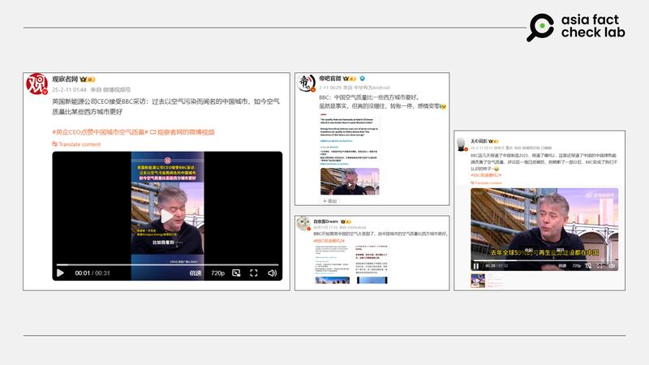
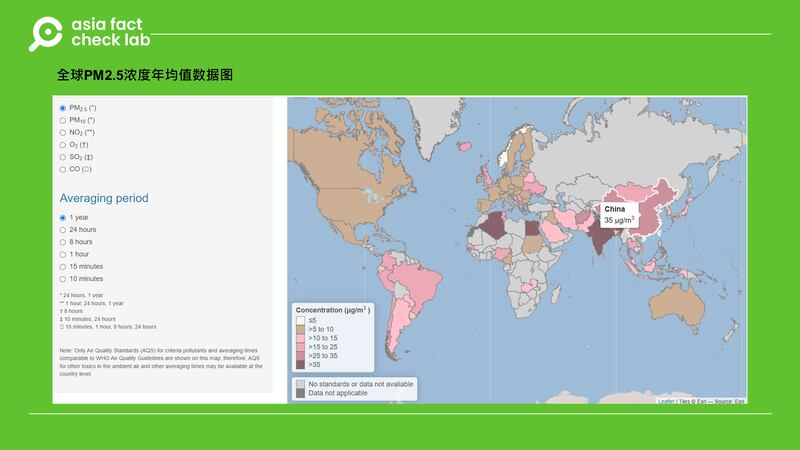

# 事實釐清|BBC報道中國城市空氣品質好過西方？

鄭崇生

2025.02.24 13:54 EST

近日， 英國廣播公司（BBC）一則報道在中國社交媒體平臺廣泛流傳，報道引述一位英國商人稱“中國一些城市空氣質量比西方城市好”。該說法一度在中國社交媒體上成爲熱點話題，[觀察者網](https://archive.ph/wip/kuHNm "https://archive.ph/wip/kuHNm")擷取轉發BBC的視頻片段，剛在X平臺上開設帳號的中國外交部發言人[毛寧也用了這一片段](https://x.com/SpoxCHN_MaoNing/status/1890010634328420745 "https://x.com/SpoxCHN_MaoNing/status/1890010634328420745")發文稱，“中國正讓藍天再現”。

但這裏所謂“中國一些城市空氣質量比西方城市好”的說法是什麼意思？是根據什麼樣的標準而得出？亞洲事實查覈實驗室（Asia Fact Check Lab, AFCL）將在本文中詳細解釋。

## 這個說法的源起是什麼？

英國廣播公司[（BBC）X帳號](https://x.com/BBCPolitics/status/1888554184942682445 "https://x.com/BBCPolitics/status/1888554184942682445")近日分享一段週日訪談節目內容，當主持人昆斯伯格（Laura Kuenssberg）談到英國工黨的施政重心，似乎以提升經濟增長爲首要目標，對包括綠色能源在內的議題關注程度下降，詢問相關效應是否已經對英國的綠能行業造成影響？隨後，參與節目的一家英國新能源公司執行長傑克遜（Greg Jackson）以中國爲例，試圖講述可再生能源的發展和經濟成長可以並行不悖。

傑克遜舉證認爲，首先，中國去年的可再生能源建設達到全球可再生能源建設的59%；其次，中國去年新車銷售量有一半是新能源車。最後他稱，中國一些過去以空氣污染聞名的城市，如北京、上海、深圳，現在的空氣質量都比一些西方城市要好。

傑克遜的談話，特別是“過去以空氣污染聞名的城市，現在的空氣質量都比一些西方城市要好”的說法，引起爭議。也有中文用戶加註中文翻譯，甚或只擷取有關“中國空氣質量比一些西方城市好”的說法[轉發到微博](https://archive.ph/YtKGp "https://archive.ph/YtKGp")。

中國空氣質量“比西方好”成爲社交平臺熱點話題。 中國空氣質量“比西方好”成爲社交平臺熱點話題。 (微博截圖)

## 空氣好不好，標準是什麼？

傑克遜上述有關空氣品質比較，是以哪一機構的數據爲基準？或是有特定時間點作了上述對比？詳細數據爲何？ AFCL通過電子郵件就這些問題詢問傑克遜，至截稿，未收到他的回覆。

但空氣質量的標準，也就是”空氣質量指數“（Air Quality Index, AQI）的計算方法，中國與美國等國家計算方式差不多，都是基於監測六種污染物質的濃度，計算各自的污染指數後取最大值做爲AQI的最終數值。

在計算方法相同的前提下，中國和英、美相比空氣品質究竟如何？ 我們以直徑小於或等於2.5微米的懸浮微粒，也就是一般人熟知的”PM2.5“爲例，世界衛生組織（WHO）的[最新數據](https://worldhealthorg.shinyapps.io/Air_Quality_Standards_V2_1/ "https://worldhealthorg.shinyapps.io/Air_Quality_Standards_V2_1/")資料如下

WHO發佈的全球空氣污染物年均值數據圖。 WHO發佈的全球空氣污染物年均值數據圖。 (WHO網站截圖)

WHO最新的數據顯示，美國年均PM2.5濃度是9µg/m³，英國則是20µg/m³，中國則爲35µg/m³，因此，該數據並不支持“中國空氣品質比一些西方城市要好”。

## PM2.5標準 美國最嚴格

至於空氣品質“好”或“壞”， AFCL查閱了 WHO的《[全球空氣品質指引](https://iris.who.int/bitstream/handle/10665/345329/9789240034228-eng.pdf?sequence=1 "https://iris.who.int/bitstream/handle/10665/345329/9789240034228-eng.pdf?sequence=1")》（Global Air Quality Guidelines），它建議的年平均濃度不超過5微克/立方公尺（ µg/m³），24小時均值則達15µg/m³的天數，每年以不超過3-4天爲原則。

但前述的作法是“高標準”，大部分國家或地區都達不到，因此WHO也有一套較務實的《指引》，對於已經建立中期目標要實現更潔淨空氣的國家，建議PM2.5年均值爲35µg/m³，24小時平均值則爲75µg/m³。

中國自2016年開始[實施並公佈PM2.5的數據](https://www.mee.gov.cn/ywgz/fgbz/bz/bzwb/dqhjbh/dqhjzlbz/201203/W020120410330232398521.pdf "https://www.mee.gov.cn/ywgz/fgbz/bz/bzwb/dqhjbh/dqhjzlbz/201203/W020120410330232398521.pdf")，在一般區域，標準與前述WHO的指引建議相同。英國則是PM2.5的24小時均值在35µg/m³以內，定義爲“低污染”，35-53µg/m³則是“中度”，美國的標準最嚴格，環境保護署（EPA）於2024年最新修訂PM2.5的24小時均值數據要在9µg/m³以下才屬“優”。

至於根據包括PM2.5數值在內計算出的空氣質量指數（AQI），[中國](https://sthjj.beijing.gov.cn/bjhrb/index/xxgk69/zfxxgk43/fdzdgknr2/zcfb/zcjd89/1713239/ "https://sthjj.beijing.gov.cn/bjhrb/index/xxgk69/zfxxgk43/fdzdgknr2/zcfb/zcjd89/1713239/")的計算方法基本與[美國](https://www.epa.gov/system/files/documents/2024-02/pm-naaqs-air-quality-index-fact-sheet.pdf "https://www.epa.gov/system/files/documents/2024-02/pm-naaqs-air-quality-index-fact-sheet.pdf")相似，AQI分類有六種（優、良、輕度污染、中度污染、重污染與嚴重污染），[英國](https://uk-air.defra.gov.uk/air-pollution/daqi "https://uk-air.defra.gov.uk/air-pollution/daqi")則是分爲十級四種類（低污染、中污染、高污染與嚴重污染）。但英國計算AQI指數與中國及美國不同，只採計5個指標。

中國和美國計算AQI的方法雖然相似，但在污染物濃度限值和分級標準上並不一樣，也就是說，像是中國某城市 PM2.5濃度24小時均值爲35.5µg/m³時，換算出來的空氣質量指數雖仍可能是“優”或“良”，但在美國已屬於“輕度污染”。

因此，雖然傑克遜的說法“中國一些過去以空氣污染聞名的城市，現在比一些西方城市都要好”，的確有可能出現，且中國2024年空氣品質優良的天數[確實增加](https://www.mee.gov.cn/ywdt/xwfb/202501/t20250124_1101318.shtml "https://www.mee.gov.cn/ywdt/xwfb/202501/t20250124_1101318.shtml")，這卻忽略了各國在計算PM2.5的標準和定義的差異，並不能全面反映各國空氣品質的真實情況。

## 關於中國的綠色發展

至於傑克遜說“中國去年新車銷售量有一半是新能源車”的說法，根據《上海證券報》引述中國汽車工業協會的[報道](https://auto.cyol.com/gb/articles/2025-01/14/content_Q428jacRKl.html "https://auto.cyol.com/gb/articles/2025-01/14/content_Q428jacRKl.html")，中國2024年新能源汽車滲透率（即：新能源新車銷量佔汽車新車總銷量的比例）達40.9%。

另外，傑克遜還提到“中國去年可再生能源建設達到全球可再生能源建設的59%”，但根據國際能源總署（IEA）[數據](https://www.iea.org/reports/renewables-2024/executive-summary#abstract "https://www.iea.org/reports/renewables-2024/executive-summary#abstract")，較完整的說法應是預計從2024-2030年，中國的可再生能源建設佔比將達到全球的6成。

*亞洲事實查覈實驗室（Asia Fact Check Lab）針對當今複雜媒體環境以及新興傳播生態而成立。我們本於新聞專業主義，提供專業查覈報告及與信息環境相關的傳播觀察、深度報道，幫助讀者對公共議題獲得多元而全面的認識。讀者若對任何媒體及社交軟件傳播的信息有疑問，歡迎以電郵*[*afcl@rfa.org*](mailto:afcl@rfa.org)*寄給亞洲事實查覈實驗室，由我們爲您查證覈實。*

*亞洲事實查覈實驗室更詳細的介紹請參考*[*本文*](2024-10-09_關於亞洲事實查覈實驗室｜About AFCL.md)*。我們另有X、臉書、IG頻道，歡迎讀者追蹤、分享、轉發。X這邊請進：中文*[*@asiafactcheckcn*](https://twitter.com/asiafactcheckcn)*；英文：*[*@AFCL\_eng*](https://twitter.com/AFCL_eng)*、*[*FB在這裏*](https://www.facebook.com/asiafactchecklabcn)*、*[*IG也別忘了*](https://www.instagram.com/asiafactchecklab/)*。*

[Original Source](https://www.rfa.org/mandarin/shishi-hecha/2025/02/24/fact-check-china-air-quality-better-than-west-countries/)