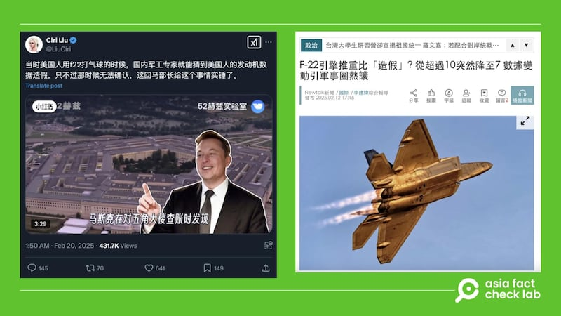
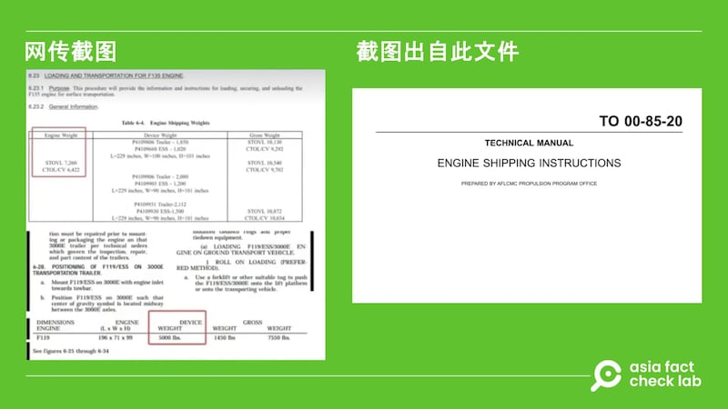

# 事實查覈｜美國F-22、F-35引擎性能數據造假？

艾倫

2025.02.25 12:25 EST

## 查覈結果：缺乏證據

## 一分鐘完讀：

二月中旬，中文社媒平臺流傳一則消息稱，美國新政府調查發現，F-22及F-35兩款戰機的發動機性能數據造假。稱兩款發動機的推重比值只有6、7左右，卻被吹噓成10以上。

亞洲事實查覈實驗室查覈後發現，沒有任何可信報道或報告證明美國新政府曾調查特定戰機發動機的性能表現。而帖文中出示的所謂“證據文件”，也只是操作手冊截圖，與發動機性能無關。因此兩款戰鬥機引擎數據造假一說缺乏證據。

## 深度分析：

近日，X上流傳美國軍機發動機數據造假的[視頻消息](https://archive.ph/DgcGd)。發佈者稱，由馬斯克（Elon Musk）領導的政府效率部日前查賬五角大樓後發現，F-22及F-35戰機的發動機“推重比”嚴重虛標。其中F-22戰機使用的F-119發動機推重比只有7，卻虛標到了10；而F-35戰機的F-135發動機虛標更加嚴重，原本僅6.7，虛標到了11。

視頻中有一份文件截圖，發佈者稱這是馬斯克發現的發動機虛標的“證據”。

該消息也傳到了一些[論壇](https://archive.ph/n3unN)及[新聞網站](https://archive.ph/JdrF1)，標題寫道“美國五代機活在PPT，中國軍工人把科幻帶到現實”“媒體:美國五代機數據造假,中國軍工人被騙了28年”。臺媒[新頭殼](https://archive.ph/iCo7p)也轉發了此消息。

近期中文輿論圈出現消息，稱美軍F-22及F-35戰機的發動機“推重比”嚴重虛標。 近期中文輿論圈出現消息，稱美軍F-22及F-35戰機的發動機“推重比”嚴重虛標。 (圖取自X、新頭殼網站)

## 馬斯克曾發佈過相關消息嗎？

AFCL（Asia Fact Check Lab, AFCL）查覈馬斯克過往針對美軍戰機發布的評論，發現馬斯克確實曾[公開稱](https://x.com/elonmusk/status/1861070432377737269)美國不該再繼續製造F-35，理由包括F-35的設計上爲滿足多種需求，欠缺專精領域，他還稱無人機的時代不需要更多載人戰機等。但進一步搜尋並未發現任何具公信力的媒體或報告提及馬斯克或者美國新政府曾經調查特定發動機的性能。

網傳視頻內也有一張截圖，被稱爲馬斯克發現的發動機虛標“證據”。但經查證，該文件截圖出自美國空軍生命週期管理中心推進計劃辦公室（AFLCMC Propulsion Program Office）2020發佈的[發動機運輸指南](https://govtribe.com/file/government-file/attachment-2-technical-manual-to-00-85-20-f135-specifc-dot-pdf?fbclid=IwY2xjawIm7IFleHRuA2FlbQIxMAABHb5W7UZCvsGmkUcU9OzELCgOdkrfBLSGKEjTK6z6Oe-u88iasHOnaiar6A_aem_pVbG84vySUxyt-_I1yt8xg)，文件內也僅提供發動機的重量，沒有推重比。

網傳的虛標截圖證據出自美國空軍的一份發動機運輸指南。 網傳的虛標截圖證據出自美國空軍的一份發動機運輸指南。 (圖取自X、運輸指南文件封面)

## 戰機發動機的推動比是什麼？

軍事專家、自由亞洲電臺“兵家常事”的節目主持周子定告訴AFCL，所謂的推重比，指的是發動機產生的推力（thrust rating）除以發動機產生的乾重（dry weight）。

他解釋說，發動機的推重比通常有兩項指標：幹推重比（dry）和後燃加力（afterburner）推重比。前者是使用一般推力測試，後者則是以打開後燃器的大推力測試。

AFCL以F-119發動機爲例，普惠官方說明書中並無特別提及其重量及推重比，但一份由航空及國防市場情報網站“Forecast International”發佈的[F-119發動機報告](https://www.forecastinternational.com/archive/disp_pdf.cfm?DACH_RECNO=901&utm_source=chatgpt.com)中指出，F-119發動機的最大幹推力約爲22,000磅力、後燃加力的推力則約爲35,000磅力，而F-119的乾重量則爲3,000磅。

以此換算，F-119的幹推重比爲22,000除以3,000，約7.3，而後燃加力的推重比則是35,000除以3,000，爲11.6。

從試算結果可以發現，F-119的推重比確實落在7至11左右，取決於使用的是幹推重比或後燃加力推重比。

## 不同計算條件下的推動比數值也會不同

臺灣國防安全研究院副研究員舒孝煌告訴AFCL，發動機的推力輸出可能因不同情況而有所改變，進而影響推重比結果。

舉例來說，Forecast International的文件裏F-119分成幹推力及後燃加力的推力重量，而普惠F-135的報告則提供最大推力級別（Maximum Thrust Class）與中間推力（Intermediate Thrust Class）級別，這些差異都會影響推重比得出的結果，網傳美國“虛標”推重比的說法，卻沒有針對這個差異進行解釋，無法直接進行類比。

舒孝煌補充，相關文獻也指出美俄雙方系統及定義的差距，例如美方發動機引擎重量包含的系統比較多，所以通常比較重，但中國使用的飛機是俄式規範，包含的系統較少，則通常較輕。此外，發動機上有成千上萬的零附件，拆除兩三樣就可能少幾十公斤，因此推重比沒有絕對定論。

周子定則說，一般談及發動機的推重比時，指的是“最大推重比”，意即使用最大推力除以發動機重量，而結果也取決於計算的是“幹推力”還是“後燃推力”。

舒孝煌認爲，這次的普惠推重比爭議，實際上是中共的宣傳，且推重比只是飛機性能的指標之一，不應只依一項指標斷定整個戰機的實際性能。

*亞洲事實查覈實驗室（Asia Fact Check Lab）針對當今複雜媒體環境以及新興傳播生態而成立。我們本於新聞專業主義，提供專業查覈報告及與信息環境相關的傳播觀察、深度報道，幫助讀者對公共議題獲得多元而全面的認識。*

*讀者若對任何媒體及社交平臺傳播的信息有疑問，歡迎以電郵*[*afcl@rfa.org*](mailto:afcl@rfa.org)*寄給亞洲事實查覈實驗室，由我們爲您查證覈實。亞洲事實查覈實驗室更詳細的介紹請參考*[*本文*](2024-10-09_關於亞洲事實查覈實驗室｜About AFCL.md)*。*

*我們另有X、臉書、IG頻道，歡迎讀者追蹤、分享、轉發。 X這邊請進：中文*[*@asiafactcheckcn*](https://twitter.com/asiafactcheckcn)*;英語：*[*@AFCL\_eng*](https://twitter.com/AFCL_eng)*、*[*FB在這裏*](https://www.facebook.com/asiafactchecklabcn)*、*[*IG也別忘了*](https://www.instagram.com/asiafactchecklab/)*。*

[Original Source](https://www.rfa.org/mandarin/shishi-hecha/2025/02/25/fact-check-fighter-jets-data-fraud/)