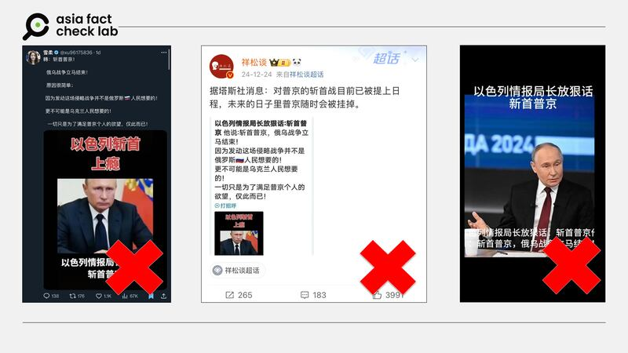

# 事實查覈|以色列情報局長放話要“斬首普京”？

鄭崇生

2025.02.26 13:19 EST

## 查覈結果：缺乏證據

## 一分鐘完讀：

近日，X上有藍勾認證的中文大V發文稱，“以色列情報局長放狠話說要斬首普京”，這將讓俄烏戰爭立刻結束。但亞洲事實查覈實驗室（Asia Fact Check Lab, AFCL）查證後發現，沒有可信的媒體提及相關信息，該傳言沒有證據。

## 深度分析：

2023年以哈爆發軍事衝突以來，以色列情報部門摩薩德（Mossad）與國防部隨後在包括加沙、黎巴嫩及伊朗等地，[襲擊](https://www.axios.com/2024/10/20/israel-assassinations-sinwar-hamas-hezbollah)哈馬斯領導層及伊朗所支持的真主黨（Hezbollah）。近來，在X上又流傳所謂“[以色列情報局長放狠話說要斬首普京](https://archive.ph/KXkpQ)”的說法。

AFCL以圖反搜發現，最早於2024年8月開始，也就是以色列暗殺哈馬斯與真主黨高層後，在X上的一些中文大V帳號（[1](https://archive.ph/wip/ZtYzZ)、[2](https://archive.ph/wip/Mu36A)）發文傳播“以色列情報局要暗殺普京”的說法，在中國社交媒體微博、抖音上，2014年12月底起也開始出現類似說法，轉傳同樣的普京照片與截圖，標題寫着“以色列斬首上癮”。

中國社媒流傳以色列放話要“暗殺普京”的說法。 中國社媒流傳以色列放話要“暗殺普京”的說法。 (X、微博與抖音截圖)

上述取自微博大V的截圖（中）發文甚至聲稱，相關消息是來自塔斯社的報導。然而，AFCL塔斯社、以色列、摩薩德、斬首行動、普京（TASS、Israel 、Mossad、decapitation、Putin）等關鍵字搜索，並沒有相關內容。

AFCL再以摩薩德局長巴爾尼亞（David Barnea）與普京兩人的名字搜索，在一篇《以色列時報》[2023年的報道](https://www.timesofisrael.com/mossad-chief-warns-russia-could-send-iran-arms-that-will-endanger-our-existence/)中，巴爾尼亞的確表達對伊朗與俄羅斯深化軍事合作的擔憂，但並未有任何內容提及要針對普京採取行動。

以色列與俄羅斯則在中東一些議題上（如敘利亞和伊朗問題）有分歧，但兩國仍在外交上維持密切溝通。像是以哈戰爭發生後，俄羅斯總統普京（Vladimir Putin）曾多次[表態](https://tass.com/politics/1869341)，哈馬斯攻擊以色列是恐怖主義行動，並呼籲以色列的回擊應適度。

另外，根據[俄羅斯外交部](https://mid.ru/en/maps/il/)，以色列境內有約150萬的前蘇聯僑民，普京也與以色列總理內坦尼亞胡（Benjamin Netanyahu）有多次會面與互訪；而在俄烏戰爭中，以色列則採取相對中立立場，內塔尼亞胡針對俄烏戰爭的[聲明](https://mepc.org/commentaries/israels-response-russian-invasion-ukraine/)，並未譴責俄羅斯。

綜合前述搜尋結果，以及具公信力媒體的報導所呈現的以色列、俄羅斯關係。傳言所稱“以色列將斬首普京”的說法，是欠缺證據的傳言。

*亞洲事實查覈實驗室（Asia Fact Check Lab）針對當今複雜媒體環境以及新興傳播生態而成立。我們本於新聞專業主義，提供專業查覈報告及與信息環境相關的傳播觀察、深度報道，幫助讀者對公共議題獲得多元而全面的認識。讀者若對任何媒體及社交軟件傳播的信息有疑問，歡迎以電郵*[*afcl@rfa.org*](mailto:afcl@rfa.org)*寄給亞洲事實查覈實驗室，由我們爲您查證覈實。*

*亞洲事實查覈實驗室更詳細的介紹請參考*[*本文*](2024-10-09_關於亞洲事實查覈實驗室｜About AFCL.md)*。我們另有X、臉書、IG頻道，歡迎讀者追蹤、分享、轉發。X這邊請進：中文*[*@asiafactcheckcn*](https://twitter.com/asiafactcheckcn)*；英文：*[*@AFCL\_eng*](https://twitter.com/AFCL_eng)*、*[*FB在這裏*](https://www.facebook.com/asiafactchecklabcn)*、*[*IG也別忘了*](https://www.instagram.com/asiafactchecklab/)*。*

[Original Source](https://www.rfa.org/mandarin/shishi-hecha/2025/02/26/fact-check-israel-plan-assassin-putin/)