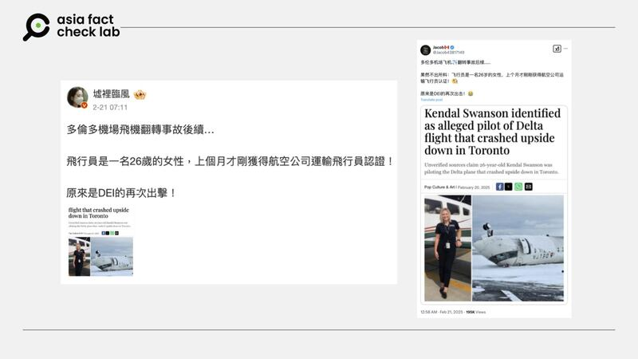

# 事實查覈｜達美航空翻覆事故飛行員不合資格？

莊敬

2025.02.26 13:19 EST

## 查覈結果：證據不足

## 一分鐘完讀：

美國達美航空客機在多倫多機場發生翻覆事故後，社媒上傳出當班的飛行員爲年輕女性、剛獲得航空公司認證，不合資格。經查，達美航空雖然未公佈機組成員具體身份，但已公告說明該班機正副駕駛的經驗及資質，表明機組人員符合資格，因此，前述傳言證據不足。

## 深度分析：

美國達美航空一架載有80人的客機日前降落加拿大多倫多皮爾遜機場時翻覆，據報事故造成21人受傷。事發後，網上出現許多有關翻覆事故的消息與影像，其中含有錯誤內容或未經查證的信息，亞洲事實查覈實驗室（Asia Fact Check Lab, AFCL）先前已發佈相關[查覈報告](2025-02-20_事實查覈｜這張圖是達美航空客機翻覆現場照片？.md)。

AFCL注意到，近日在[微博](https://m.weibo.cn/detail/5136384994050063)、[X](https://x.com/Jacob43817149/status/1892619799521296401)等平臺上有多箇中文帳號發文，宣稱達美航空翻覆事故的飛行員爲一名26歲的女性，且今年一月才獲得飛行員認證，質疑她不合資格。這些社媒內容還附上消息來源的截圖爲證，其中一個消息出處爲某[X藍勾帳號](https://x.com/houmanhemmati)（原文已刪除），另一個來源則是巴基斯坦媒體《論壇快報》（The Express Tribune）2月20日刊出的[文章](https://tribune.com.pk/story/2529824/kendal-swanson-identified-as-alleged-pilot-of-delta-flight-that-crashed-upside-down-in-toronto)，該文表明其引述的是“未經證實的消息來源”。

美國達美航空降落多倫多機場發生翻覆事故後，網傳飛行員爲一名飛行資格不足的26歲女性。 美國達美航空降落多倫多機場發生翻覆事故後，網傳飛行員爲一名飛行資格不足的26歲女性。 (微博、X截圖)

經查，達美航空、飛行員協會（ALPA）分別於2月20日、21日發佈新聞稿，提供事故航班的更多資訊，以澄清社媒上有關該航班的錯誤和誤導性言論。根據新聞稿，該航班的機長2007年加入子公司恩達航空（Endeavor Air），網傳“剛獲得認證”的說法是錯誤的。

而副駕駛是2024年1月加入恩達航空，並於當年4月完成訓練後開始飛行，她的飛行經驗符合規定。新聞稿指出，兩名機組人員都具備相應的資格，並獲得美國聯邦航空管理局（FAA）的認證。

值得注意的是，雖然達美航空的新聞稿並未提供正副駕駛的姓名、年齡等個人資料，但在寫到機長時使用的英文字是“He（他）”，寫到副駕駛時則使用“She（她）”，暗示兩者的性別。而達美航空所提供的正副駕駛經歷，也反駁了網傳所謂“今年一月才獲得飛行員認證”等說法。

AFCL電郵詢問達美航空有關事故航班的機長信息，對方回覆時僅提供已公開的新聞稿，並表示目前不提供任何有關事故航班飛行員的個人資料。

*亞洲事實查覈實驗室（Asia Fact Check Lab）針對當今複雜媒體環境以及新興傳播生態而成立。我們本於新聞專業主義，提供專業查覈報告及與信息環境相關的傳播觀察、深度報道，幫助讀者對公共議題獲得多元而全面的認識。讀者若對任何媒體及社交軟件傳播的信息有疑問，歡迎以電郵*[*afcl@rfa.org*](mailto:afcl@rfa.org)*寄給亞洲事實查覈實驗室，由我們爲您查證覈實。*

*亞洲事實查覈實驗室更詳細的介紹請參考*[*本文*](2024-10-09_關於亞洲事實查覈實驗室｜About AFCL.md)*。我們另有X、臉書、IG頻道，歡迎讀者追蹤、分享、轉發。X這邊請進：中文*[*@asiafactcheckcn*](https://twitter.com/asiafactcheckcn)*；英文：*[*@AFCL\_eng*](https://twitter.com/AFCL_eng)*、*[*FB在這裏*](https://www.facebook.com/asiafactchecklabcn)*、*[*IG也別忘了*](https://www.instagram.com/asiafactchecklab/)*。*

[Original Source](https://www.rfa.org/mandarin/shishi-hecha/2025/02/26/fact-check-delta-pilot-qualification/)