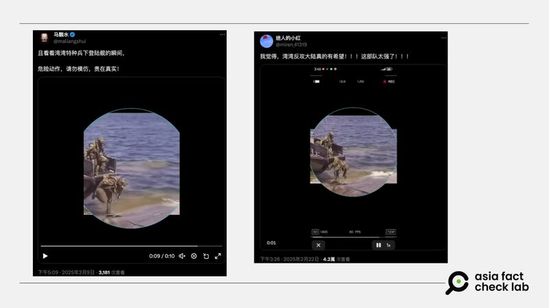
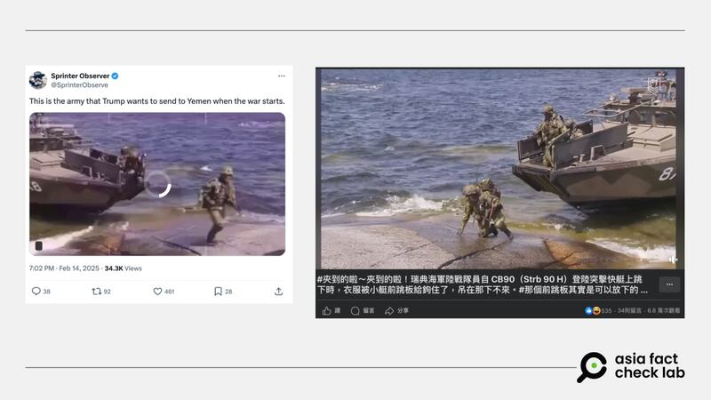
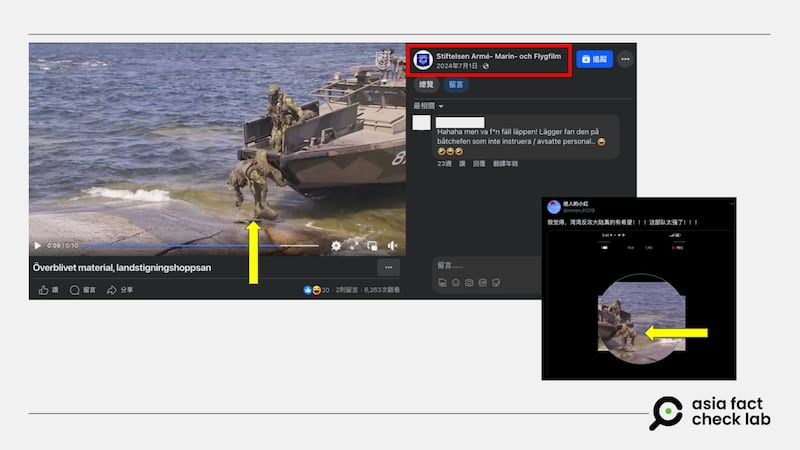

# 事實查覈｜視頻顯示，臺灣特種兵下登陸艦時慘跌？

董喆

2025.02.27 15:59 EST

## 查覈結果：錯誤

## 一分鐘完讀：

近期X上有多個賬號傳播同一則視頻，稱是臺灣特種兵下登陸艦時摔倒的影片，傳播者藉以嘲諷臺灣軍隊沒有戰鬥力。亞洲事實查覈實驗室查證，原始影片是瑞典機構拍攝的用於軍事教育的紀錄片，與臺軍無關，影片中的士兵也不是臺灣人。

## 深度分析：

“灣灣反攻大陸真的有希望！！！這部隊太強了！！！”Ｘ賬號[“迷人的小粉紅”](https://archive.ph/O6wTh)在Ｘ上傳播一則視頻，畫面中的士兵跳下軍艦時，因裝備勾住了船上的設施，踉蹌跌倒。同樣的視頻亦獲[其他Ｘ賬號](https://archive.ph/dHchW)傳播，發佈者均宣稱這是臺灣士兵下登陸艦的畫面。

X上有多個賬號貼出同一則視頻，稱這是臺灣特種兵下登陸艦時摔倒的影片，並嘲諷臺灣軍力落後 X上有多個賬號貼出同一則視頻，稱這是臺灣特種兵下登陸艦時摔倒的影片，並嘲諷臺灣軍力落後 (圖取自X)

亞洲事實查覈實驗室（AFCL）以截圖反搜，發現同一則視頻也被[英文Ｘ賬戶](https://archive.ph/UK2OJ)發佈，但發佈者稱這是特朗普要送去葉門的軍隊並加以嘲諷。另有臉書賬戶社團[“世界尖端武器觀測站”](https://www.facebook.com/watch/?v=1141484780173744)發佈這則視頻，稱這是瑞典海軍陸戰隊員自 CB90（Strb 90 H）登陸突擊快艇上跳下的視頻。

同一則視頻也被英文Ｘ賬戶及臉書社團發佈 同一則視頻也被英文Ｘ賬戶及臉書社團發佈 (圖取自X、臉書)

比較多個版本，AFCL發現Ｘ上的視頻有鏡相反轉並去除左上角浮水印的變造痕跡。進一步以臉書版本視頻上的白色LOGO反搜，AFCL發現這個標誌屬於[瑞典陸軍、海軍陸戰隊和航空電影基金會](https://stiftelsen-amf.se/)（Stiftelsen Armé- Marin- och Flygfilm，AMF）。

根據官網說明，瑞典陸軍、海軍陸戰隊和航空電影基金會旨在提供與保存瑞典軍事紀錄片和教育電影。AFCL在其臉書粉絲專頁找到了與網傳視頻相符的[內容](https://www.facebook.com/StiftelsenAMFfilm/videos/1580135526051921?locale=ps_AF)。

原始視頻出自瑞典陸軍、海軍陸戰隊和航空電影基金會 原始視頻出自瑞典陸軍、海軍陸戰隊和航空電影基金會 (圖取自AMF臉書賬號)

原始視頻發佈於2024年7月1日，視頻描述“這些新兵訓練時的影片展示了，想站穩雙腳有多難。”AFCL去信詢問視頻背景資訊，於2月27日接到回信，AMF告訴AFCL，“這段視頻並非軍事演習，我們可以確認這些士兵不是臺灣人”。AMF說明，該片段來自約20年前一部未完成的作品，其內容展示的是訓練過程中可能發生的困難，影片中的士兵爲歐洲人。

成立於1997年、由瑞典退伍軍人營運的瑞典武裝部隊裝備彙整網站SoldF.com[指出](https://www.soldf.com/fartyg-och-batar/stridsbat-90h-strb90h/)，視頻中編號873的艦艇爲爲CB90登陸突擊快艇，編號873的CB90生產時間介於1993年至1996年之間，是瑞典海軍較早期使用的標準型（Stridsbåt 90H）突擊登陸艇之一。

除了視頻中的着裝與士兵樣貌與臺灣人不符外，根據CB90製造商瑞典Saab公司的[資訊](https://www.saab.com/globalassets/products/kockums/saab_dockstacb90hsm.pdf)，該艘登陸快艇曾銷售給美國、瑞典、挪威、馬來西亞、墨西哥、希臘，並不包含臺灣。

*亞洲事實查覈實驗室（Asia Fact Check Lab）針對當今複雜媒體環境以及新興傳播生態而成立。我們本於新聞專業主義，提供專業查覈報告及與信息環境相關的傳播觀察、深度報道，幫助讀者對公共議題獲得多元而全面的認識。*

*讀者若對任何媒體及社交平臺傳播的信息有疑問，歡迎以電郵*[*afcl@rfa.org*](mailto:afcl@rfa.org)*寄給亞洲事實查覈實驗室，由我們爲您查證覈實。亞洲事實查覈實驗室更詳細的介紹請參考*[*本文*](2024-10-09_關於亞洲事實查覈實驗室｜About AFCL.md)*。*

*我們另有X、臉書、IG頻道，歡迎讀者追蹤、分享、轉發。 X這邊請進：中文*[*@asiafactcheckcn*](https://twitter.com/asiafactcheckcn)*;英語：*[*@AFCL\_eng*](https://twitter.com/AFCL_eng)*、*[*FB在這裏*](https://www.facebook.com/asiafactchecklabcn)*、*[*IG也別忘了*](https://www.instagram.com/asiafactchecklab/)*。*

[Original Source](https://www.rfa.org/mandarin/shishi-hecha/2025/02/27/fact-check-taiwan-soldier-fell-down/)