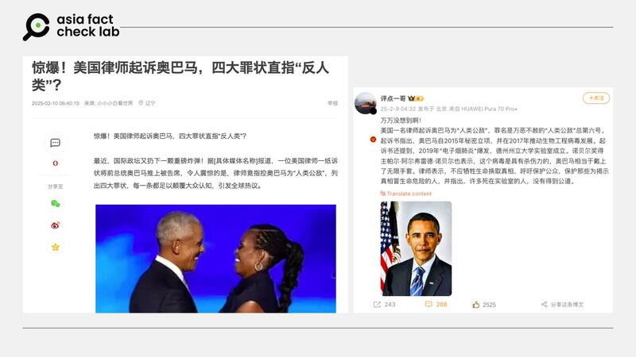

# 事實查覈｜美國律師起訴奧巴馬，指控他是“人類公敵”？

董喆

2025.02.28 12:56 EST

## 查覈結果：缺乏證據

## 一分鐘完讀：

中國社羣平臺近期流傳，美國前總統奧巴馬被一名律師起訴，遭指控四大罪狀，並被指是“人類公敵”。亞洲事實查覈實驗室並未在公開信息中找到該訴訟，也沒有任何美國媒體報道該消息。因此沒有任何證據可以證明奧巴馬遭“人類公敵”或類似理由起訴，相關傳言不可信。

## 深度分析：

近期中國社羣網站[網易](https://archive.ph/ZPMnw)、頭條（[1](https://archive.ph/KVM9s)、[2](https://archive.ph/WHNlr)）、[抖音](https://www.douyin.com/video/7469326855397461307)及[微博](https://archive.ph/TzOjm)皆出現一則訊息，稱美國有律師起訴美國前總統奧巴馬，並以四大罪狀指控奧巴馬“反人類”、“人類公敵”。

## 指控奧巴馬的四大罪狀可信嗎？

亞洲事實查覈實驗室（Asia Fact Check Lab，AFCL）首先以指控內容的關鍵字進行搜索，並未找到任何外電、國際主流媒體的相關報道，亦未找到任何公開聲明與法律文件。

傳言中提及所謂“四大罪狀”大多與病毒有關，中國社羣上的傳言稱奧巴馬在執政時期祕密推動生物工程病毒研究。並有諾貝爾獎得主出面作證，稱該病毒的殺傷力遠超過想像。另外傳言指控2019年武漢軍人運動會期間美國運動員爆發怪病，隨後新冠疫情在全球肆虐。最後，傳言還稱美國電子煙肺炎與奧巴馬支持病毒研究有關。

AFCL仔細檢視網傳謠言，有幾處可疑。

首先，網易文章中引用的消息來源爲“[具體媒體名稱]”，看似爲未編輯完成的文章，全篇最終未提出是哪一間媒體報導。另全文未提及發起訴訟律師、作證的諾貝爾獎得主的姓名，對於傳言中被創造的是哪一種病毒都未提及，可信度存疑。

中國社羣傳言稱美國有律師起訴美國前總統奧巴馬，並以四大罪狀指控奧巴馬是人類公敵。 中國社羣傳言稱美國有律師起訴美國前總統奧巴馬，並以四大罪狀指控奧巴馬是人類公敵。 (取自網易、微博)

而在微博對該傳言進一步的傳播中，有微博用戶稱出面指控奧巴馬的諾獎得主名爲“帕爾·阿爾費雷德·諾貝爾”，經查，並無在世的諾獎得主有此姓名，而諾貝爾獎的創始人“阿爾弗雷德·諾貝爾”，是1896年去世的歷史人物。

另外，2019武漢軍人運動會期間美國運動員爆發怪病的說法源自央視，央視2021年的[報道](https://www.youtube.com/watch?v=IHHVu5Y-HqI&ab_channel=CCTV%E4%B8%AD%E6%96%87)稱2019 年世界軍人運動會期間，5名美軍選手出現發燒、咳嗽和腹瀉等症狀，並被緊急送往武漢金銀潭醫院。不過武漢金銀潭醫院院長張定宇在2020年就曾向中國媒體《南方週末》[說明](https://www.infzm.com/contents/177493)，5名美軍選手患有瘧疾，該事件與新冠肺炎無關，根據《美國之音》[報道](https://www.voanews.com/a/military-world-games-us-army-wuhan/6743108.html)，當時人民日報亦轉推了南方週末的報導。

新冠疫情起源不屬於此次查覈範圍，但“武漢軍人運動會期間美國運動員爆發怪病”在過去的討論中皆沒有提到奧巴馬。

至於傳言指控稱病毒研究與美國電子煙肺炎有關，根據美國疾管署（CDC）2019年提出的電子煙肺損傷[指引](https://www.cdc.gov/mmwr/volumes/68/wr/mm6841e3.htm)，並未提到電子煙造成的肺損傷與病毒有關。

亞洲事實查覈實驗室去信巴拉克與蜜雪兒·奧巴馬辦公室（Office of Barack and Michelle Obama），至截稿前未獲回應。

## 奧巴馬近期有涉入法律糾紛嗎？

AFCL以關鍵字查詢跟奧巴馬有關的訴訟，有一訴訟與奧巴馬總統中心相關。美國[福斯新聞](https://www.foxnews.com/us/obama-center-subcontractor-files-40m-discrimination-lawsuit-against-engineering-firm-overruns)、《[Newsweek](https://www.newsweek.com/barack-obama-presidential-center-library-chicago-lawsuit-discrimination-2024316?utm_source=chatgpt.com)》報導，芝加哥的承包商Powers & Sons Construction Company近期對工程公司 Thornton Tomasetti 提起4000萬美元的訴訟，指控該公司存在種族歧視，並聲稱這些歧視性的做法增加了工程量與財務壓力。

但這起訴訟與奧巴馬個人無關。

## “人類公敵”的說法出自何處？

在奧巴馬執政期間，的確有人用“人類公敵”的字眼批評過他。

根據《POLITICO》[報道](https://www.politico.com/story/2009/09/franks-obama-is-enemy-of-humanity-027725?utm_source=chatgpt.com)，2009年9月在“如何奪回美國”（How to Take Back America）會議中，美國衆議員特倫特·弗蘭克斯（Trent Franks）稱時任總統奧巴馬爲“人類的敵人”，原因是他在墮胎問題上的立場。美國有線電視CNN亦[記錄到](https://www.youtube.com/watch?v=9HpcfU2bh1g&ab_channel=NewsPaperOnline)了此一畫面。

弗蘭克斯後來[澄清](https://www.upi.com/Top_News/2009/09/30/Franks-amends-Obama-enemy-comments/96531254311031/?utm_source=chatgpt.com)他的言論是針對奧巴馬的墮胎立場而非個人，並表示他認爲總統是“未出生人類的敵人”。

*亞洲事實查覈實驗室（Asia Fact Check Lab）針對當今複雜媒體環境以及新興傳播生態而成立。我們本於新聞專業主義，提供專業查覈報告及與信息環境相關的傳播觀察、深度報道，幫助讀者對公共議題獲得多元而全面的認識。讀者若對任何媒體及社交軟件傳播的信息有疑問，歡迎以電郵*[*afcl@rfa.org*](mailto:afcl@rfa.org)*寄給亞洲事實查覈實驗室，由我們爲您查證覈實。*

*亞洲事實查覈實驗室更詳細的介紹請參考*[*本文*](2024-10-09_關於亞洲事實查覈實驗室｜About AFCL.md)*。我們另有X、臉書、IG頻道，歡迎讀者追蹤、分享、轉發。X這邊請進：中文*[*@asiafactcheckcn*](https://twitter.com/asiafactcheckcn)*；英文：*[*@AFCL\_eng*](https://twitter.com/AFCL_eng)*、*[*FB在這裏*](https://www.facebook.com/asiafactchecklabcn)*、*[*IG也別忘了*](https://www.instagram.com/asiafactchecklab/)*。*

[Original Source](https://www.rfa.org/mandarin/shishi-hecha/2025/02/28/fact-check-obama-lawsuit/)