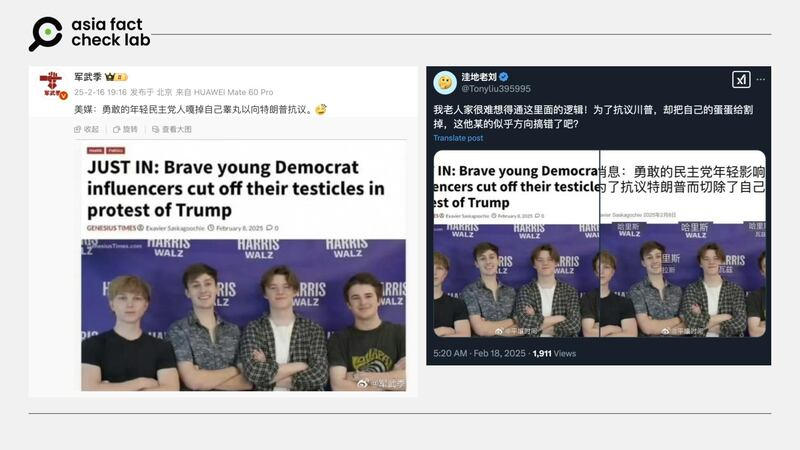
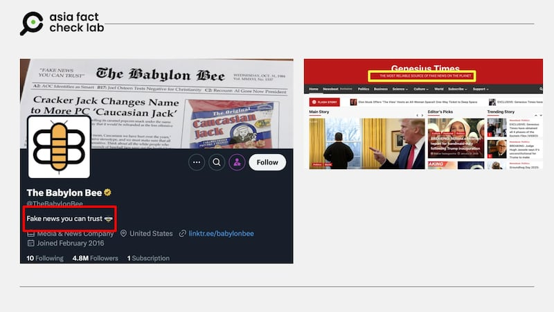
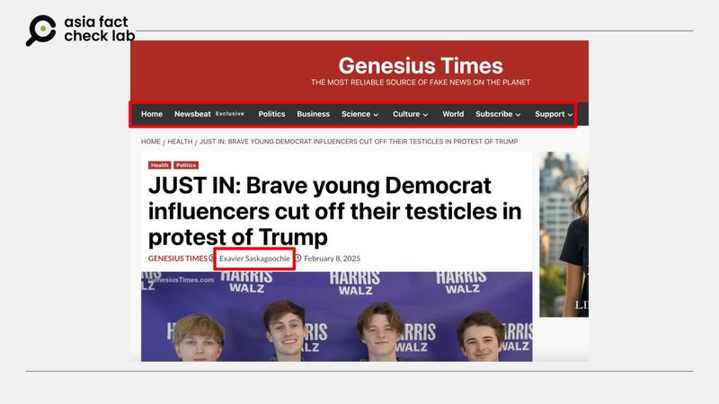
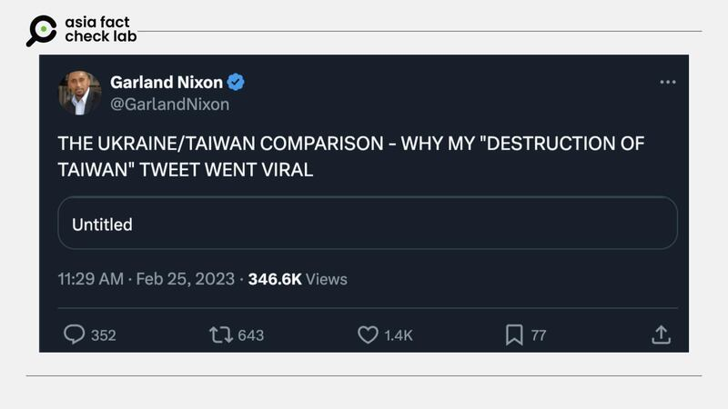

# 傳播觀察｜刊發“民主黨支持者集體自宮”的諷刺網站緣何成了 “新聞信源”？

艾倫

2025.03.03 15:33 EST

2月16日，微博大V“軍武季”[發文](https://weibo.com/2178514797/5134755483618217)寫道，美國媒體報道稱，“勇敢的年輕民主黨人嘎掉自己睾丸以向特朗普抗議”，文章並附上一張看起來像英文新聞報道的截圖，作爲消息來源。

無獨有偶，X上也出現中文認證賬號轉發該張截圖（[1](https://x.com/usa912152217/status/1890660838559686684)，[2](https://x.com/Tonyliu395995/status/1891598653564801188)，[3](https://x.com/dylanzhao/status/1890781702982668578)），這些賬號皆稱民主黨的網紅爲了抗議特朗普而“揮刀自宮”，評論區有人驚呼“太不可思議了，這是典型的自殘自殺行爲”，也有人稱這只不過“找個高大上的理由變性罷了”。

二月中，中文社媒出現一則“民主黨人揮刀自宮以抗議特朗普”的傳聞。 二月中，中文社媒出現一則“民主黨人揮刀自宮以抗議特朗普”的傳聞。 (圖取自微博、X)

但其實只要搜尋網傳截圖的標題，就很容易發現，這條所謂的“新聞”，其實出自美國的諷刺新聞網站（satirical news）“Genesius Times”，該網站自稱“地球上最值得信賴的假新聞來源”（The Most Reliable Source of Fake News on the Planet）。傳播“民主黨支持者自我閹割”消息的中文用戶直接將其創作的諷刺文章當作“美媒新聞”轉發。

亞洲事實查覈實驗室（Asia Fact Check Lab, AFCL）曾經多次發現中文社媒用戶誤將諷刺新聞網站內容當成真實新聞傳播。例如二月初的一篇[查覈報告](2025-02-08_事實查覈｜白宮多人累暈，美國媒體求特朗普休息一天？.md)中提到，中國官媒“環球網”及數個微博“大V”皆誤傳稱，美國媒體因無法負荷特朗普製造的過多的新聞，“懇求特朗普休息一天”。而這則“新聞”來自諷刺網站“巴比倫蜜蜂”（The Babylon Bee），該網站在自我介紹中就註明了這是“你可以信賴的假新聞”（Fake news you can trust）。

AFCL曾查覈的諷刺新聞網站及社媒附有免責聲明，稱自己發佈的是假新聞。 AFCL曾查覈的諷刺新聞網站及社媒附有免責聲明，稱自己發佈的是假新聞。 (圖取自X、Genesius Times)

## 諷刺新聞就是假消息嗎

長期關注假信息發展的臺灣事實查覈中心前總編輯陳慧敏告訴AFCL，所謂的諷刺新聞網站，如上述的“Genesius Times”及巴比倫蜜蜂，或是大家耳熟能詳的《洋蔥報》(The Onion），其創立目的是嘲諷時事，網站風格基本上遵照“新聞體”，網站通常會自稱自己是個歷史悠久的新聞機構，有總編輯、記者等一般新聞機構會有的編制，看起來有模有樣，“但是整個都是虛構的”。

以“民主黨支持者自宮抗議特朗普”的消息爲例，該“新聞”出自“Genesius Times”網站。該網站的“新聞編排”和一般新聞網站相差無幾，有商業、政治、科技、文化、國際等類別。該文章還附上記者署名“Exavier Saskagoochie”，網站對該“記者”的介紹寫道：“Exavier是個出色的作家——非常傑出。他真的非常、非常有才華。而且他的頭髮也非常好看。如果這世界有公理正義的話，他現在應該已經拿下好幾座普利策獎了。”

“民主黨支持者揮刀自宮”的消息頁面既有作者名稱，也有一般新聞網站的報道分類，與正常新聞網的配置相差無幾。 “民主黨支持者揮刀自宮”的消息頁面既有作者名稱，也有一般新聞網站的報道分類，與正常新聞網的配置相差無幾。 (圖取自Genesius Times)

點進該“記者”的主頁可以發現，“他”幾乎每天都發布“國際新聞”，其中不乏快訊及獨家，有時甚至一天可發到兩三則。陳慧敏解釋，這些政治類諷刺網站通常都使用爲數不多的寫手，在短時間內發表數篇虛構的文章，且內容多爲所謂的“內幕爆料”或“獨家消息”，以新聞實務上來說，處理國際消息本就費時，更不用說掌握獨家或爆料需要更多的求證時間，這些記者卻可以做到一天多篇，本來就不合理。

她補充，這些政治諷刺的文章通常都帶有語言的趣味，對一件時事的嘲弄，長期閱讀這些文章的讀者會知道笑點爲何，以及文章的嘲笑、批判對象是什麼。

但AFCL發現，這些諷刺文章卻經常在跨語言、文化的轉譯過程中，失去它們原本的脈絡，進而被當成了真的新聞。

“一個諷刺的東西，搞笑的東西失去搞笑的脈絡，然後把它變成新聞，它就會變成假訊息”，陳慧敏說。“不只是臺灣，包含簡中的用戶、新聞網，像是網易，搜狐，可能有時候也會不小心去用到這一類政治諷刺網站。”

## 惡搞不見得是惡意

研究假信息的馬里蘭大學新聞學院博士後研究員李惟平告訴AFCL，所謂的諷刺新聞網站，是以諷刺爲目的而被生產的信息，雖不真實，但製造者的目的是諷貶時事，而非要欺瞞受衆，因此無法直接被定義爲（帶有惡意的）假信息。

目前在美國天普大學（Temple University）研究政治諷刺的博士生Darren Chan則對AFCL說，早期的“諷刺新聞”和“假新聞”是兩個可互換使用的概念，尤其在當模仿新聞播報的“每日秀”（The Daily Show）興起後。但從2010年代中期以來，“假新聞”更常被用來指涉錯誤或刻意誤導的信息。

“諷刺新聞與假新聞的最大區別在於其內容的意圖。諷刺新聞是一種娛樂性的社會批判，旨在揭露社會上的不公與不道德行爲。透過讓觀衆在歡笑中思考，諷刺新聞有助於促進公民參與與政治參與，無論是在網路上或現實生活中。相較之下，今日所稱的“假新聞”則指的是刻意散播虛假信息，以損害故事中相關人物的名譽爲目的的內容”，Chan說。

他指出，許多案例顯示，諷刺新聞能夠影響政治進程或引起人們對冷門議題的關注，例如約翰·奧利佛（John Oliver）的“每日秀”在某種程度上充當了“第五權”，同時監督了媒體與政府。但當這些新聞被誤傳成真，原先美好的立意則成了用來攻擊特定對象、立場的假信息。

## 諷刺新聞爲什麼常引人轉發

AFCL在2024年11月初曾發佈一篇[查覈報告](2024-11-04_事實查覈｜加州男子因投票時出示身份證被逮捕？.md)，傳言內容爲一名美國加州男子因爲投票時出示了身份證，而遭到逮捕。

該消息內容出自“巴比倫蜜蜂”，和前述的例子相近，在翻譯成中文時被忽略了這是一則“諷刺新聞”的脈絡，被當成了真實國際消息傳播。

李惟平指出，部分中文社媒用戶或記者並不熟悉西方世界這樣的諷刺類型創作，以及這些創作平臺也有各自政治傾向的區別，因此只要內容有趣吸睛，便可能在社媒上引起關注。

她提到，“認知偏差”是造成這類消息被放大的其中一個因素。也就是說，受衆在瀏覽網路信息時，比較容易相信與自己印象相呼應的證據，或者在找尋證據時，偏向採納印證自己先入爲主觀念的內容。

“加州男子因投票時出示身分證被逮捕”的消息便是一個經典案例：美國長年以來在郵寄投票及選民身分確認上產生不少爭議及論戰，選舉期間炒作出示身分證被逮捕的消息，有助於散播選舉不公的陰謀論。即使諷刺新聞一開始的目的是以嘲諷爲主，在去脈絡化的過程中已失了本意。

Chan則說，這類諷刺內容能夠獲得高關注度，反映出當今社會如何看待政治諷刺，“它可能成爲確認自身政治立場的工具，或是一種嘲諷政治對手的方式，藉由誇大的諷刺形象來進行攻擊。”

陳慧敏也補充，查覈工作者通常無法直接驗證信息傳播者的意圖，因此重點還是應該放在“查證消息”本身。

## 查證諷刺新聞的方法

2023年2月，美國一名廣播節目主持人嘉蘭·尼克森（Garland Nixon）推文稱，拜登稱將會有“毀滅臺灣”計劃，消息傳到中文世界引發譁然。不僅中港臺大量媒體報道，更驚動美國在臺協會及中國外交部回應。

該名主持人後來[解釋](https://www.rfa.org/cantonese/news/factcheck/tw-03022023084048.html)，所謂的“毀滅臺灣計劃”推文只是玩笑，並坦言自己常發嘲諷（satire）推文，只是爲了搞笑、有趣。但再細查會發現，他的節目播放電臺“WZHF-AM”曾遭美國法院判定爲“俄羅斯政府代理人”，且他的推文多以聳動謾罵方式評論政治。

發佈拜登“毀滅臺灣”計劃的廣播主持人在X上澄清該推文只是玩笑話，這是政治諷刺被當成真實消息傳播的經典案例。 發佈拜登“毀滅臺灣”計劃的廣播主持人在X上澄清該推文只是玩笑話，這是政治諷刺被當成真實消息傳播的經典案例。 (圖取自X)

陳慧敏解釋，類似這樣的諷刺推文就如同上述的新聞網站一樣，很難直接斷定發文者的目的，但它確實成了不同政治立場支持者的武器，“疑美論”者稱這是拜登“不小心說了真心話”，且質疑拜登未曾親自闢謠，親美者則以此批評“疑美論”者沒有依據。

她指出，專業的新聞機構通常會有其辦公室及員工的公開信息，這些都能讓讀者更全面瞭解該家機構的性質。此外，許多諷刺新聞網站或推文賬號爲了避開法律責任，都會有免責聲明，例如上述的“Genesius Times”及“巴比倫蜜蜂”皆已明確在社媒及網站頁面告知讀者自己發表的是“假新聞”。

此外，若同個記者在短時間內寫了許多主題完全不同的議題，且多自稱獨家消息，則非常可疑。如上述寫“民主黨支持者自我閹割”的記者，還曾在2月24日發佈了“美國媒體MSNBC解僱其主持人”的新聞，同時還刊發了法國總理馬克龍積極介入烏俄戰爭，只是爲了可以“趕快向某一邊投降”的文章。這些文章不僅內容荒誕不經、不合邏輯，該“記者”也不似一般記者有專長的領域，而是什麼話題都寫。

陳慧敏說，另一個辨別諷刺文章和可靠新聞的方式，是參照可信媒體對同一話題的報道。

“因爲其實媒體業是一個競爭非常激烈的行業，不會有什麼東西是隻有他有，然後別人沒有。所以通常你可以找到一些比較可信的新聞機構去做比對。”

李惟平和Chan則同時點出社媒平臺的重要性，認爲讀者在這些平臺接受消息時，應以質疑傳統新聞媒體的標準，來判斷網紅與大V所傳遞的消息。比如他們爲何能夠知道這些訊息，證據在哪裏，這些網紅過去的發言是否可信等背景信息。

“最重要的一點是‘在互動前先思考’。在這個標題黨橫行的時代，使用者應該暫停一下，思考自己即將發佈的內容，以及它可能引發的反應，而不只是衝動分享”，Chan說。

Chan強調，諷刺是一種高度依賴語境的類型，只有當熟悉其所嘲諷的時事背景時，才能真正“懂”其中的幽默。此外，政治諷刺網站，尤其是模仿真實新聞的類型，在非民主國家中相對少見。考慮到這些因素，以及當前中國日益高漲的民族主義與反美情緒，美國的政治諷刺被用來表達或強化對美國的不滿，並不令人意外。

*亞洲事實查覈實驗室（Asia Fact Check Lab）針對當今複雜媒體環境以及新興傳播生態而成立。我們本於新聞專業主義，提供專業查覈報告及與信息環境相關的傳播觀察、深度報道，幫助讀者對公共議題獲得多元而全面的認識。*

*讀者若對任何媒體及社交平臺傳播的信息有疑問，歡迎以電郵*[*afcl@rfa.org*](mailto:afcl@rfa.org)*寄給亞洲事實查覈實驗室，由我們爲您查證覈實。亞洲事實查覈實驗室更詳細的介紹請參考*[*本文*](2024-10-09_關於亞洲事實查覈實驗室｜About AFCL.md)*。*

*我們另有X、臉書、IG頻道，歡迎讀者追蹤、分享、轉發。 X這邊請進：中文*[*@asiafactcheckcn*](https://twitter.com/asiafactcheckcn)*;英語：*[*@AFCL\_eng*](https://twitter.com/AFCL_eng)*、*[*FB在這裏*](https://www.facebook.com/asiafactchecklabcn)*、*[*IG也別忘了*](https://www.instagram.com/asiafactchecklab/)*。*

[Original Source](https://www.rfa.org/mandarin/shishi-hecha/2025/03/03/observe-how-sarcasm-turn-to-credit-source/)