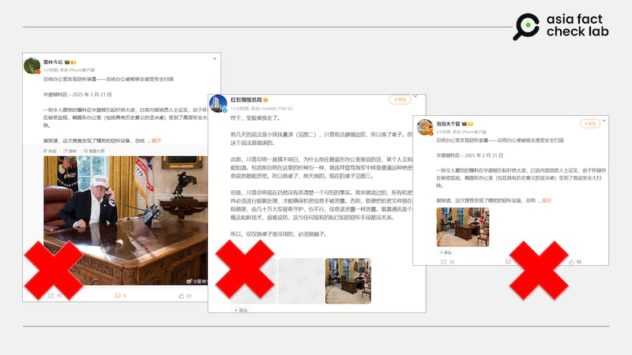
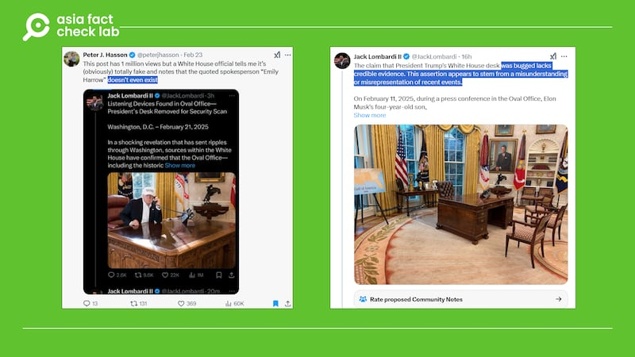

# 事實查覈｜白宮發言人證實總統辦公桌遭裝竊聽器？

鄭崇生

2025.03.04 18:38 EST

## 查覈結果：錯誤

## 一分鐘完讀：

“白宮內部消息證實，橢圓形辦公室的“堅毅桌”遭裝竊聽器，正進行全面安全檢測。”近日，這樣的消息在微博上流傳（[1](https://archive.ph/wip/3MUlm)、[2](https://archive.ph/wip/KGvBq)、[3](https://archive.ph/GAOp5)）。

亞洲事實查覈實驗室（Asia Fact Check Lab, AFCL）發現該消息來源於X上的英文用戶，該用戶已承認消息不可靠並已刪除了原文。此外，傳聞中引述的“白宮發言人”實際上並不存在。而“堅毅桌遭裝竊聽器”的說法，也完全沒有可靠信源。

## 深度分析：

近日，一些微博“大V”（[1](https://archive.ph/wip/3MUlm)、[2](https://archive.ph/wip/KGvBq)）以翻譯英文報道的形式發文，稱美國總統特朗普最近移走白宮橢圓形辦公室的“堅毅桌”（Resolute Desk），是因爲發現它被安裝了精密竊聽設備。文末還引述“白宮發言人艾米莉·哈羅”的說法，稱她“證實已加強安全措施”，並在新聞發佈會上表示，“政府嚴肅對待所有可能的國家安全威脅。”

微博上被多個用戶傳播的“總統辦公桌遭裝竊聽器”的帖子 微博上被多個用戶傳播的“總統辦公桌遭裝竊聽器”的帖子 (圖取自微博)

AFCL搜索後發現，上述微博“大V”的翻譯的文章來自X賬號“傑克·隆巴迪二世”（Jack Lombardi II），並非正規媒體報道。隆巴迪已將原帖刪除，但保留在[檔案網站上的內容](https://archive.ph/07xIE)，與微博上中文“大V”所發的文圖內容完全相同。

隆巴迪發文當天就在X上獲得超過一百萬次點擊量，引發熱烈討論。AFCL查閱特朗普政府上任後的[白宮新聞發佈會資料](https://www.whitehouse.gov/briefings-statements/)，發現發佈會均由白宮發言人李維特（Karoline Leavitt）主持，並沒有名爲艾米莉·哈羅（Emily Harrow）的發言人。

立場親保守派的媒體“華盛頓自由燈塔”（Washington Free Beacon）網站編輯哈森（Peter J. Hasson）在X上附上隆巴迪的發文截圖，並指出有白宮官員告訴他，隆巴迪的發文“明顯是假的”，白宮也確認所引述的“發言人”艾米莉·哈羅根本不存在。

X上已經出現的闢謠帖 X上已經出現的闢謠帖 (圖取自X)

隆巴迪隨後又發了[一篇帖子](https://archive.ph/nczup)，改稱自己早前發佈的所謂“堅毅桌遭安裝竊聽器”的內容缺乏可靠證據。

因此，中文網絡上流傳的“白宮發言人證實堅毅桌遭裝竊聽器”的說法明顯是假信息，原始發文者自己也已說明消息來源不可靠。

關於這張引人關注的辦公桌，特朗普日前曾[發文](https://truthsocial.com/@realDonaldTrump/posts/114033884590103594)稱，白宮的這張有上百年曆史的“堅毅桌”需要稍作整修，所以橢圓形辦公室裏暫時換上了前總統老布什（George H.W. Bush）使用過的C&O辦公桌。但官方並未說明更換辦公桌的具體原因。

*亞洲事實查覈實驗室（Asia Fact Check Lab）針對當今複雜媒體環境以及新興傳播生態而成立。我們本於新聞專業主義，提供專業查覈報告及與信息環境相關的傳播觀察、深度報道，幫助讀者對公共議題獲得多元而全面的認識。*

*讀者若對任何媒體及社交平臺傳播的信息有疑問，歡迎以電郵*[*afcl@rfa.org*](mailto:afcl@rfa.org)*寄給亞洲事實查覈實驗室，由我們爲您查證覈實。亞洲事實查覈實驗室更詳細的介紹請參考*[*本文*](2024-10-09_關於亞洲事實查覈實驗室｜About AFCL.md)*。*

*我們另有X、臉書、IG頻道，歡迎讀者追蹤、分享、轉發。 X這邊請進：中文*[*@asiafactcheckcn*](https://twitter.com/asiafactcheckcn)*;英語：*[*@AFCL\_eng*](https://twitter.com/AFCL_eng)*、*[*FB在這裏*](https://www.facebook.com/asiafactchecklabcn)*、*[*IG也別忘了*](https://www.instagram.com/asiafactchecklab/)*。*

[Original Source](https://www.rfa.org/mandarin/shishi-hecha/2025/03/04/fact-check-presidents-desk-bugged/)