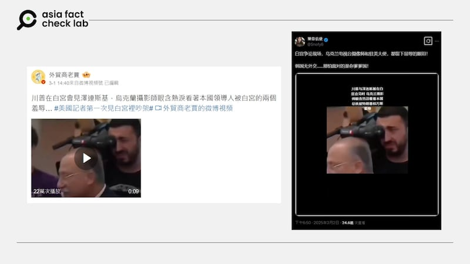
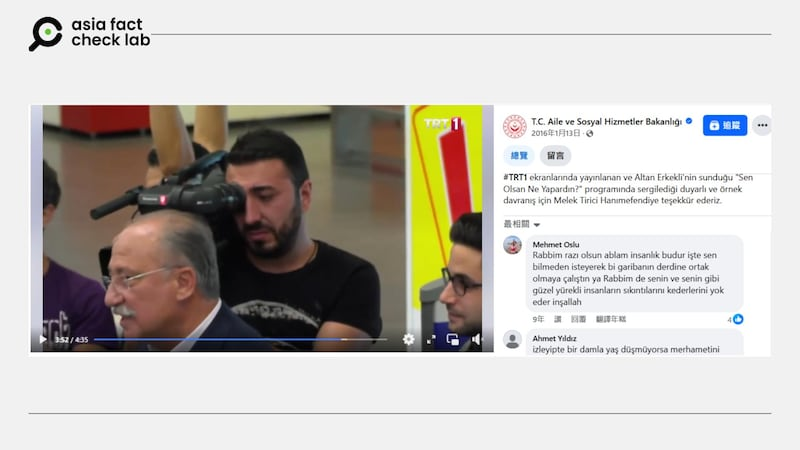

# 事實查覈｜拍攝美烏領袖會面時烏克蘭攝影師流淚？

莊敬

2025.03.05 12:44 EST

## 查覈結果：錯誤

## 一分鐘完讀：

近日社媒上流傳一則短視頻，畫面中一名男性攝影師邊拍攝邊流淚，社媒用戶聲稱影像出自美國總統特朗普與烏克蘭總統澤連斯基在白宮會談時，有烏克蘭電視臺攝影師在場流下”屈辱的眼淚”。

但經查，這則視頻應爲一個土耳其電視節目，且拍攝於多年前，與近日美烏領袖會談無關，部分社媒用戶挪用過往視頻傳播錯誤信息。

## 深度分析：

2025年2月28日，美國總統特朗普（Donald Trump，又譯川普）與烏克蘭總統澤連斯基（Volodymyr Zelenskyy）在白宮橢圓形辦公室會談，雙方對話約半小時後[發生爭執](https://www.bbc.com/zhongwen/articles/c14jxnjj24vo/trad)，最終澤連斯基及其團隊提前離開白宮，未按原計劃簽署美烏礦產協議。

各國媒體大幅報道美烏領袖會談，社媒上也有大量討論。亞洲事實查覈實驗室（Asia Fact Check Lab, AFCL）注意到，近日有[Ｘ藍勾賬號](https://x.com/Snofy8/status/1896151188548247981)、[微博大V](https://m.weibo.cn/detail/5139397222597089)發文，稱在美烏領袖會談起爭執時，一名烏克蘭電視臺攝影師流下屈辱的眼淚；發文的社媒用戶並附上一段短視頻，畫面是一名男攝影師在拍攝時流淚。

網傳在美國總統特朗普與烏克蘭總統澤連斯基會談時，有名烏克蘭攝影師流淚。 網傳在美國總統特朗普與烏克蘭總統澤連斯基會談時，有名烏克蘭攝影師流淚。 (微博、X截圖)

AFCL以圖反搜並未找到相似影像，但以“攝影師”、“哭泣”等英文關鍵字搜尋，找到TikTok賬號“[s0cs0](https://www.tiktok.com/@s0cs0/video/7327712959789042949)”在2024年1月發佈的視頻中出現網傳攝影師哭泣畫面，這個視頻提供了一些線索，包括右上角顯示“TRT1”（土耳其廣播電視公司第一臺），以及螢幕上寫着“Gizli Kamera”，Google自動偵測爲土耳其文，翻譯爲“偷拍相機”（或稱隱藏相機）。

進一步以上述線索搜尋，在臉書上找到[長版影片](https://www.facebook.com/watch/?v=986248128129368)，發佈賬號是經認證的政府機構“土耳其家庭及社會服務部”，發佈時間顯示是2016年。在這則影片的3分45秒處，可以看到網傳的男攝影師哭泣畫面。

有Facebook賬號在2016年發佈的視頻，內有網傳的攝影師流淚畫面。 有Facebook賬號在2016年發佈的視頻，內有網傳的攝影師流淚畫面。 (Facebook截圖)

網絡上的資訊顯示，該男攝影師哭泣的視頻發佈於多年前，不可能與近日美烏領袖會談有關。因此，部分社媒用戶挪用無關事件的影像，傳播錯誤信息。

*亞洲事實查覈實驗室（Asia Fact Check Lab）針對當今複雜媒體環境以及新興傳播生態而成立。我們本於新聞專業主義，提供專業查覈報告及與信息環境相關的傳播觀察、深度報道，幫助讀者對公共議題獲得多元而全面的認識。讀者若對任何媒體及社交軟件傳播的信息有疑問，歡迎以電郵*[*afcl@rfa.org*](mailto:afcl@rfa.org)*寄給亞洲事實查覈實驗室，由我們爲您查證覈實。*

*亞洲事實查覈實驗室更詳細的介紹請參考*[*本文*](2024-10-09_關於亞洲事實查覈實驗室｜About AFCL.md)*。我們另有X、臉書、IG頻道，歡迎讀者追蹤、分享、轉發。X這邊請進：中文*[*@asiafactcheckcn*](https://twitter.com/asiafactcheckcn)*；英文：*[*@AFCL\_eng*](https://twitter.com/AFCL_eng)*、*[*FB在這裏*](https://www.facebook.com/asiafactchecklabcn)*、*[*IG也別忘了*](https://www.instagram.com/asiafactchecklab/)*。*

[Original Source](https://www.rfa.org/mandarin/shishi-hecha/2025/03/05/fact-check-trump-zelenskyy-meeting-ukraine-photographer-crying/)