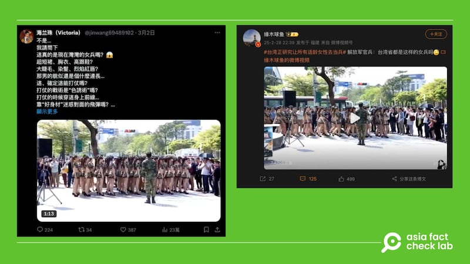
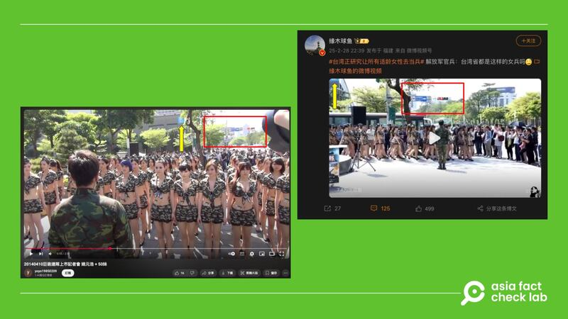

# 事實查覈｜視頻顯示，穿着香豔的“臺灣女兵”正在刻苦訓練？

董喆

2025.03.06 13:34 EST

## 查覈結果：錯誤

## 一分鐘完讀：

近日中國社羣平臺廣傳一則視頻，稱是“臺灣省女兵”的操演畫面，視頻還稱，臺灣近期爲阻止中國武統，正在研擬適齡女性皆要服兵役。視頻留言嘲諷臺灣女兵穿着香豔，不具戰力。但經查覈，這則視頻是在臺灣舉辦的一場電玩活動，與臺灣軍隊無關。

## 深度分析：

近日微博（[1](https://archive.ph/prmWV)、[2](https://archive.ph/1TmyX)、[3](https://archive.ph/2V1zE)）、Ｘ（[1](https://archive.ph/nNfNw)、[2](https://archive.ph/GRS4m)）、[抖音](https://www.douyin.com/video/7476836453801053503)出現同一則視頻，稱是”臺灣省女兵”的操演畫面，並稱臺灣近期爲阻止中國武統臺灣，正在研擬適齡女性皆要服兵役。此外，這些視頻以及留言都在嘲諷臺灣女兵穿着香豔、沒有戰力。

近日社羣平臺的簡體中文賬號廣傳一則視頻，稱是“臺灣省女兵”的操演畫面。 近日社羣平臺的簡體中文賬號廣傳一則視頻，稱是“臺灣省女兵”的操演畫面。 (Ｘ、微博截圖)

亞洲事實查覈實驗室（以下簡稱AFCL）以圖反搜，結果多爲相同的傳言，但在視頻約32至40秒處，可見右下方有一則看板寫着”巨炮連隊”，是一款軍事戰爭策略手機遊戲，可推測這可能與手機遊戲宣傳活動有關。

AFCL近一步以”巨炮連隊”、記者會、宣傳等關鍵字搜尋，在Youtube找到一則民衆自發上傳的視頻，標題爲“[20140410巨炮連隊上市記者會”](https://www.youtube.com/watch?v=T9S0WAF-FaU&ab_channel=yoyo19850209)，視頻中的地標與網傳臺灣省女兵視頻地標相符，且原視頻中帶隊的男性士兵實際上是臺灣男星姚元浩，臺灣媒體《自由時報》娛樂版仍可看見當時新聞，視頻拍攝時間與新聞報道的時間一致，皆爲2014年4月10日。

據傳是臺灣省女兵的操演畫面，比對街景可確定原始視頻應爲手機遊戲宣傳活動。 據傳是臺灣省女兵的操演畫面，比對街景可確定原始視頻應爲手機遊戲宣傳活動。 (Youtube、微博截圖)

因此網傳視頻稱畫面爲臺灣女兵刻苦訓練爲錯誤資訊。

根據臺灣事實查覈中心[報告](https://tfc-taiwan.org.tw/fact-check-reports/migration-11205/)，這一則視頻亦曾在臺灣社羣媒體被誤用，稱是“抗中獨臺”的新力量，這次舊視頻又遭翻出，反遭中國網友作爲打擊臺灣軍事實力的錯假資訊。過去AFCL也曾查覈中國社羣針對臺灣女性士兵的歧視假視頻，這些傳言的共同特色爲使用毫無相關的視頻，稱臺灣女士兵“過度甜美”或是“只靠美色”，企圖形塑臺灣女性士兵實力不足的謠言。

## 相關閱讀：

* [**事實查覈｜中國網民想“活捉”的臺灣女兵“自投羅網”到廈門旅遊？**](2024-04-04_事實查覈｜中國網民想“活捉”的臺灣女兵“自投羅網”到廈門旅遊？.md)

至於臺灣正在研擬適齡女性皆要服兵役一事，起因爲臺灣媒體《定傳媒》2月21日的[報道](https://archive.ph/UXLNP)，當中提到國防部在近期總統府的“大軍談”，提出兵力結構調整，其中女性服義務役即列爲其中的一項研究課題。不過根據多家臺灣媒體[民視](https://archive.ph/jobVL)、《[聯合報](https://archive.ph/7CbJM)》的報道引述國防部發言人孫立方25日[表示](https://www.ettoday.net/news/20250225/2914732.htm)，向總統軍談提報等內容並非事實，目前並未有要將女性納入義務役的規劃。

*亞洲事實查覈實驗室（Asia Fact Check Lab）針對當今複雜媒體環境以及新興傳播生態而成立。我們本於新聞專業主義，提供專業查覈報告及與信息環境相關的傳播觀察、深度報道，幫助讀者對公共議題獲得多元而全面的認識。讀者若對任何媒體及社交軟件傳播的信息有疑問，歡迎以電郵*[*afcl@rfa.org*](mailto:afcl@rfa.org)*寄給亞洲事實查覈實驗室，由我們爲您查證覈實。*

*亞洲事實查覈實驗室更詳細的介紹請參考*[*本文*](2024-10-09_關於亞洲事實查覈實驗室｜About AFCL.md)*。我們另有X、臉書、IG頻道，歡迎讀者追蹤、分享、轉發。X這邊請進：中文*[*@asiafactcheckcn*](https://twitter.com/asiafactcheckcn)*；英文：*[*@AFCL\_eng*](https://twitter.com/AFCL_eng)*、*[*FB在這裏*](https://www.facebook.com/asiafactchecklabcn)*、*[*IG也別忘了*](https://www.instagram.com/asiafactchecklab/)*。*

[Original Source](https://www.rfa.org/mandarin/shishi-hecha/2025/03/06/fact-check-taiwan-female-soldiers-video/)