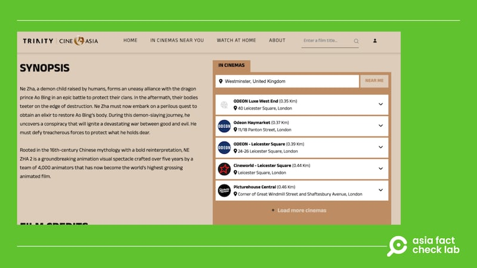

# 事實查覈｜《哪吒2》遭歐盟國家抵制？

李志德

2025.03.11 18:38 EDT

## 查覈結果：錯誤

## 一分鐘完讀：

中國動畫電影《哪吒2》近來在中國大受歡迎，票房破百億人民幣且還在增長，但迄今主要是國內票房的貢獻。近日有YouTube短片和中文媒體散佈消息，宣稱《哪吒2》在歐盟國家遭到抵制，未能上映。

亞洲事實查覈實驗室（AFCL）查覈後發現，《哪吒2》在歐洲的發行權已經由一家商業公司取得，預計下週上映。而在此之前，也沒有可信報道證實《哪吒2》曾經在任何一個歐盟國家遭抵制或禁播。

## 深度分析：

《哪吒2》自一月底在中國上映，陸續在香港、澳門和北美放映，據報道[票房超過19億美元](https://www.thetimes.com/static/china-animated-film-ne-zha-tourism-box-office/)。近日，[YouTube短片](https://www.youtube.com/watch?v=r3IZhEE1fZQ)和中文媒體（[1](https://www.163.com/dy/article/JOMIAE0M0556ASHT.html)、[2](https://www.163.com/dy/article/JPSTFEL00552BYL4.html)）散佈《哪吒2》遭到歐洲封殺的信息，參與擴散該消息的還有中國知名國際關係學者[金燦榮](https://www.youtube.com/watch?v=GPzWuldMZxw)。AFCL檢視了相關報道，並沒有從中發現關於“封殺”該影片的確切信息，例如，究竟是哪些國家，或者哪些機構，以什麼理由“封殺”《哪吒2》等等。

AFCL再以“哪吒2”“封殺”“禁止””抵制”等中、英語關鍵字查詢，也沒有發現任何具公信力的媒體機構曾經報道相關信息。

宣稱《哪吒2 》遭到歐洲封殺的相關帖文和影片 宣稱《哪吒2 》遭到歐洲封殺的相關帖文和影片 (圖截取自YouTube、新浪)

## 已有發行商買下歐洲發行權

就在《哪吒2》“遭歐洲封殺”的消息在網絡上傳播時，3月10日，英國倫敦一家電影發行商“Trinity CineAsia”[向媒體證實](https://today.line.me/hk/v2/article/0ME0JDz)，該公司已經買下《哪吒2》在歐洲境內超過37個國家的獨家院線發行版權，包括英國、愛爾蘭、德國、法國和西班牙等。根據該公司[官網資訊](https://www.trinitycineasia.com/en/movie/ne-zha-2?whereToWatch=in-cinemas)，《哪吒2》將於3月14日在英國上映。

《哪吒2》在英國的購票信息 《哪吒2》在英國的購票信息 (圖截取自Trinity CineAsia官網)

事實上，這已經不是第一次傳出《哪吒2》遭封殺的謠言。2月底，社媒平臺X就曾經傳出消息稱，美國商務部以 “國家安全” 的考量禁止《哪吒2》在美國上映，稱其可能導致意識形態滲透。這則傳聞日前由法新社[查覈闢謠](https://factcheck.afp.com/doc.afp.com.36YA9N6)。此外，也有傳言稱《哪吒2》遭臺灣政府限制，臺灣文化部長[李遠](https://www.cna.com.tw/news/amov/202502280035.aspx)也出面否認，並表示這部電影根本不曾申請在臺灣上映。

*亞洲事實查覈實驗室（Asia Fact Check Lab）針對當今複雜媒體環境以及新興傳播生態而成立。我們本於新聞專業主義，提供專業查覈報告及與信息環境相關的傳播觀察、深度報道，幫助讀者對公共議題獲得多元而全面的認識。*

*讀者若對任何媒體及社交平臺傳播的信息有疑問，歡迎以電郵*[*afcl@rfa.org*](mailto:afcl@rfa.org)*寄給亞洲事實查覈實驗室，由我們爲您查證覈實。亞洲事實查覈實驗室更詳細的介紹請參考*[*本文*](2024-10-09_關於亞洲事實查覈實驗室｜About AFCL.md)*。*

*我們另有X、臉書、IG頻道，歡迎讀者追蹤、分享、轉發。 X這邊請進：中文*[*@asiafactcheckcn*](https://twitter.com/asiafactcheckcn)*;英語：*[*@AFCL\_eng*](https://twitter.com/AFCL_eng)*、*[*FB在這裏*](https://www.facebook.com/asiafactchecklabcn)*、*[*IG也別忘了*](https://www.instagram.com/asiafactchecklab/)*。*

[Original Source](https://www.rfa.org/mandarin/shishi-hecha/2025/03/11/fact-check-nezha-banned-by-eu/)