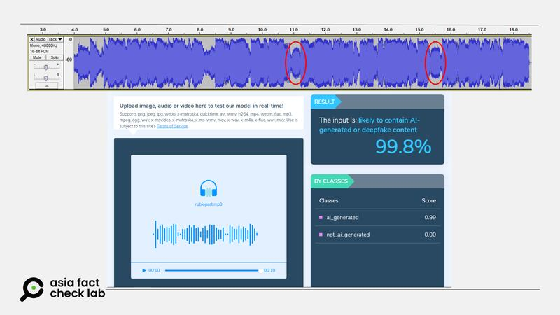
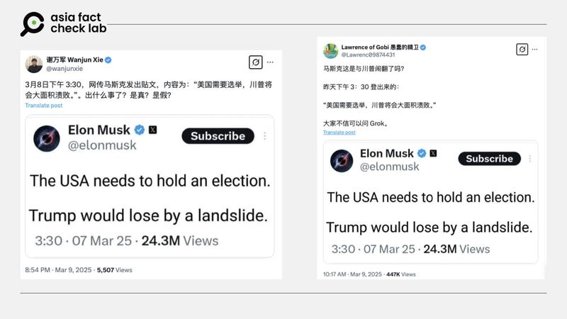
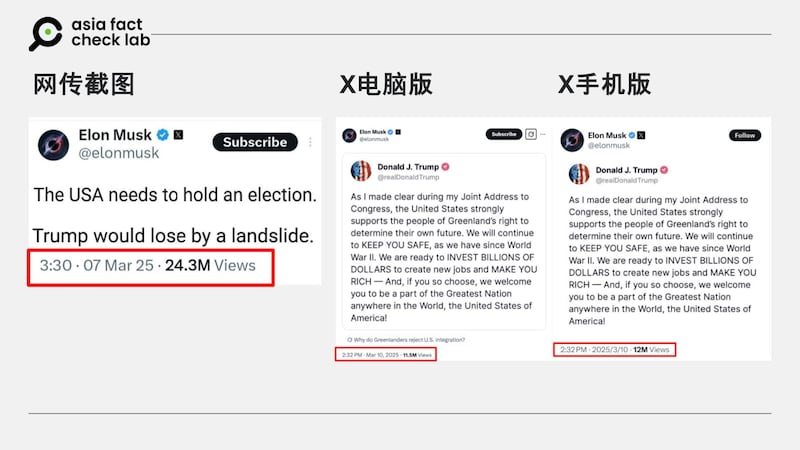
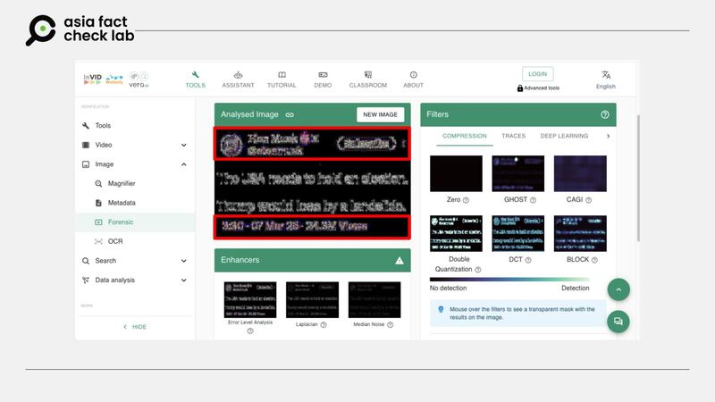
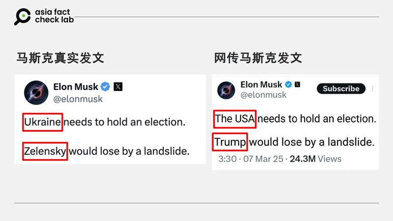

# 事實查覈｜關閉星鏈？重行選舉？這些假信息由AI加工而來

鄭崇生、艾倫

2025.03.12 20:46 EDT

最近，一些針對美國政府及其高階官員的資訊，藉由人工智能（AI）科技加工真實音畫素材在網上傳播。亞洲事實查覈實驗室收集、查覈了其中兩則：

## 1. 盧比奧在接受CNN採訪時稱，要說服馬斯克關閉給烏克蘭的星鏈服務？

## 查覈結果：錯誤

原視頻經剪輯變造並插入音頻。

一些微博用戶（[1](https://archive.ph/D9kaV)、[2](https://archive.ph/wip/dn2lA)）與[抖音用戶](https://v.douyin.com/i5qSyUUB/)近來在傳播一段18秒的視頻，畫面是取自美國國務卿盧比奧（Marco Rubio）2月28日接受美國有線電視新聞網（CNN）[訪問內容片段](https://www.cnn.com/2025/02/28/politics/rubio-zelensky-apology-trump-cnntv/index.html)。微博大“V”[“斯圖卡98”](https://archive.ph/D9kaV)根據這一視頻內容翻譯稱，盧比奧受訪時說自己“過兩天會與馬斯克見面，會說服馬斯克切斷烏克蘭軍隊（使用的）星鏈，那時澤連斯基就知道有多麼離不開美國了。”

上述資訊傳在抖音與微博上都引來“美國背信棄義”或質疑美國不向俄羅斯施壓的批評。然而，亞洲事實查覈實驗室（Asia Fact Check Lab, AFCL）比對了CNN專訪[原始視頻](https://youtube.com/shorts/Yva8nhDsP0c?si=zYTj3PGAu-QrO1ti)，發現原始片段中主持人和盧比奧視頻連線，全程都畫面中，對話全程不曾切換到其它畫面。（下方截圖左）。

但網傳視頻中，約第8秒開始卻插入了烏克蘭總統澤連斯基（Volodymyr Zelenskyy）日前在白宮與特朗普等人爭執的畫面（下方截圖右），搭配着聽起來像是盧比奧聲音說的“要說服馬斯克關閉烏克蘭星鏈”的內容。

網傳視頻（右）加入了原視頻（左）中沒有的畫面 網傳視頻（右）加入了原視頻（左）中沒有的畫面 (圖截取自YouTube、微博)

再從談話內容來看，CNN的原版訪談裏，盧比奧先是表達他認爲澤連斯基應該爲在白宮的表現道歉。記者追問：澤連斯基應該爲什麼事道歉？盧比奧說，澤連斯基不需要擺出如此對抗的姿態，以致於把事情搞砸了。他就此展開講述了一些細節，但並未提到馬斯克和星鏈。

但在網傳視頻中，盧比奧回答了一句之後，就話鋒一轉稱”自己要說服馬斯克關閉星鏈”。這不僅和原視頻內容完全不同，語速也明顯變慢，還有規律的停頓（下圖紅圈處），而音質也比原視頻中聽起來更爲扁平。

AFCL擷取這段第8秒到18秒的[音頻](https://drive.google.com/file/d/1oFApUyRg9yWJnh6rU0B5RgaPKOn0x8na/view?usp=sharing)，用AI生成內容偵測軟件[Hive](https://hivemoderation.com/ai-generated-content-detection)的檢測發現，這段聽起來極似盧比奧聲音的音頻，有高達99.8%的可能是AI生成，極有可能是深僞技術編造出的內容。

AI偵測軟件檢查的結果顯示盧比奧的音頻大概率由AI生成 AI偵測軟件檢查的結果顯示盧比奧的音頻大概率由AI生成 (圖截取自Hive軟件界面)

這段加工過的視頻最早由X上的[英文用戶](https://archive.ph/KCs91)發佈，已有[烏克蘭官方的查覈組織](https://x.com/CforCD/status/1896893386323628172)及[法新社](https://factcheck.afp.com/doc.afp.com.36ZP828)（AFP）發佈查覈報告，但相關不實內容仍然在中文世界流傳。

## 2. 網傳截圖顯示，馬斯克說特朗普若再選舉，會大輸特輸？

## 查覈結果：缺乏證據

3月9日，X上有中文賬號（[1](https://x.com/lawrenc09874431/status/1898558837713420736?s=46&t=OcwRl26KwGrlCoefgaqyvw)，[2](https://x.com/wanjunxie/status/1898719028337660047)）轉發一張據稱是馬斯克（Elon Musk）的發文截圖，內容爲馬斯克發文說：“美國需要舉行選舉，川普將以壓倒性差距落敗”。

3月9日，X上傳出馬斯克發文嘲諷特朗普再次選舉會大輸的消息。 3月9日，X上傳出馬斯克發文嘲諷特朗普再次選舉會大輸的消息。 (圖取自X)

轉發的其中一名“藍勾“用戶爲“Lawrence of Gobi 愚蠢的精衛”，他的文章在一天內就收穫將近50萬次觀看，該用戶還直接邀請網民問Grok（X的內建AI）這則消息是否爲真。

觀察網傳截圖內容，AFCL發現文末時間標記的格式和X上的其他文章不同。隨機選取一則X上的貼文（見下圖），會發現在電腦上時間的正確寫法爲“時間+AM或PM，月+日+年”，在手機上閱覽則稍有不同，但都和截圖內的時間標記不一樣。

比對網傳截圖和X在電腦及手機上的版本，時間標記方式明顯不同。 比對網傳截圖和X在電腦及手機上的版本，時間標記方式明顯不同。 (圖取自X)

進一步使用查覈工具InVID & WeVerify查證，檢測結果顯示，該圖上的用戶名稱及時間處有變造痕跡（見下方截圖的紅色部分）。

InVID & WeVerify檢測結果稱：“過濾器可檢測圖像在先前創建和壓縮過程中的異常。如果圖像中新增或移除了一個元素，而其壓縮方式與圖像其餘部分不同，則可以被檢測出來”，而紅色部分正是被檢測出的不尋常之處。

查覈工具InVID & WeVerify的驗證結果，其中彩色模糊部分爲明顯經後製變造的部分。 查覈工具InVID & WeVerify的驗證結果，其中彩色模糊部分爲明顯經後製變造的部分。 (圖取自InVID & WeVerify網站)

AFCL再以關鍵字“The USA needs to hold an election”等關鍵詞搜尋，並沒有找到馬斯克曾經發過相關信息的證據，也沒有任何官方消息或機構媒體報道他發表過這一言論。

但馬斯克曾在此傳言的前一天，即3月6日發佈過一篇[帖文](https://x.com/elonmusk/status/1897670662325461160?ref_src=twsrc%5Etfw%7Ctwcamp%5Etweetembed%7Ctwterm%5E1897670662325461160%7Ctwgr%5E750fd5a8d60f54cca19e75164924f5dd8c20b63d%7Ctwcon%5Es1_&ref_url=https%3A%2F%2Fleadstories.com%2Fhoax-alert%2F2025%2F03%2Ffact-check-elon-usa-needs-to-hold-election-trump-lose-by-a-landslide.html)，稱“烏克蘭需要舉行選舉，澤連斯基將以壓倒性差距落敗”，目前該文還在線上，並未被撤銷，網傳截圖可能是將該帖的內容進行加工，變造而來。

以關鍵字搜尋找到馬斯克3月6日的發文，與傳言內的內容高度相近。 以關鍵字搜尋找到馬斯克3月6日的發文，與傳言內的內容高度相近。 (圖取自X)

*亞洲事實查覈實驗室（Asia Fact Check Lab）針對當今複雜媒體環境以及新興傳播生態而成立。我們本於新聞專業主義，提供專業查覈報告及與信息環境相關的傳播觀察、深度報道，幫助讀者對公共議題獲得多元而全面的認識。*

*讀者若對任何媒體及社交平臺傳播的信息有疑問，歡迎以電郵*[*afcl@rfa.org*](mailto:afcl@rfa.org)*寄給亞洲事實查覈實驗室，由我們爲您查證覈實。亞洲事實查覈實驗室更詳細的介紹請參考*[*本文*](2024-10-09_關於亞洲事實查覈實驗室｜About AFCL.md)*。*

*我們另有X、臉書、IG頻道，歡迎讀者追蹤、分享、轉發。 X這邊請進：中文*[*@asiafactcheckcn*](https://twitter.com/asiafactcheckcn)*;英語：*[*@AFCL\_eng*](https://twitter.com/AFCL_eng)*、*[*FB在這裏*](https://www.facebook.com/asiafactchecklabcn)*、*[*IG也別忘了*](https://www.instagram.com/asiafactchecklab/)*。*

[Original Source](https://www.rfa.org/mandarin/shishi-hecha/2025/03/13/fact-check-ai-generated-us-fake-news/)