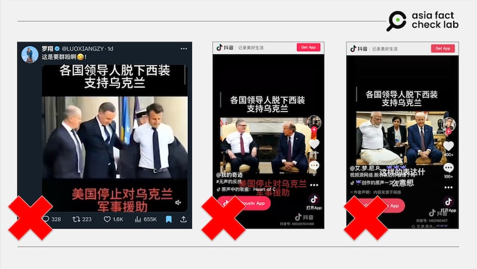
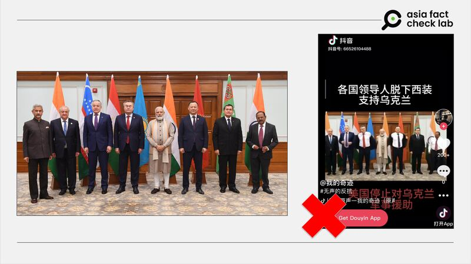

# 事實查覈｜多國領導人脫西裝挺烏克蘭？

鄭崇生

2025.03.14 15:32 EDT

## 查覈結果：錯誤

## 一分鐘完讀：

近日抖音上有多個賬號傳播同一段視頻：印度總理莫迪（Narendra Modi）、英國首相斯塔默（Keir Starmer）等多國領導人與美國總統特朗普（Donald Trump）會面時脫下西裝，表達對烏克蘭的支持。

但亞洲事實查覈實驗室發現，沒有任何可信媒體報道前述領導人以“脫西裝”方式表達支持烏克蘭。而相關視頻極可能是人工智能改造新聞視頻拼接而成。

## 深度分析：

前述視頻在抖音（[1](https://v.douyin.com/i5pA9wyU/)、[2](https://v.douyin.com/3Md5--La59c/)）和中文社媒平臺X流傳，名爲[“羅翔”](https://archive.ph/NfAyf)的用戶上傳近50秒的影片搭配背景音樂，中間有一片段標註福布斯“突發新聞現場直播”，標題寫着“各國領導人脫下西裝支持烏克蘭”，他發文調侃稱“這是要羣毆啊！”

中國網友評論，這些國家領導人爲了支持烏克蘭總統澤連斯基（Volodymyr Zelenskyy），因爲此前他到訪白宮時被批評“不穿西裝”。這段視頻獲得大量點贊、轉發。

社交媒體流傳影像稱各國領導人“脫下西裝支持烏克蘭”，但相關影像極可能爲人工智能生成（AI-generated）。 社交媒體流傳影像稱各國領導人“脫下西裝支持烏克蘭”，但相關影像極可能爲人工智能生成（AI-generated）。 (抖音、X截圖)

針對流傳信息，亞洲事實查覈實驗室（Asia Fact Check Lab, AFCL）首先搜索傳言中所指信源——福布斯（Forbes）網站，沒有發現所謂“各國元首脫西裝挺烏克蘭”的報道，進一步審閱這一49秒的視頻，實際上是兩次重複播放一段24秒的內容。

AFCL試着以AI偵測軟件Hive鑑別該視頻，但由於畫面模糊，軟件無法有效識別。

然而，以圖反搜，可以發現這段視頻不同部分的來源。

第2秒到第6秒的內容，其實是2021年年底印度主辦與中亞五國外長會談期間，莫迪接見到訪印度的五國外長，包括[印度總理辦公室官網](https://www.pmindia.gov.in/en/news_updates/call-on-pm-by-foreign-ministers-of-central-asian-countries/)以及莫迪的[官方X賬號](https://x.com/narendramodi/status/1472926068495601666)，都有公佈該場景照片，印度英文媒體[WION](https://youtu.be/csxcu0oOMcs?si=1Ebk8f3uNsN396Gz)也根據相關照片發佈報道，然而，原始新聞照片中，各國外長並未有“脫西裝”的動作。再細看上述賬號流傳的視頻中，在每個人物脫西裝的動作時兩邊腋下都出現不自然的黑影，疑似經過變造。

所謂“各國領導人齊脫西裝”的照片，是變造自2021年的一張合照，疑似由人工智能生成（AI Generated）。 所謂“各國領導人齊脫西裝”的照片，是變造自2021年的一張合照，疑似由人工智能生成（AI Generated）。 (莫迪X帳號、抖音截圖)

另外，俄烏戰爭爆發於2022年2月24日，也就是說，2021年底莫迪與中亞五國外長合照之時，不可能有“聲援烏克蘭”的行動，因此，AFCL判斷，這極可能是使用舊照片生成的AI視頻。

上述可疑視頻的第8秒至第10秒則是近期莫迪訪問美國時，與特朗普在[白宮見面的場景](https://www.youtube.com/live/cgFGcxWTtp4?si=eJ95RWrwBhylK49b)。對照白宮公佈當時兩人在鏡頭前互動的[轉播畫面](https://youtu.be/5BE6HNXNjRg?si=C8p0J7kqsSYLBXvm)，儘管莫迪雙手不時有所移動，但他並沒有脫下自己身上具印度風格的西裝外套。

而第11秒到第15秒則是[斯塔默近期與特朗普在白宮會面](https://www.youtube.com/live/cgFGcxWTtp4?si=AOyemq23ytYxBUiH)的場景，相關新聞報道中，他並沒有脫下西裝的動作。

第16秒至第21秒則是波蘭總統杜達（Andrzej Duda）在特朗普第一任期訪美時的畫面，從這兩人的領帶與背景可以確認，這是2018年在白宮東廳舉辦兩國元首會面後[記者會現場](https://www.youtube.com/live/lrhnYd_mtsE?si=woszVM_XJKK269lE)。同樣，原始視頻中杜達並沒有脫掉西裝外套。值得注意的是，疑似AI生成杜達脫西裝的場景時，特朗普仍呈現與人握手的動作，是明顯破綻。

另外，以時間線來看，包括莫迪、斯塔默與杜達分別與特朗普會面的時間點，都是在烏克蘭總統澤連斯基（Volodymyr Zelenskyy）[到訪白宮](https://youtu.be/ajxSWocbye8?si=HWi_9uaXbgK65JYU)、面對記者詢問有關“穿西裝”問題之前，對照事件先後順序，也不可能出現“三國元首脫西裝挺烏克蘭“的情況。

至於第22秒到第24秒的片段，AFCL以圖反搜，發現是2023年6月的新聞現場，當時由法國總統馬克龍（Emmanuel Macron）主辦與時任德國總理朔爾茨（Olaf Scholz）和杜達舉行的法、波、德三國元首會談。根據美聯社當時的[報道](https://apnews.com/article/france-germany-poland-ukraine-counteroffensive-nato-vilnius-53c742af44e699a7c75114a43bfdfba2)與[視頻](https://youtu.be/xH3X_jg7vpI?si=YXahqdTyuf-KwWXc)，三國當時會談的重點的確包括俄烏戰爭，在轉播畫面中三人並沒有在鏡頭前解開西裝鈕釦，或是脫下西裝外套，也因此，這段視頻中脫西裝的動作也極可能是AI生成，試圖營造“各國元首脫西裝外套挺烏克蘭”的虛假信息。

*亞洲事實查覈實驗室（Asia Fact Check Lab）針對當今複雜媒體環境以及新興傳播生態而成立。我們本於新聞專業主義，提供專業查覈報告及與信息環境相關的傳播觀察、深度報道，幫助讀者對公共議題獲得多元而全面的認識。讀者若對任何媒體及社交軟件傳播的信息有疑問，歡迎以電郵*[*afcl@rfa.org*](mailto:afcl@rfa.org)*寄給亞洲事實查覈實驗室，由我們爲您查證覈實。*

*亞洲事實查覈實驗室更詳細的介紹請參考*[*本文*](2024-10-09_關於亞洲事實查覈實驗室｜About AFCL.md)*。我們另有X、臉書、IG頻道，歡迎讀者追蹤、分享、轉發。X這邊請進：中文*[*@asiafactcheckcn*](https://twitter.com/asiafactcheckcn)*；英文：*[*@AFCL\_eng*](https://twitter.com/AFCL_eng)*、*[*FB在這裏*](https://www.facebook.com/asiafactchecklabcn)*、*[*IG也別忘了*](https://www.instagram.com/asiafactchecklab/)*。*

[Original Source](https://www.rfa.org/mandarin/shishi-hecha/2025/03/14/fact-check-leaders-take-off-suit-support-ukraine/)