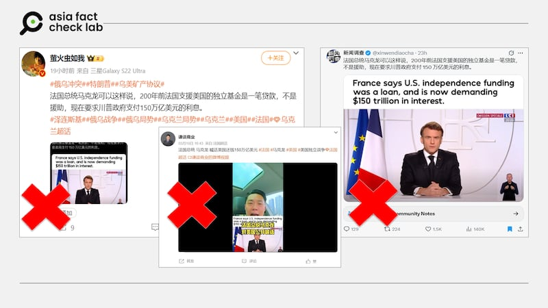
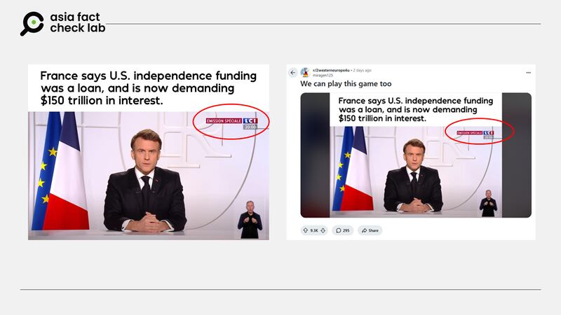
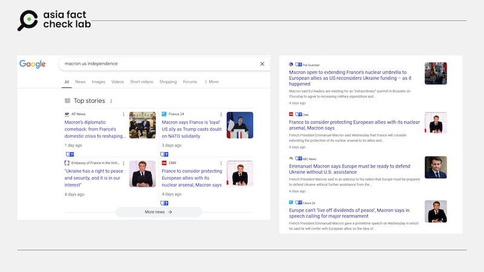

# 事實查覈｜法國要求美國償還獨立戰爭貸款利息？

鄭崇生

2025.03.13 20:22 EDT

## 查覈結果：錯誤

## #

## 一分鐘完讀：

近日，X平臺與微博上都流傳法國媒體報道了法國總統馬克龍（Emmanuel Macron）要求美國償還150萬億建國基金利息的消息。然而，亞洲事實查覈實驗室發現，這實際上是篡改了媒體報道內容的不實信息。

## 深度分析：

包括X平臺的[藍勾勾認證用戶](https://archive.ph/jMKVC)以及微博上的大V賬號（[1](https://archive.ph/hRQd2)、[2](https://archive.ph/wip/4kE0g)）都傳播了一張馬克龍最近發表電視演說的截圖。截圖上的英文標題寫着：“法國表示，當年支持美國獨立的基金是貸款，現在要美國支付150萬億元利息。”

此外，一些微博用戶還根據這張截圖錄制[視頻](https://archive.ph/3gz4k)，聲稱馬克龍向美國喊話，要求美國償還200多年前法國在美國獨立戰爭中提供的援助貸款利息。

中文社交媒體上流傳法國總統要求美國償還150萬億美元的消息 中文社交媒體上流傳法國總統要求美國償還150萬億美元的消息 (圖截取自微博、X)

亞洲事實查覈實驗室（Asia Fact Check Lab, AFCL）通過[文章配圖](https://archive.ph/jMKVC)反搜，發現同樣的圖文在[Reddit](https://archive.ph/kjNxE)平臺上已有流傳。截圖右上角標註着法國電視一臺（LCI）旗下新聞頻道的英文縮寫“LCI”，並附有法文“Emission spéciale”（意爲“特別報道”）的紅底白字標題，右下角還出現了手語翻譯員的畫面。

同樣的圖文消息已在英文社交媒體上傳播 同樣的圖文消息已在英文社交媒體上傳播 (圖截取自Reddit)

然而，比對LCI在YouTube上發佈的馬克龍演說[視頻](https://youtu.be/bnsBM-JqsuI?si=llC4guJ5nBvUcnTl)，不論是在馬克龍講話期間，還是在他演說後LCI進行的評論節目中，都沒有出現“法國要求美國支付獨立基金的貸款利息”相關內容。

進一步搜索[LCI官網](https://www.tf1info.fr/)及搜索引擎的公開資料，也未發現任何有關“馬克龍向美國討債”的報道。

## 馬克龍演講的真實內容

3月5日晚8時，馬克龍向法國民衆發表電視演說。根據[法國總統府官網](https://www.elysee.fr/emmanuel-macron/2025/03/05/adresse-aux-francais-6)公佈的逐字稿，以及法國24英文國際頻道（FRANCE 24 English）當天提供的[即時英文翻譯直播](https://youtu.be/ZvssAXQz4Cw?si=FBtn5eIiZc2pzvIJ)，馬克龍並未提及“要求美國償還建國基金貸款利息”。

在谷歌平臺上使用“Macron + America + independence”（馬克龍+美國+獨立）等關鍵詞搜索，雖然可以找到相關的新聞報道，但主要圍繞着歐洲防衛的獨立性展開。

以[美國有線電視新聞網](https://www.cnn.com/2025/03/05/europe/macron-france-nuclear-arsenal-ukraine-intl-hnk/index.html)（CNN）爲例，除了聚焦馬克龍在演說中向歐洲盟友喊話，呼籲歐洲各國必須付出更多努力，強化自身防衛的獨立性之外，還表示法國正考慮將自己的核武保護傘擴展至歐洲盟邦。

主流媒體報道的截圖相關的馬克龍演講內容 主流媒體報道的截圖相關的馬克龍演講內容 (圖截取自Google)

*亞洲事實查覈實驗室（Asia Fact Check Lab）針對當今複雜媒體環境以及新興傳播生態而成立。我們本於新聞專業主義，提供專業查覈報告及與信息環境相關的傳播觀察、深度報道，幫助讀者對公共議題獲得多元而全面的認識。*

*讀者若對任何媒體及社交平臺傳播的信息有疑問，歡迎以電郵*[*afcl@rfa.org*](mailto:afcl@rfa.org)*寄給亞洲事實查覈實驗室，由我們爲您查證覈實。亞洲事實查覈實驗室更詳細的介紹請參考*[*本文*](2024-10-09_關於亞洲事實查覈實驗室｜About AFCL.md)*。*

*我們另有X、臉書、IG頻道，歡迎讀者追蹤、分享、轉發。 X這邊請進：中文*[*@asiafactcheckcn*](https://twitter.com/asiafactcheckcn)*;英語：*[*@AFCL\_eng*](https://twitter.com/AFCL_eng)*、*[*FB在這裏*](https://www.facebook.com/asiafactchecklabcn)*、*[*IG也別忘了*](https://www.instagram.com/asiafactchecklab/)*。*

[Original Source](https://www.rfa.org/mandarin/shishi-hecha/2025/03/14/fact-check-did-macron-ask-us-repay-interest/)