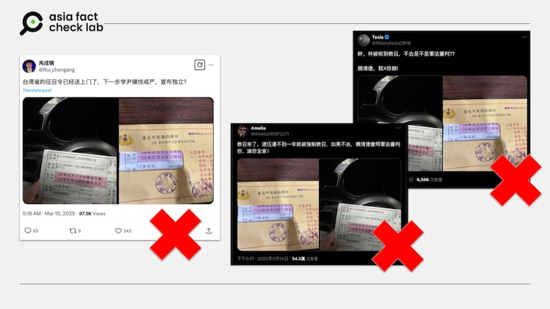
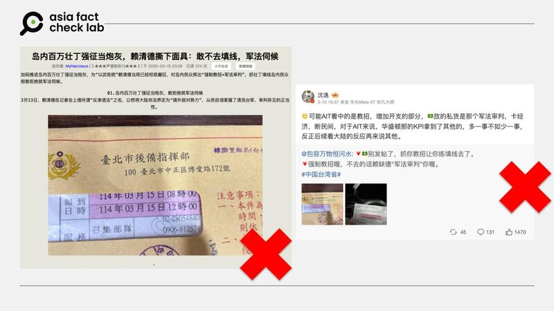
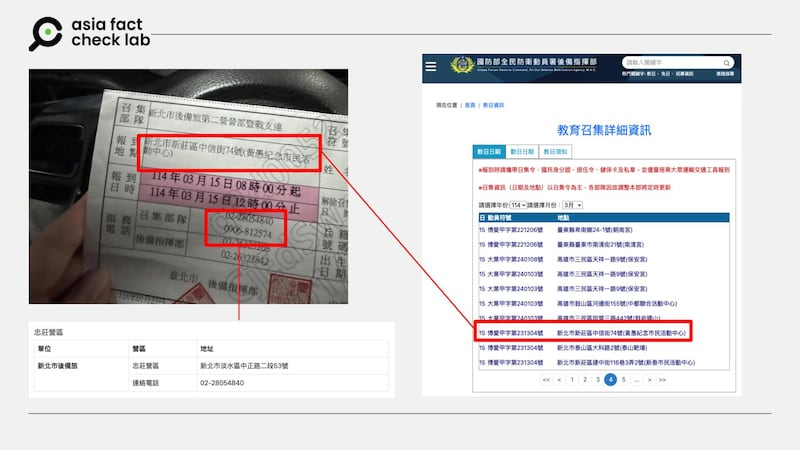
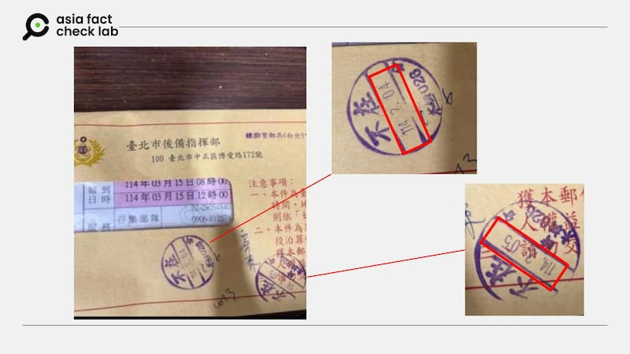
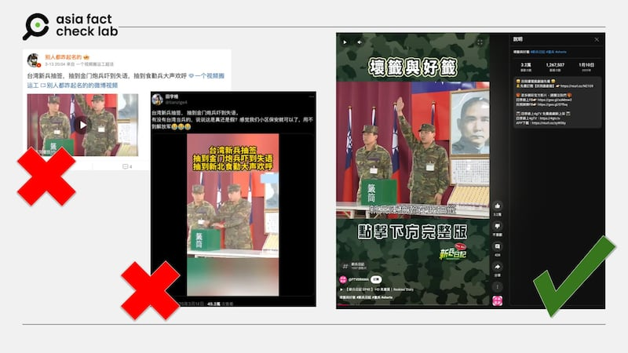

# 事實查覈｜臺灣恢復軍事審判後，開始“抓壯丁”準備打仗？

董喆

2025.03.17 19:30 EDT

(本文於2025年3月30日更新，更新內容詳文末)

3月13日，臺灣總統賴清德宣佈恢復軍事審判制度，稱爲了應對中共對臺軍的滲透，將全面檢討修正《軍事審判法》。中國外交部發言人毛寧在例行新聞發佈會上回應此事稱這 “不是一個外交問題” ，並稱“臺灣是中國的一部分，沒有什麼‘總統‘”。這件事也在社羣平臺上發酵，與臺軍相關的錯假資訊相繼出現，關於臺灣即將動員徵兵，或者以不實影片嘲諷臺軍戰力的信息開始傳播。

## 1.臺灣發佈徵召令，準備宣佈獨立？

## 查覈結果：錯誤

一個署名“芮成鋼“，並使用芮成鋼照片為頭像的X帳號(@Rui\_chengang)5日在X上發表[推文](https://archive.ph/H4Ne6)，附上兩封信件稱，“臺灣省的徵召令已經送上門，下一步學尹錫悅戒嚴，宣佈獨立”？芮成鋼於3月30日致信AFCL，澄清發文的是冒名的假帳號(impersonator)。

亞洲事實查覈實驗室（AFCL）以圖反搜發現，早在這篇文發出前，就有多個繁體中文賬號在Ｘ上“現身說法”，稱自己“退伍不到一年就被強制教召，如果不去，賴清德會用軍法審判你！”但使用的卻都是同一系列照片。

X上有多則帖文傳播有關臺灣後備軍人教召的錯誤資訊，包括冒名芮成鋼的帳號。 X上有多則帖文傳播有關臺灣後備軍人教召的錯誤資訊，包括冒名芮成鋼的帳號。 (圖取自X)

中國知名評論員、復旦大學國際政治系教授沈逸亦在微博轉發同樣口徑的帖文與照片，並將其與美國在臺協會（AIT）相關聯。簡體中文論壇亦有[文章](https://archive.ph/inlK8)稱，賴清德宣佈恢復軍事審判後，便立刻“抓壯丁”，誰敢拒絕就“軍法伺候”。

中文社媒上有多則帖文傳播有關臺灣後備軍人教召的錯誤資訊。 中文社媒上有多則帖文傳播有關臺灣後備軍人教召的錯誤資訊。 (圖取自X)

AFCL以信件上的集合地點“新北市新莊區中信街74號（黃愚紀念市民活動中心）”，對照臺灣國防部全民防衛動員署後備指揮部資料，發現網傳文件編號確實與博愛甲字第231304號動員符號相符，此信的確爲教召令，教召集合日期也確實爲3月15日。

網傳照片中的資訊比對臺灣國防部全民防衛動員署後備指揮部資料，確實與博愛甲字第231304號動員符號相符。 網傳照片中的資訊比對臺灣國防部全民防衛動員署後備指揮部資料，確實與博愛甲字第231304號動員符號相符。 (圖取自X、臺灣國防部)

另外以照片中的召集部隊電話反搜，爲新北市後備旅忠莊營區所有，進一步致電確認，此梯次召集時間爲114年3月15日至114年3月28日止，且此教召日程爲前一年度所決定。

依照臺灣《兵役法施行法》第27條及召集規則規定，爲培養國軍後備潛力，增進後備軍人軍事素養與戰鬥技能，以適應動員戰備需要，會依軍事需要，於舉行訓練或演習時，施予5至7天或14天教召訓練。

因此這封信件與前述可疑信息所稱的徵召令並不同，僅是後備軍人回軍營增進技能的教育召集訓練。另外同系列照片稱是賴清德宣佈恢復軍法審判後“抓壯丁”也是不實說法，目前賴清德僅宣佈將恢復軍事審判制度，《軍事審判法》的相關修正尚未推行，逃避教召目前適用《妨害兵役治罪條例》而非《軍事審判法》。

且從信封中的郵戳可見，兩次投遞時間爲民國114年（2025年）2月4日及2月5日，依時序判斷，此一梯次教召與賴清德宣佈恢復軍事審判制度無關。

網傳照片信封上的投遞時間早於賴清德宣佈恢復軍事審判制度。 網傳照片信封上的投遞時間早於賴清德宣佈恢復軍事審判制度。 (圖取自X)

## 2.臺灣新兵抽籤抽到金門炮兵，嚇到失語？

## 查覈結果：錯誤

X上有賬號貼出[一則視頻](https://archive.ph/jt7Qr)，稱臺灣新兵抽籤抽到金門炮兵嚇到失語，嘲笑對抗臺軍恐不需要派出解放軍，只要派出社區保安即可，該帖文至今已有超過40萬次觀看。

AFCL以圖反搜，發現這則視頻其實是臺灣戲劇《新兵日記》的畫面，且內容與YouTube頻道“民視戲劇”今年1月10日上傳的花絮內容完全相符。根據民視戲劇描述，視頻擷取自《新兵日記》第40集。《新兵日記》爲臺灣2010年由全民電視臺製作的軍教戲劇，畫面中爲臺灣演員阿龐（龐庸之）與陳柏翰。

網傳臺灣新兵抽到金門炮兵嚇到失語的視頻出自臺灣戲劇《新兵日記》。 網傳臺灣新兵抽到金門炮兵嚇到失語的視頻出自臺灣戲劇《新兵日記》。 (圖取自X、YouTube)

事實上，這已非第一次有簡體中文賬號以廣告、影劇畫面作爲素材嘲笑臺軍實力。AFCL曾發佈查覈報告[《視頻顯示，穿着香豔的“臺灣女兵”正在刻苦訓練？》](2025-03-06_事實查覈｜視頻顯示，穿着香豔的“臺灣女兵”正在刻苦訓練？.md)亦是挪用廣告活動畫面諷刺臺軍戰力的案例。

## 2025年3月30日更新：

## AFCL在3月30日收到了芮成鋼先生的來信，指出本文所引述，署名”芮成鋼”的X帳號(@Rui\_chengang)，並不是他所有，而是冒名貼文。

## AFCL在收信之後，經過討論，對原本發文做出如下修訂：

## 1. 將“前央視記者芮成鋼15日在X上發表推文”一句，修改爲“一個署名‘芮成鋼‘，並使用芮成鋼照片爲頭像的X帳號(@Rui\_chengang)15日在X上發表推文。"

## 2. 在第一段最後補充說明：“芮成鋼於3月30日致信AFCL，澄清發文的是冒名的假帳號(impersonator)。"

## 3. 本文另兩處原本直接提及芮先生姓名的文字，都改稱“可疑信息”或“該帳號”。

## 4. 更新圖片說明。

*亞洲事實查覈實驗室（Asia Fact Check Lab）針對當今複雜媒體環境以及新興傳播生態而成立。我們本於新聞專業主義，提供專業查覈報告及與信息環境相關的傳播觀察、深度報道，幫助讀者對公共議題獲得多元而全面的認識。*

*讀者若對任何媒體及社交平臺傳播的信息有疑問，歡迎以電郵*[*afcl@rfa.org*](mailto:afcl@rfa.org)*寄給亞洲事實查覈實驗室，由我們爲您查證覈實。亞洲事實查覈實驗室更詳細的介紹請參考*[*本文*](2024-10-09_關於亞洲事實查覈實驗室｜About AFCL.md)*。*

*我們另有X、臉書、IG頻道，歡迎讀者追蹤、分享、轉發。 X這邊請進：中文*[*@asiafactcheckcn*](https://twitter.com/asiafactcheckcn)*;英語：*[*@AFCL\_eng*](https://twitter.com/AFCL_eng)*、*[*FB在這裏*](https://www.facebook.com/asiafactchecklabcn)*、*[*IG也別忘了*](https://www.instagram.com/asiafactchecklab/)*。*

[Original Source](https://www.rfa.org/mandarin/shishi-hecha/2025/03/17/fact-check-taiwan-forced-conscription/)