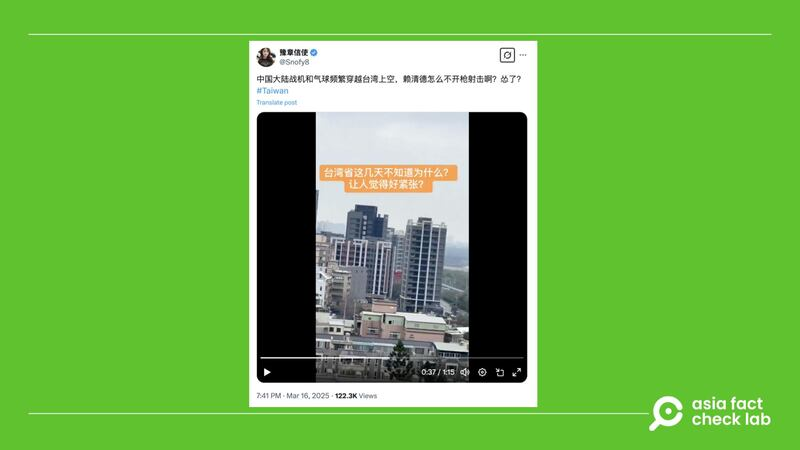
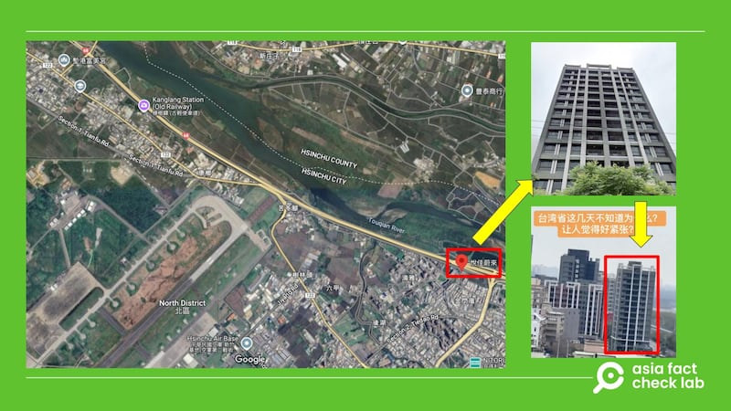
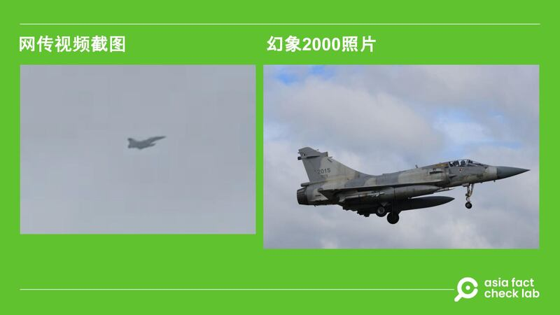

# 事實查覈｜視頻顯示中國戰機頻繁飛越臺灣上空？

艾倫, 莊敬, 和 董喆

2025.03.18 15:42 EDT

## 查覈結果：錯誤

## 一分鐘完讀：

三月中，社媒平臺X上廣傳一則視頻，稱是“中國軍機已飛進臺灣”，並有網民質問賴清德爲何不“開槍射擊”。經比對，該視頻拍攝地點爲新竹市北區的空軍基地附近，而其中展示的軍機爲該基地的幻象2000型戰機，並非中國軍機。

## 深度分析：

3月16日，X認證用戶“豫章信使”轉發一則[視頻](https://archive.ph/MQD92)，內容爲一架戰機從城市上空飛過，並另有四架戰機接連升空。視頻拍攝者還轉移鏡頭拍攝了一處水岸，宣稱拍攝地點在臺灣海峽旁，且“海峽對面就是福建省了”。該視頻的帖文則稱：“中國大陸戰機和氣球頻繁穿越臺灣上空，賴清德怎麼不開槍射擊啊？”

中文社媒上傳出中國戰機飛越臺灣上空的消息，傳言並附上一則視頻。經查覈，該說法並不屬實。 中文社媒上傳出中國戰機飛越臺灣上空的消息，傳言並附上一則視頻。經查覈，該說法並不屬實。 (X截圖)

亞洲事實查覈實驗室（Asia Fact Check Lab，下簡稱AFCL）將視頻內灰黑色高樓建築比對谷歌街景，如下圖所示，該畫面的地點爲臺灣新竹市北區的建案“悅佳蔚來”，新竹市北區爲臺灣空軍新竹基地所在地，幻象2000型戰機的常駐在此。

同時，原視頻宣稱是“臺灣海峽”的水岸部分，經比對、查覈後確認是緊靠新竹基地的頭前溪河牀。

谷歌地圖（左圖）街景功能中現實的一棟灰黑色建築（右上圖），比對後可確認爲視頻中的其中一棟建築物（右下圖），可知拍攝地點爲臺灣新竹市北區。 谷歌地圖（左圖）街景功能中現實的一棟灰黑色建築（右上圖），比對後可確認爲視頻中的其中一棟建築物（右下圖），可知拍攝地點爲臺灣新竹市北區。 (X、谷歌地圖街景截圖)

臺灣國防部回覆AFCL時表示，新竹基地經常有例行訓練，因此周圍羣衆可以看得到相關軍機飛行。網傳稱近期有“反常的大量軍機”飛行並不準確。

臺灣國防安全研究院副研究員舒孝煌則說，從圖中三角翼的輪廓可判別，視頻中的戰機是幻象2000（中國稱幻影2000）。他補充，臺灣軍用機場大多接近民宅，因此新竹跑道附近可以輕易拍到清楚影像。

網傳視頻內的軍機畫面雖遠，但仍可依輪廓比對出是幻象2000。 網傳視頻內的軍機畫面雖遠，但仍可依輪廓比對出是幻象2000。 (網傳視頻截圖、戰機照片由舒孝煌提供)

幻象2000爲法國戰鬥機公司達梭出產的機型，臺灣在1992年初次與達梭簽約購買60架，並於1997年開始在臺服役。

由這些證據可得知，網傳視頻中稱“中國大陸戰機在臺灣上空”爲錯誤消息，該視頻拍攝地點也並不在所宣稱的臺灣海峽邊，而在新竹市區。

（自由亞洲電臺普通話組唐鎮對本文亦有貢獻）

*亞洲事實查覈實驗室（Asia Fact Check Lab）針對當今複雜媒體環境以及新興傳播生態而成立。我們本於新聞專業主義，提供專業查覈報告及與信息環境相關的傳播觀察、深度報道，幫助讀者對公共議題獲得多元而全面的認識。讀者若對任何媒體及社交軟件傳播的信息有疑問，歡迎以電郵*[*afcl@rfa.org*](mailto:afcl@rfa.org)*寄給亞洲事實查覈實驗室，由我們爲您查證覈實。*

*亞洲事實查覈實驗室更詳細的介紹請參考*[*本文*](2024-10-09_關於亞洲事實查覈實驗室｜About AFCL.md)*。我們另有X、臉書、IG頻道，歡迎讀者追蹤、分享、轉發。X這邊請進：中文*[*@asiafactcheckcn*](https://twitter.com/asiafactcheckcn)*；英文：*[*@AFCL\_eng*](https://twitter.com/AFCL_eng)*、*[*FB在這裏*](https://www.facebook.com/asiafactchecklabcn)*、*[*IG也別忘了*](https://www.instagram.com/asiafactchecklab/)*。*

[Original Source](https://www.rfa.org/mandarin/shishi-hecha/2025/03/18/fact-check-video-chinese-fighter-jet-taiwan/)