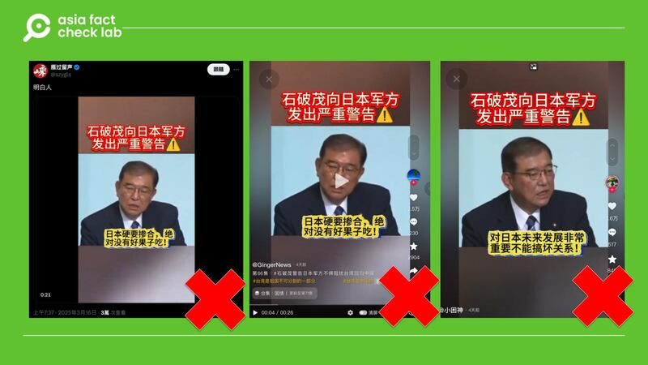
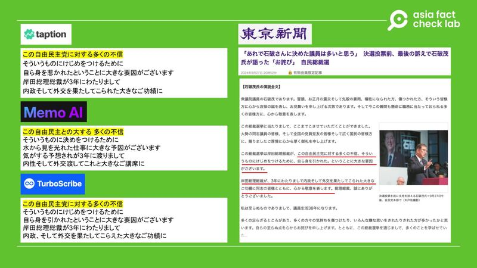
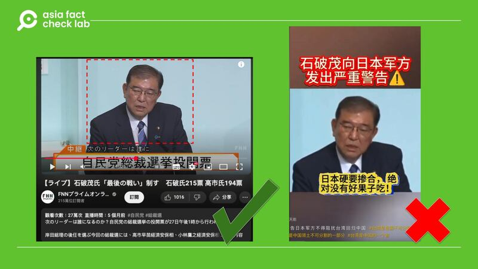

# 事實查覈｜日本首相石破茂警告自衛隊不要介入臺海？

董喆

2025.03.19 20:54 EDT

## 查覈結果：錯誤

## 一分鐘完讀：

近日X與抖音流傳一則視頻，稱日本首相石破茂對日本自衛隊發出嚴重警告，要日本不要干涉臺海。經查，這段視頻剪輯自2024年石破茂在日本自民黨總裁決選前的演說，內容是他表達對時任首相兼總裁岸田文雄的敬意，網傳視頻的字幕全是捏造的，與石破茂演說內容完全不相符。

## 深度分析：

## 近期X及[抖音](https://v.douyin.com/i5W7CT8K/)上廣泛流傳一則視頻，內容是日本首相石破茂正在發表演說，視頻字幕顯示是“石破茂向日本軍方發出嚴重警告”，要他們不要介入臺海挑釁中國。

抖音及X近期廣泛流傳一則視頻，稱日本首相石破茂發表演說警告日軍不要介入臺海。 抖音及X近期廣泛流傳一則視頻，稱日本首相石破茂發表演說警告日軍不要介入臺海。 (圖取自抖音、X)

網傳視頻的字幕可以整理出以下四點內容：

1. 臺海是中國的領海，日本硬要摻和，絕對沒有好下場！
2. 石破茂清楚日本的軍事實力、經濟實力遠不如中國，硬碰硬只會給日本帶來大災難。
3. 石破茂強調幹涉臺海不僅破壞地區和平，還會把日本拖入危險境地，得不償失！
4. 石破茂認爲與中國保持好合作關係，對日本未來發展非常重要，不能搞壞關係！

亞洲事實查覈實驗室將視頻上傳至3個AI影音轉文字的線上工具，分別爲[Taption](https://www.taption.com/zh?advertiserId=f0e7jXwyreY9XZONHdeQtZd4mko1&platform=google9&gad_source=1&gclid=Cj0KCQjws-S-BhD2ARIsALssG0Z4C1aa5fgjAaxFfTt9RWMInC1q_IicIJCvmug67hM4H7b_fLaIUwQaAtOTEALw_wcB)、[TurboScribe](https://turboscribe.ai/?ref=gad-self&gad_source=1&gclid=Cj0KCQjws-S-BhD2ARIsALssG0YUGek5UWZdzvbcLDFl8fLikGCyF1KSsX4dGFmOwDo5Kial_pr8OToaAkBEEALw_wcB)以及[Memo AI](https://memo.ac/zh_tw/)，得到3個相似的結果：

將視頻上傳至3個AI影音轉文字的線上工具檢測，發現內容與石破茂演講全文中部分段落吻合。 將視頻上傳至3個AI影音轉文字的線上工具檢測，發現內容與石破茂演講全文中部分段落吻合。 (圖取自《東京新聞》官網)

進一步以Google搜索引擎反搜翻譯結果中一致的“この自由民主黨に対する多くの不信”，確定上述內容符合石破茂2024年競選自民黨總裁時的演說。

2024年9月27日石破茂進入自民黨總裁決選，在決選投票前他發表了演說。根據《東京新聞》發佈的[演說全文](https://www.tokyo-np.co.jp/article/356985)，網傳視頻的轉譯內容與當中的第三段相符，比對視頻畫面也與日本網絡媒體“THE PAGE（ザ・ページ）”釋出的演說全紀錄中[1分15秒起](https://youtu.be/VwjPFLbZKWw?si=xb4NbYqn9v6TKw1P&t=75)的內容一致。畫面佈局更與日本富士新聞網直播視頻1小時13分28秒起幾乎相同。

網傳視頻的畫面佈局，與富士電視臺釋出自民黨總裁決選前演說直播視頻高度相似。 網傳視頻的畫面佈局，與富士電視臺釋出自民黨總裁決選前演說直播視頻高度相似。 (圖取自YouTube、抖音)

該段落完整內容爲：

この総裁選挙は岸田総理総裁が、この自由民主黨に対する多くの不信、そういうものにけじめをつけるために、自ら身を引かれた。ということに大きな要因がございます。

此次總裁選舉，岸田首相兼總裁爲了對自由民主黨所面臨的種種不信任做出明確的了斷，選擇了主動退位。這是一個重要的原因。

岸田総理総裁が、3年にわたりまして內政そして外交を果たしてこられた大きなご功績に同志の皆様とともに、心から敬意を表します。総理総裁、誠にありがとうございました。

對於岸田首相兼總裁在過去三年內政與外交方面所取得的重大成就，我與各位同志一同衷心表示敬意。首相總裁，誠摯感謝您的付出。

因此網傳視頻後製的字幕爲錯誤訊息，與石破茂演講內容完全不相符，且視頻錄製的時間點爲2024年9月27日自民黨總裁選舉前，當時石破茂尚未擔任日本首相。

事實上今年2月石破茂訪問美國，與美國總統特朗普舉行峯會，兩人發表[聯合聲明](https://www.whitehouse.gov/briefings-statements/2025/02/united-states-japan-joint-leaders-statement/)重申臺海和平穩定的重要性。

*亞洲事實查覈實驗室（Asia Fact Check Lab）針對當今複雜媒體環境以及新興傳播生態而成立。我們本於新聞專業主義，提供專業查覈報告及與信息環境相關的傳播觀察、深度報道，幫助讀者對公共議題獲得多元而全面的認識。*

*讀者若對任何媒體及社交平臺傳播的信息有疑問，歡迎以電郵*[*afcl@rfa.org*](mailto:afcl@rfa.org)*寄給亞洲事實查覈實驗室，由我們爲您查證覈實。亞洲事實查覈實驗室更詳細的介紹請參考*[*本文*](2024-10-09_關於亞洲事實查覈實驗室｜About AFCL.md)*。*

*我們另有X、臉書、IG頻道，歡迎讀者追蹤、分享、轉發。 X這邊請進：中文*[*@asiafactcheckcn*](https://twitter.com/asiafactcheckcn)*;英語：*[*@AFCL\_eng*](https://twitter.com/AFCL_eng)*、*[*FB在這裏*](https://www.facebook.com/asiafactchecklabcn)*、*[*IG也別忘了*](https://www.instagram.com/asiafactchecklab/)*。*

[Original Source](https://www.rfa.org/mandarin/shishi-hecha/2025/03/20/fact-check-japan-minister-warns-army/)