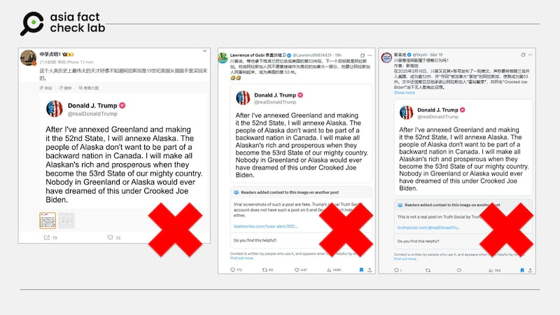
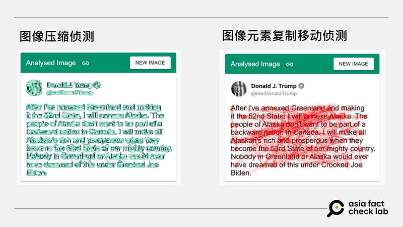

# 事實查覈｜特朗普發文要把阿拉斯加變成美國第53州？

鄭崇生

2025.03.21 12:20 EDT

## 查覈結果：錯誤

## 一分鐘完讀：

近日，微博與X上的多位中文用戶散佈一張美國總統特朗普的“發文”圖片，稱他要“把阿拉斯加變成美國第53州”，並嘲笑他“竟不知阿拉斯加早已是美國的一州”。

然而經查發現，這是截取特朗普社交媒體上官方賬號頭像和貼文後，再加變造生成的虛假信息。

## 深度分析：

網上流傳的圖文沒有標註發文時間，但形式和照片確實和特朗普（Donald Trump，又譯川普）社媒賬號頭像相同，所貼的內文爲：“我把格陵蘭島納入第52州後，要讓阿拉斯加也加入，阿拉斯加民衆不想成爲落後國家加拿大的一部分”， 還稱“當阿拉斯加成爲我們偉大美國的第53州後，我會讓所有阿拉斯加人變得富裕繁榮。”

在微博上，軍事大V博主“[中孚貞明1](https://archive.ph/wip/yGmXJ) ”就以此發文嘲諷特朗普 “好像不知道阿拉斯加是19世紀美國從俄羅斯手裏買來的”。X上也有中文用戶轉發（[1](https://archive.ph/fZpCG)、[2](https://archive.ph/FsuLj)），但並未察覺出該圖的嘲諷意味，而是進一步傳播“特朗普要把阿拉斯加變成美國”的信息。

社媒用戶流傳經過變造的“特朗普發文”。 社媒用戶流傳經過變造的“特朗普發文”。 (微博、X截圖)

然而，亞洲事實查覈實驗室（Asia Fact Check Lab, AFCL）查詢特朗普的[Truth Social賬號](https://truthsocial.com/@realDonaldTrump?gsid=9119a1ab-1932-475a-b778-80a2df005e3f)，並沒有發現上述圖文，也沒有任何主流媒體有相關報道。

AFCL以圖反搜發現，在X上可查到最早的發文是3月14日、名爲[“KGB News”的賬號](https://archive.ph/JY1wX)的發文，隔天已有X用戶在社羣筆記標註這是假造圖文，但相關內容仍流傳到中文世界。

AFCL進一步以查覈工具InVID & WeVerify查覈，下圖左有關圖像壓縮偵測的濾鏡中發現，包括特朗普的頭像與文字都顯示爲淺綠色，根據InVID & WeVerify的說明：當要儲存新影像時，影像未被篡改的部分被壓縮兩次，而加進來的區域只被壓縮一次。在這種情況下，被篡改的區域就會呈現淺綠色。另外，在圖像元素複製移動的偵測中，下圖右紅線部分則是疑似不自然形成的相似處。

查覈軟件顯示，左圖淺綠色爲重複壓縮合成的內容，右圖紅線疑似是不自然生成的複製區域。 查覈軟件顯示，左圖淺綠色爲重複壓縮合成的內容，右圖紅線疑似是不自然生成的複製區域。 (查覈工具InVID & WeVerify截圖)

事實上，特朗普曾多次評論阿拉斯加的資源和當地政治，他在第二任期開始前曾[錄製影片](https://www.facebook.com/share/v/18gv23D9YF/)，細數自己第一任期對鬆綁阿拉斯加能源開採的貢獻，更強調自己和共和黨籍州長鄧利維（Mike Dunleavy）有良好的合作關係，承諾要加強對阿拉斯加當地的防衛投資，而他1月20日上任第一天就簽署有關鬆綁阿拉斯加天然資源開採的[行政命令](https://www.whitehouse.gov/presidential-actions/2025/01/unleashing-alaskas-extraordinary-resource-potential/)，這些相關背景都顯示，特朗普不太可能不知道阿拉斯加是美國的一州。

這並不是特朗普的社交媒體賬號頭像第一次遭盜用合成後流竄的虛假信息，AFCL之前已經發表過利用特朗普社媒賬號，生成以假亂真的不實信息。而這次所謂“特朗普聲稱要把阿拉斯加納爲第53州”的不實說法，已有[美國查覈機構](https://leadstories.com/hoax-alert/2025/03/fact-check-trump-post-annexe-alaska-greenland.html#google_vignette)發表報告。

## 延伸閱讀

* [關閉星鏈？重行選舉？這些假信息由AI加工而來](2025-03-13_事實查覈｜關閉星鏈？重行選舉？這些假信息由AI加工而來.md)
* [特朗普與馬斯克翻臉　發文稱“我纔是總統”？](2024-12-27_事實查覈 ｜ 特朗普與馬斯克翻臉　發文稱“我纔是總統”？.md)

*亞洲事實查覈實驗室（Asia Fact Check Lab）針對當今複雜媒體環境以及新興傳播生態而成立。我們本於新聞專業主義，提供專業查覈報告及與信息環境相關的傳播觀察、深度報道，幫助讀者對公共議題獲得多元而全面的認識。讀者若對任何媒體及社交軟件傳播的信息有疑問，歡迎以電郵*[*afcl@rfa.org*](mailto:afcl@rfa.org)*寄給亞洲事實查覈實驗室，由我們爲您查證覈實。*

*亞洲事實查覈實驗室更詳細的介紹請參考*[*本文*](2024-10-09_關於亞洲事實查覈實驗室｜About AFCL.md)*。我們另有X、臉書、IG頻道，歡迎讀者追蹤、分享、轉發。X這邊請進：中文*[*@asiafactcheckcn*](https://twitter.com/asiafactcheckcn)*；英文：*[*@AFCL\_eng*](https://twitter.com/AFCL_eng)*、*[*FB在這裏*](https://www.facebook.com/asiafactchecklabcn)*、*[*IG也別忘了*](https://www.instagram.com/asiafactchecklab/)*。*

[Original Source](https://www.rfa.org/mandarin/shishi-hecha/2025/03/21/fact-check-fake-social-post-trump/)